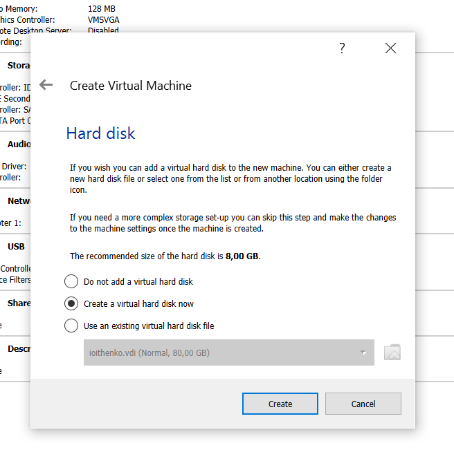
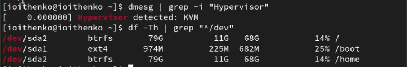
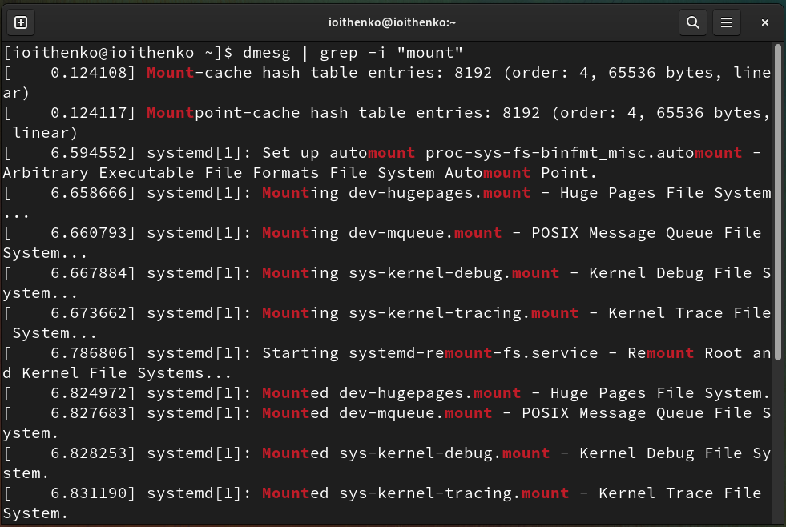

---
## Front matter
lang: ru-RU
title: Лабораторная работа №1
subtitle: Операционные системы
author:
  - Ищенко Ирина Олеговна
institute:
  - Российский университет дружбы народов, Москва, Россия
date: 17 февраля 2023

## i18n babel
babel-lang: russian
babel-otherlangs: english

## Formatting pdf
toc: false
toc-title: Содержание
slide_level: 2
aspectratio: 169
section-titles: true
theme: metropolis
header-includes:
 - \metroset{progressbar=frametitle,sectionpage=progressbar,numbering=fraction}
 - '\makeatletter'
 - '\beamer@ignorenonframefalse'
 - '\makeatother'
---

## Цель работы

Приобретение практических навыков установки операционной системы на виртуальную машину, настройки минимально необходимых для дальнейшей работы сервисов.

# Выполнение работы

## Создание виртуальной машины 

Установили виртуальную машину Oracle Virtual Box операционной системы Linux и дистрибутив Fedora.

{#fig:001 width=40%}

## Настройка параметров виртуальной машины

- Объем оперативной памяти
- Создание виртуального диска на 80 Гб
- Объем видеопамяти 128 Мб
- Добавление образа Fedora

{#fig:002 width=30%}

## Создание пользователя

{#fig:003 width=40%}

## Установка pandoc и TexLive

Установили pandoc и его необходимые расширения.
Установили дистрибутив TexLive.

# Выполнение домашнего задания

## Версия ядра Linux

{#fig:004 width=70%}

## Частота процессора

{#fig:005 width=70%}

## Модель процессора

{#fig:006 width=70%}

## Объём доступной оперативной памяти

{#fig:007 width=70%}

## Тип обнаруженного гипервизора и тип файловой системы корневого раздела

{#fig:008 width=70%}

## Последовательность монтирования файловых систем

{#fig:009 width=70%}

# Вывод

## Подведение итога

В ходе выполнения лабораторной рабооты я приобрела практические навыки установки операционной системы LInux дистрибутив Fedora на виртуальную машину, настройки минимально необходимых для дальнейшей работы сервисов таких как: pandoc и texlive. 

