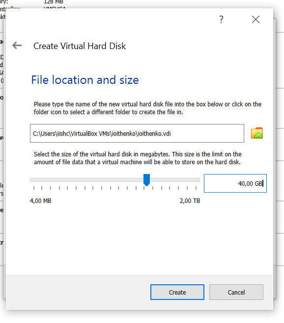
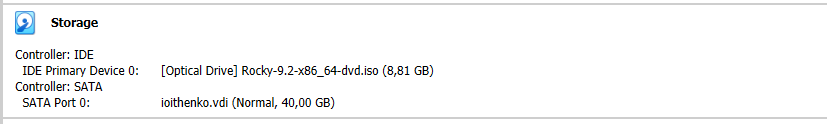
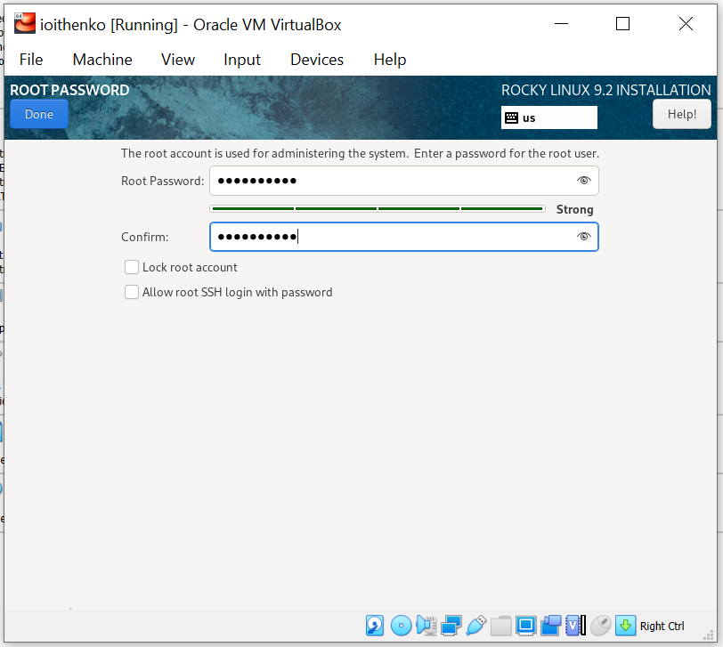
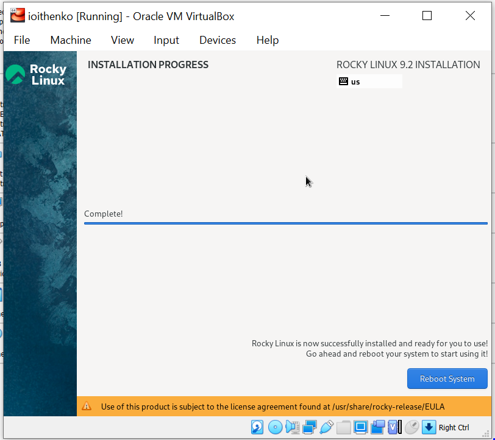
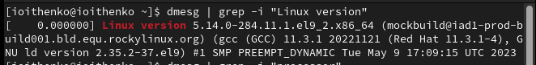
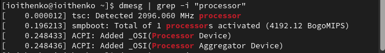

---
## Front matter
title: "Отчёт по лабораторной работе"
subtitle: "Дисциплина: Основы администрирования операционных систем"
author: "Ищенко Ирина Олеговна НПИбд-01-22"

## Generic otions
lang: ru-RU
toc-title: "Содержание"

## Bibliography
bibliography: bib/cite.bib
csl: pandoc/csl/gost-r-7-0-5-2008-numeric.csl

## Pdf output format
toc: true # Table of contents
toc-depth: 2
lof: true # List of figures
lot: true # List of tables
fontsize: 12pt
linestretch: 1.5
papersize: a4
documentclass: scrreprt
## I18n polyglossia
polyglossia-lang:
  name: russian
  options:
	- spelling=modern
	- babelshorthands=true
polyglossia-otherlangs:
  name: english
## I18n babel
babel-lang: russian
babel-otherlangs: english
## Fonts
mainfont: PT Serif
romanfont: PT Serif
sansfont: PT Sans
monofont: PT Mono
mainfontoptions: Ligatures=TeX
romanfontoptions: Ligatures=TeX
sansfontoptions: Ligatures=TeX,Scale=MatchLowercase
monofontoptions: Scale=MatchLowercase,Scale=0.9
## Biblatex
biblatex: true
biblio-style: "gost-numeric"
biblatexoptions:
  - parentracker=true
  - backend=biber
  - hyperref=auto
  - language=auto
  - autolang=other*
  - citestyle=gost-numeric
## Pandoc-crossref LaTeX customization
figureTitle: "Рис."
tableTitle: "Таблица"
listingTitle: "Листинг"
lofTitle: "Список иллюстраций"
lotTitle: "Список таблиц"
lolTitle: "Листинги"
## Misc options
indent: true
header-includes:
  - \usepackage{indentfirst}
  - \usepackage{float} # keep figures where there are in the text
  - \floatplacement{figure}{H} # keep figures where there are in the text
---

# Цель работы

Целью данной работы является приобретение практических навыков установки операционной системы на виртуальную машину, настройки минимально необходимых для дальнейшей работы сервисов.

# Выполнение лабораторной работы

В данной лабораторной работе мне требуется установить виртиуальную машину Oracle Virtual Box (уже установлен) операционной системы Linux и дистрибутив Rocky.

Создаем виртуальную машину и задаем ее расположение с указанием моего логина, типа операционной системы (Linux, Red Hat 64-bit) и (рис. @fig:001).
 
 {#fig:001 width=70%}

Указываем объем оперативной памяти виртуальной машины, я указала 2048 Мб (рис. @fig:002). Создаем новый виртуальный жесткий диск (рис. @fig:003), указываем тип VDI (рис. @fig:004), выбираем динамический виртуальный диск (рис. @fig:005).

{#fig:002 width=70%}
 
 {#fig:003 width=70%}
 
 {#fig:004 width=70%}
 
 {#fig:005 width=70%}

Указываем имя и размер виртуального диска – 40Гб (рис. @fig:006). Проверяем расположение файла.

{#fig:006 width=70%}

Во вкладке носители добавляем новый привод оптических дисков и выбираем образ, для этого используем скачанный образ Rocky (рис. @fig:007).

 {#fig:007 width=70%}

Запускаем виртуальную машину (рис. @fig:008). Переходим к настройкам установки операционной системы и выбираем английский язык для интерфейса.При выборе места установки оставляем параметры, которые были
выставлены автоматически (рис. @fig:009). Отключаем KDUMP (рис. @fig:0010).
 
{#fig:008 width=70%}

{#fig:009 width=70%}

{#fig:0010 width=70%}

Включаем сетевое соединение и в качестве имени узла указываем
ioithenko.localdomain (рис. @fig:0011).
 
{#fig:0011 width=70%}
 
Устанавливаем пароль для root и пользователя с правами администратора (рис. @fig:0012).

{#fig:0012 width=70%}

Начинаем процесс установки (рис. @fig:0013). 

{#fig:0013 width=70%}

Дожидаемся и завершаем установку. После успешной установки
выполняем перезагрузку системы. Последним пунктом нашей лабораторной
работы становится подключение дополнений ОС (рис. @fig:0014).

{#fig:0014 width=70%}

# Выполнение домашнего задания

Получили следующую информацию:
1.Версия ядра Linux (Linux version) (рис. @fig:0015).

{#fig:0015 width=70%}

2.Частота процессора (Detected Mhz processor) (рис. @fig:0016).

{#fig:0016 width=70%}

3.Модель процессора (CPU0) (рис. @fig:0017).

{#fig:0017 width=70%}

4.Объём доступной оперативной памяти (Memory available) (рис. @fig:0018).

{#fig:0018 width=70%}

5.Тип обнаруженного гипервизора (Hypervisor detected) (рис. @fig:0019).

{#fig:0019 width=70%}

6.Тип файловой системы корневого раздела (рис. @fig:0020).

{#fig:0020 width=70%}

7.Последовательность монтирования файловых систем (рис. @fig:0021).

{#fig:0021 width=70%}

# Ответы на контрольные вопросы

1. Какую информацию содержит учётная запись пользователя?

Учетная запись пользователя содержит информацию, которая необходима для индентификации пользователя в системе и его аавторизации:
- Имя пользователя
- Идентефикационный номер пользователя
- идентификационный номер группы
- Пароль
- Полное имя
- Начальная оболочка 
- Домашний каталог

2.Укажите команды терминала и приведите примеры:

 <команда> --help  - для получения справки по команде;
cd - для перемещения по файловой системе;
ls - для просмотра содержимого каталога;
du <имя каталога> - для определения объёма каталога;
rm/touch - для создания / удаления каталогов / файлов;
chmod - для задания определённых прав на файл / каталог;
history - для просмотра истории команд.

3. Что такое файловая система? Приведите примеры с краткой характеристикой.

Файловая система  — порядок, определяющий способ организации, хранения и именования данных на носителях информации в компьютерах, а также в другом электронном оборудовании: цифровых фотоаппаратах, мобильных телефонах и т. п. Файловая система определяет формат содержимого и способ физического хранения информации, которую принято группировать в виде файлов.
NTFS - файловая система ОС Windows, которая поддерживает разграничение доступа для различных групп пользователей.

4.Как посмотреть, какие файловые системы подмонтированы в ОС?

Команды df и findmnt выводят информацию о том, какие файловые системы подмонтированы в ОС.

5.Как удалить зависший процесс?

Команда killall <название процесса> позволяет удалить зависший процесс.

# Выводы

В ходе выполнения лабораторной рабооты я приобрела практические навыки установки операционной системы на виртуальную машину, настройки минимально необходимых для дальнейшей работы сервисов.

::: {#refs}
:::
