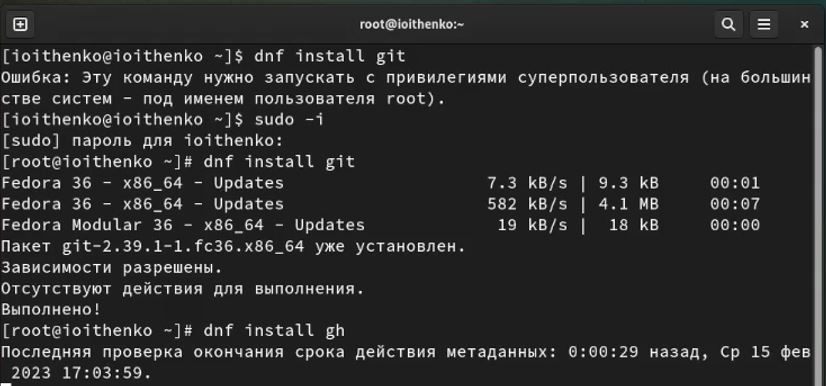
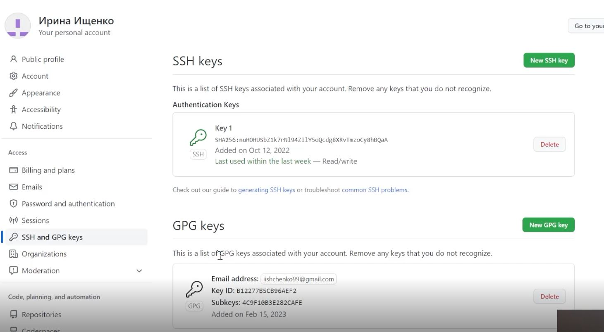
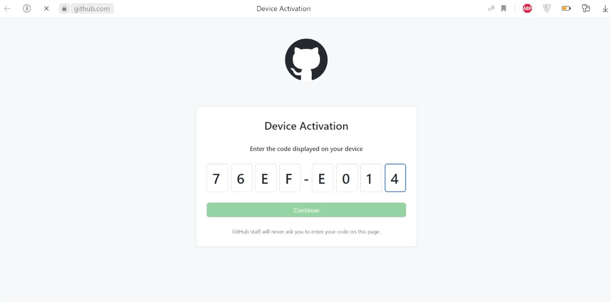
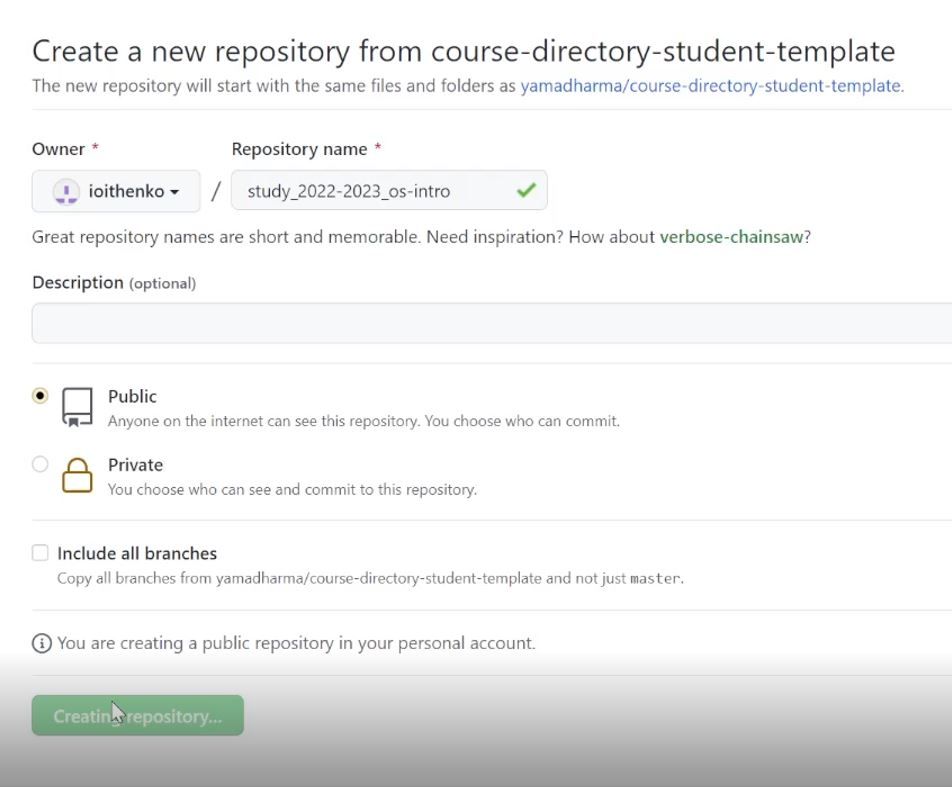
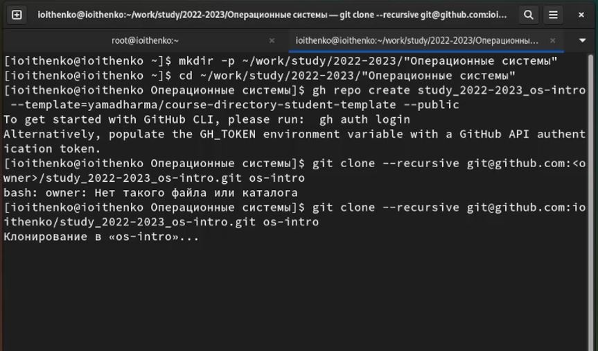
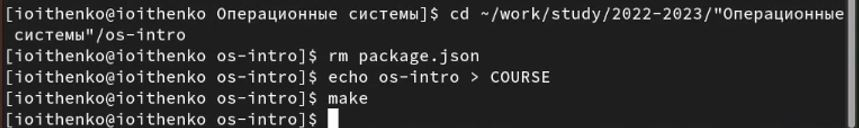
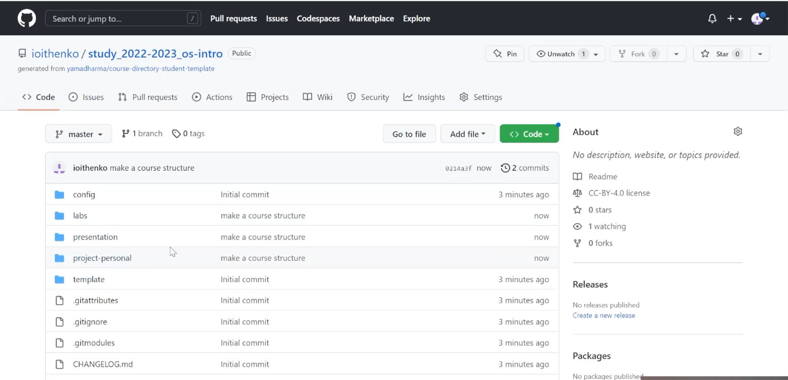

---
## Front matter
lang: ru-RU
title: Лабораторная работа №2
subtitle: Операционные системы
author:
  - Ищенко Ирина Олеговна
institute:
  - Российский университет дружбы народов, Москва, Россия
date: 18 февраля 2023

## i18n babel
babel-lang: russian
babel-otherlangs: english

## Formatting pdf
toc: false
toc-title: Содержание
slide_level: 2
aspectratio: 169
section-titles: true
theme: metropolis
header-includes:
 - \metroset{progressbar=frametitle,sectionpage=progressbar,numbering=fraction}
 - '\makeatletter'
 - '\beamer@ignorenonframefalse'
 - '\makeatother'
---

## Цель работы

- Изучить идеологию и применение средств контроля версий.
- Освоить умения по работе с git.

# Выполнение лабораторной работы

## Установка git и gh

{#fig:001 width=60%}

## Создание ключей ssh и pgp

{#fig:002 width=60%}

## Авторизация

{#fig:003 width=60%}

## Создание репозитория

{#fig:004 width=60%}

## Создание локального репозитория

{#fig:005 width=60%}

## Настройка каталогов

{#fig:006 width=60%}

## Добавление файлов на сервер

{#fig:007 width=60%}

# Вывод

## Вывод

В ходе выполнения лабораторной работы я изучила идеологию и применение средств контроля версий и освоила умения по работе с git: создала репозиторий.

