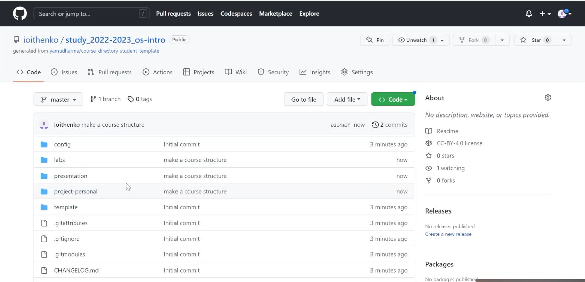

---
## Front matter
title: "Лабораторная работа №2"
subtitle: "Дисциплина: Операционные системы"
author: "Ищенко Ирина Олеговна "

## Generic otions
lang: ru-RU
toc-title: "Содержание"

## Bibliography
bibliography: bib/cite.bib
csl: pandoc/csl/gost-r-7-0-5-2008-numeric.csl

## Pdf output format
toc: true # Table of contents
toc-depth: 2
lof: true # List of figures
lot: true # List of tables
fontsize: 12pt
linestretch: 1.5
papersize: a4
documentclass: scrreprt
## I18n polyglossia
polyglossia-lang:
  name: russian
  options:
	- spelling=modern
	- babelshorthands=true
polyglossia-otherlangs:
  name: english
## I18n babel
babel-lang: russian
babel-otherlangs: english
## Fonts
mainfont: PT Serif
romanfont: PT Serif
sansfont: PT Sans
monofont: PT Mono
mainfontoptions: Ligatures=TeX
romanfontoptions: Ligatures=TeX
sansfontoptions: Ligatures=TeX,Scale=MatchLowercase
monofontoptions: Scale=MatchLowercase,Scale=0.9
## Biblatex
biblatex: true
biblio-style: "gost-numeric"
biblatexoptions:
  - parentracker=true
  - backend=biber
  - hyperref=auto
  - language=auto
  - autolang=other*
  - citestyle=gost-numeric
## Pandoc-crossref LaTeX customization
figureTitle: "Рис."
tableTitle: "Таблица"
listingTitle: "Листинг"
lofTitle: "Список иллюстраций"
lotTitle: "Список таблиц"
lolTitle: "Листинги"
## Misc options
indent: true
header-includes:
  - \usepackage{indentfirst}
  - \usepackage{float} # keep figures where there are in the text
  - \floatplacement{figure}{H} # keep figures where there are in the text
---

# Цель работы

- Изучить идеологию и применение средств контроля версий.
- Освоить умения по работе с git.

# Выполнение лабораторной работы

Установили git и gh (рис. @fig:001).

{#fig:001 width=70%}

Зададим имя и email владельца репозитория. Настроим utf-8 в выводе сообщений git. Зададим имя начальной ветки.
Задаем параметры autocrlf и safecrlf (рис. @fig:002).

{#fig:002 width=70%}

Создаем ключи ssh:
- по алгоритму rsa с ключём размером 4096 бит (рис. @fig:003).

{#fig:003 width=70%}

- по алгоритму ed25519 (рис. @fig:004).

{#fig:004 width=70%}

Генерируем ключ pgp: тип RSA and RSA; размер 4096; срок действия - 0 (рис. @fig:005).
Указываем имя и адрес электронной почты (рис. @fig:006).

{#fig:005 width=70%}

Учетная запись на github настроена с первого семестра.

Выводим список ключей и копируем отпечаток приватного ключа. Cкопируем наш сгенерированный PGP ключ в буфер обмена (рис. @fig:007).

{#fig:007 width=70%}

В настройках github добавляем полученный ключ (рис. @fig:008).

{#fig:008 width=70%}

Используя введёный email, укажем Git применять его при подписи коммитов (рис. @fig:009).

{#fig:009 width=70%}

Авторизовываемся (рис. @fig:0010).

{#fig:0010 width=70%}

С помощью шаблона создаем новый репозиторий (рис. @fig:0011).

{#fig:0011 width=70%}

Создаем каталог "Операционные системы", переходим в него, создаем структуру с помощью шаблона, клонируем репозиторий (рис. @fig:0012).

{#fig:0012 width=70%}

Удаляем лишний каталог. Создаем необходимые каталоги (рис. @fig:0013).

{#fig:0013 width=70%}

Отправляем файлы на сервер (рис. @fig:0014) и (рис. @fig:0015).

{#fig:0014 width=70%}

{#fig:0015 width=70%}

Репозиторий настроен (рис. @fig:0016).

{#fig:0016 width=70%}

# Ответы на контрольные вопросы

1. Что такое системы контроля версий (VCS) и для решения каких задач они предназначаются?

Система контроля версий — это программные инструменты, помогающие командам разработчиков управлять изменениями в исходном коде с течением времени. VCS прмменяется при работе н6ескольких разработчиков над одним общим проектом. Система контроля версий хранит все изменения, внесенные в проект, а также разработчики могут вернуться к любой более ранней версии проекта.

2. Объясните следующие понятия VCS и их отношения: хранилище, commit, история, рабочая копия.

Хранилище - место расположения файлов и каталогов проекта, изменения которых отслеживаются.
Коммит - операция отправки в репозиторий измениний, которые внес разработчик в свою копию проекта.
История - информация о всех более ранних версиях проекта.
Рабочая копия - текущее состояние файлов проекта, полученных из хранилища и используемых разработчиков в настоящее время.

3. Что представляют собой и чем отличаются централизованные и децентрализованные VCS? Приведите примеры VCS каждого вида.

Централизованная система контроля версий предназначена для решения основной проблемы локальной системы контроля версий. Для организации такой системы контроля версий используется единственный сервер, который содержит все версии файлов. Пример централизованной VCS - CVS, Subversion, Perforce.
Децентрализованные системы контроля версий - это такие системы, как Git, Mercurial, Bazaar или, например, Darcs. Каждый пользователь имеет свою версию репозитория, может вносить в нее изменения.

Различие между централизованными и децентрализованными VCS заключается в количестве репозиториев.

4. Опишите действия с VCS при единоличной работе с хранилищем.

Разработчик работает с главной веткой master, при необходимости может создавать дополнительные ветки для отдельных задач проекта. При внесении изменений он сохраняет файлы в общем хранилище.

5. Опишите порядок работы с общим хранилищем VCS.

Каждый разработчик работает с отдельной веткой проекта и вносит изменения в локальный репозиторий. При завершении работы ему требуется запушить файлы на сервер, внести изменения в главную ветку.

6. Каковы основные задачи, решаемые инструментальным средством git?

Основные задачи: возможность коллективной работы над проектом и сохранение всей информации об изменениях, внесенных в проект.

7. Назовите и дайте краткую характеристику командам git.

Создание основного дерева репозитория: git init
Получение обновлений (изменений) текущего дерева из центрального репозитория: git pull
Отправка всех произведённых изменений локального дерева в центральный репозиторий: git push
Просмотр списка изменённых файлов в текущей директории: git status
Просмотр текущих изменений: git di
добавить все изменённые и/или созданные файлы и/или каталоги: git add .
добавить конкретные изменённые и/или созданные файлы и/или каталоги: git add имена_файлов
удалить файл и/или каталог из индекса репозитория (при этом файл и/или каталог остаётся в локальной директории): git rm имена_файлов
сохранить все добавленные изменения и все изменённые файлы: git commit -am 'Описание коммита'
сохранить добавленные изменения с внесением комментария через встроенный редактор: git commit
создание новой ветки, базирующейся на текущей: git checkout -b имя_ветки
переключение на некоторую ветку: git checkout имя_ветки (при переключении на ветку, которой ещё нет в локальном репозитории, она будет создана и связана с удалённой)
отправка изменений конкретной ветки в центральный репозиторий: git push origin имя_ветки
слияние ветки с текущим деревом: git merge --no-ff имя_ветки
удаление локальной уже слитой с основным деревом ветки: git branch -d имя_ветки
принудительное удаление локальной ветки: git branch -D имя_ветки
удаление ветки с центрального репозитория: git push origin :имя_ветки

8. Приведите примеры использования при работе с локальным и удалённым репозиториями.

Локальный репозиторий используется одним человеком и расположен на его компьютере.
Удаленный репозиторий может использоваться группой разработчиков, в центральный репозиторий они пушат из локальных репозиториев изменения, внесенные в проект.

9. Что такое и зачем могут быть нужны ветви (branches)?

Ветка - тэо указатель на один из коммитов. Ветки используются для работы над одной из частей проекта в отдельности от других его частей. Каждая ветка представляет собой отдельную копию проекта, что позволяет работать над разными версиями одного проекта.

10. Как и зачем можно игнорировать некоторые файлы при commit?

Игнорировать файлы при commit можно с помощью файла gitignor. Там помещаются файлы, не требующиеся в итоговой версии проекта.

# Выводы

В ходе выполнения лабораторной работы я изучила идеологию и применение средств контроля версий и освоила умения по работе с git.

# Список литературы{.unnumbered}

::: {#refs}
:::
