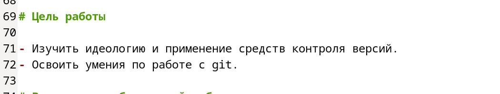
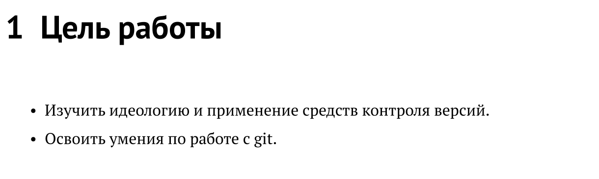
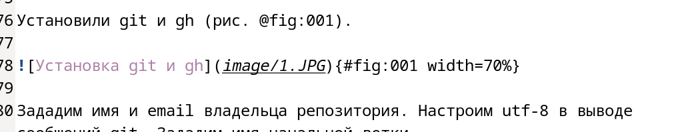
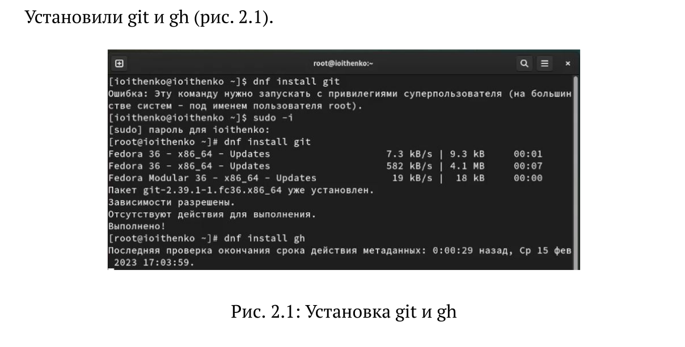
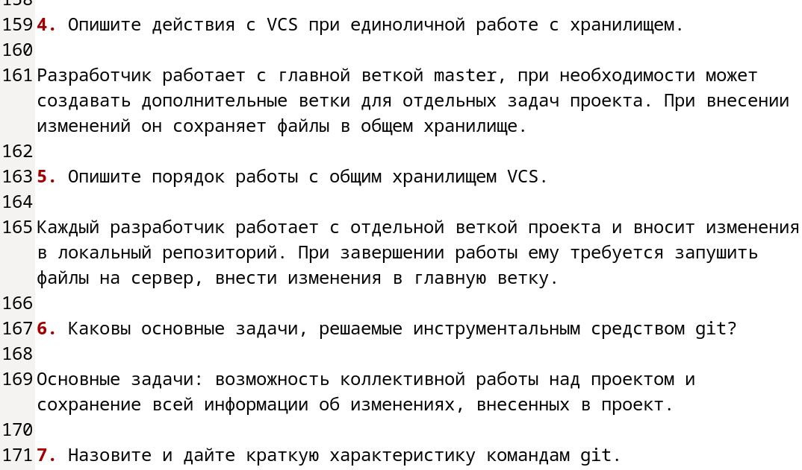
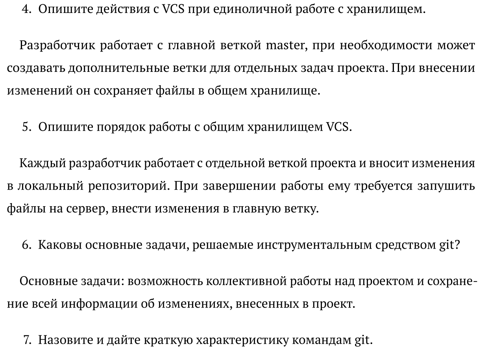
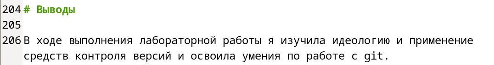
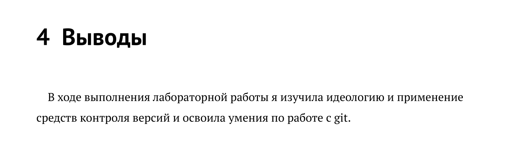

---
## Front matter
lang: ru-RU
title: Лабораторная работа №3
subtitle: Операционные системы
author:
  - Ищенко Ирина Олеговна
institute:
  - Российский университет дружбы народов, Москва, Россия
date: 25 февраля 2023

## i18n babel
babel-lang: russian
babel-otherlangs: english

## Formatting pdf
toc: false
toc-title: Содержание
slide_level: 2
aspectratio: 169
section-titles: true
theme: metropolis
header-includes:
 - \metroset{progressbar=frametitle,sectionpage=progressbar,numbering=fraction}
 - '\makeatletter'
 - '\beamer@ignorenonframefalse'
 - '\makeatother'
---

## Докладчик

:::::::::::::: {.columns align=center}
::: {.column width="70%"}

  * Ищенко Ирина Олеговна
  * НПИбд-01-22

:::
::: {.column width="30%"}


:::
::::::::::::::

## Цель 

Научиться оформлять отчёты с помощью легковесного языка разметки Markdown.

# Теоретическое введение

## Заголовки

Знак # используется для обозначения заголовков:

 # This is heading 1

 ## This is heading 2
 
 ### This is heading 3
 
 #### This is heading 4

## Начертания и уполрядоченные списки

1. Двойные звездочки используются для полужирного начертания текста.

2. Одинарные звездочки - курсивное начертание.

3. Тройные звездочки - одновременно курсивное и полужирное начертания.

**полужирный** *курсивный* ***полужирный и курсивный***

## Маркированные списки

- Блоки цитирования оформляются с помощью символа >
   - Для создания дочернего списка используется отступ
- Блок кода можно оградить с помощью знаков ```

```language
текст кода
```
    
# Выполнение лабораторной работы

## Цель и маркированный список

{#fig:001 width=50%}

{#fig:002 width=50%}

## Вставка изображений

{#fig:003 width=50%}

{#fig:004 width=50%}

## Упорядоченный список

:::::::::::::: {.columns align=center}
::: {.column width="50%"}

{#fig:005 width=50%}

:::
::: {.column width="50%"}

{#fig:006 width=50%}

:::
::::::::::::::

## Оформление заголовка и  вывод

{#fig:007 width=50%}

{#fig:008 width=50%}

# Вывод

## Вывод

В ходе выполнения лабораторной работы я научилась оформлять отчёты с помощью легковесного языка разметки Markdown.

