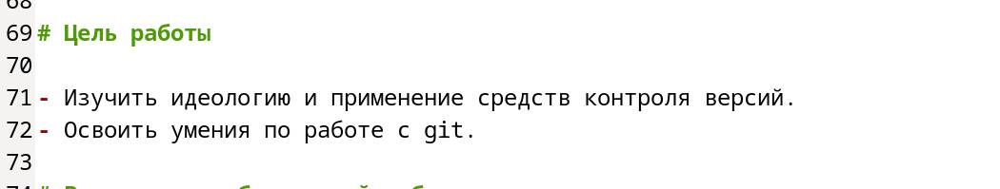
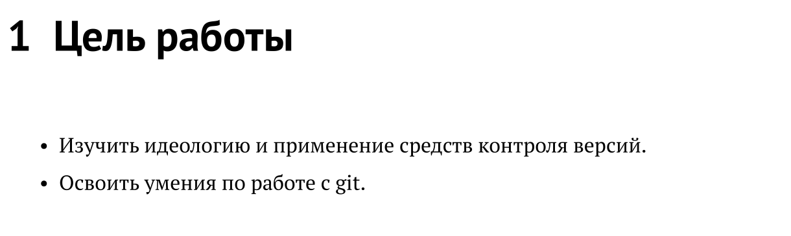
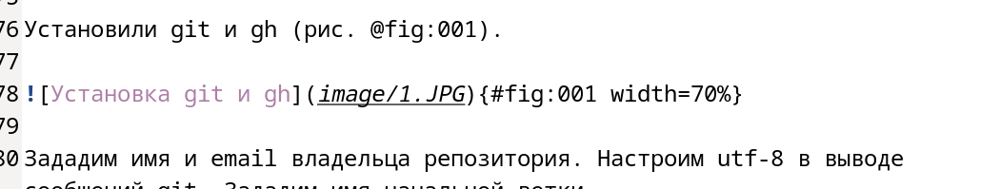
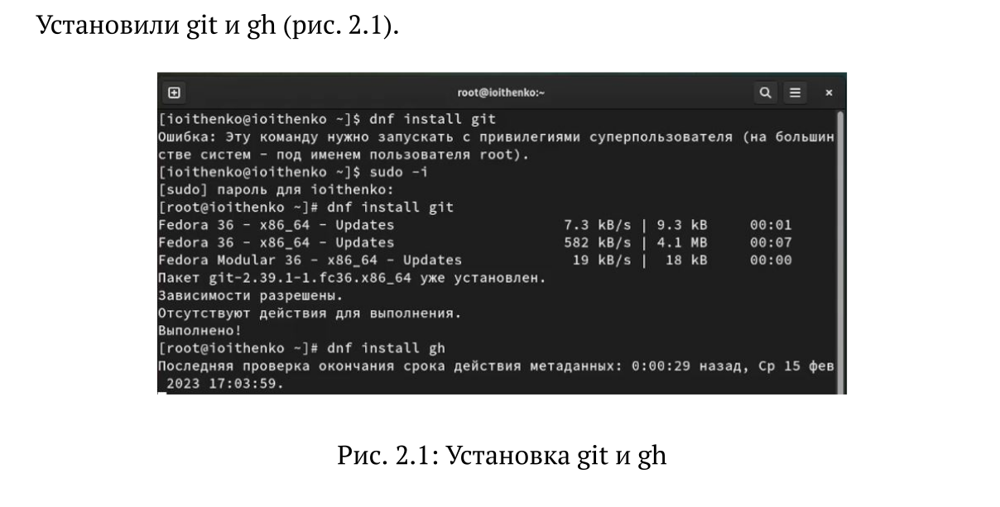
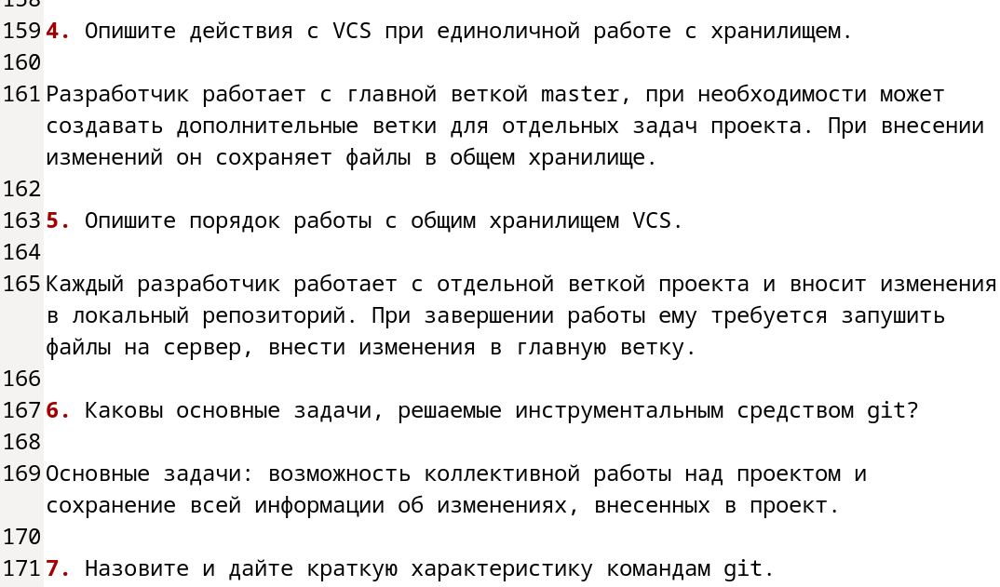
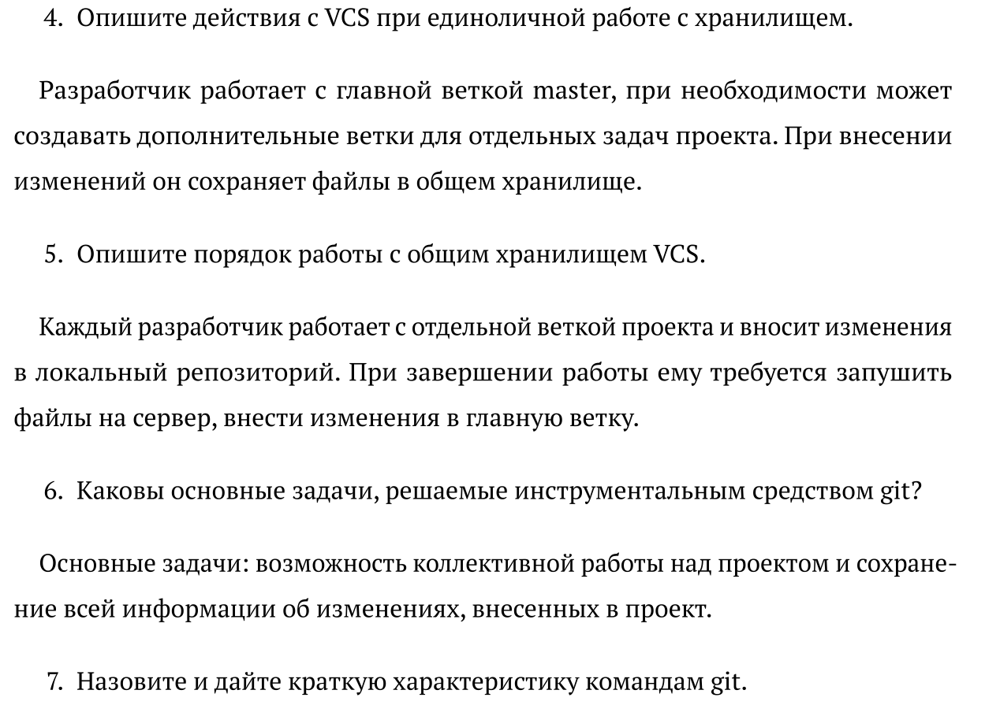
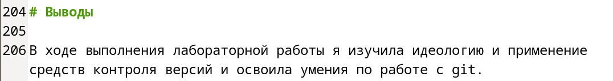
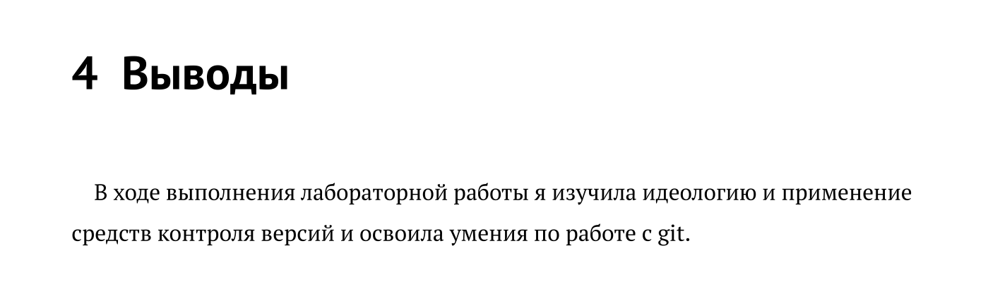

---
## Front matter
title: "Отчёт по лабораторной работе №3"
subtitle: "Дисциплина: Операционные системы"
author: "Ищенко Ирина Олеговна"

## Generic otions
lang: ru-RU
toc-title: "Содержание"

## Bibliography
bibliography: bib/cite.bib
csl: pandoc/csl/gost-r-7-0-5-2008-numeric.csl

## Pdf output format
toc: true # Table of contents
toc-depth: 2
lof: true # List of figures
lot: true # List of tables
fontsize: 12pt
linestretch: 1.5
papersize: a4
documentclass: scrreprt
## I18n polyglossia
polyglossia-lang:
  name: russian
  options:
	- spelling=modern
	- babelshorthands=true
polyglossia-otherlangs:
  name: english
## I18n babel
babel-lang: russian
babel-otherlangs: english
## Fonts
mainfont: PT Serif
romanfont: PT Serif
sansfont: PT Sans
monofont: PT Mono
mainfontoptions: Ligatures=TeX
romanfontoptions: Ligatures=TeX
sansfontoptions: Ligatures=TeX,Scale=MatchLowercase
monofontoptions: Scale=MatchLowercase,Scale=0.9
## Biblatex
biblatex: true
biblio-style: "gost-numeric"
biblatexoptions:
  - parentracker=true
  - backend=biber
  - hyperref=auto
  - language=auto
  - autolang=other*
  - citestyle=gost-numeric
## Pandoc-crossref LaTeX customization
figureTitle: "Рис."
tableTitle: "Таблица"
listingTitle: "Листинг"
lofTitle: "Список иллюстраций"
lotTitle: "Список таблиц"
lolTitle: "Листинги"
## Misc options
indent: true
header-includes:
  - \usepackage{indentfirst}
  - \usepackage{float} # keep figures where there are in the text
  - \floatplacement{figure}{H} # keep figures where there are in the text
---

# Цель работы

Научиться оформлять отчёты с помощью легковесного языка разметки Markdown.

# Задание

Создать отчет к лабораторной работе №2 с помощью легковесного языка разметки Markdown.

# Теоретическое введение

Знак # используется для обозначения заголовков:

 # This is heading 1

 ## This is heading 2
 
 ### This is heading 3
 
 #### This is heading 4

Двойные звездочки используются для полужирного начертания текста:

This text is **bold**.

Одинарные звездочки - курсивное начертание:

This text is *italic*.

Тройные звездочки - одновременно курсивное и полужирное начертания:

This is text is both ***bold and italic***.

Блоки цитирования оформляются с помощью символа >:

> The drought had lasted now for ten million years, and the reign of
the terrible lizards had long since ended. Here on the Equator, in
the continent which would one day be known as Africa, the battle
for existence had reached a new climax of ferocity, and the victor
was not yet in sight. In this barren and desiccated land, only the
small or the swift or the fierce could flourish, or even hope to
survive.

Неупорядоченный (маркированный) задается с помощью звездочек или тире:

- List item 1
- List item 2
- List item 3

Для создания вложенного списка нужно добавить отступ для элементов дочернего списка:

- List item 1
   - List item A
   - List item B
 - List item 2
 
Упорядоченный список можно отформатировать с помощью соответствующих цифр:

1. First instruction
2. Second instruction
3. Third instruction

Чтобы вложить один список в другой, добавьте отступ для элементов дочернего списка:
1. First instruction
   1. Sub-instruction
   2. Sub-instruction
2. Second instruction

Для того, чтобы добавить ссылку, нужно оформить текст гиперссылки в квадратных скобках [link text], а в круглых указать URL-адреса или имени файла, на который дается ссылка (file-name.md):

[link text](file-name.md)

 Общий формат огражденных блоков кода:
 
 ``` language
 your code goes in here
 ```

# Выполнение лабораторной работы

Обозначили цель лабораторной работы №2, используя маркированный список (рис. @fig:001) и (рис. @fig:002).

{#fig:001 width=70%}

{#fig:002 width=70%}

Описали шаги выполнения лабораторной работы и прикрепили изображения с помощью ссылок (рис. @fig:003) и (рис. @fig:004).

{#fig:003 width=70%}

{#fig:004 width=70%}

Ответили на контрольные вопросы, для этого использовали упорядоченный список (рис. @fig:005) и (рис. @fig:006).

{#fig:005 width=70%}

{#fig:006 width=70%}

Оформили вывод к лабораторной работе, использовали синтаксис написания заголовков (рис. @fig:007) и (рис. @fig:008).

{#fig:007 width=70%}

{#fig:008 width=70%}

# Выводы

В ходе выполнения лабораторной работы я научилась оформлять отчёты с помощью легковесного языка разметки Markdown.

::: {#refs}
:::
