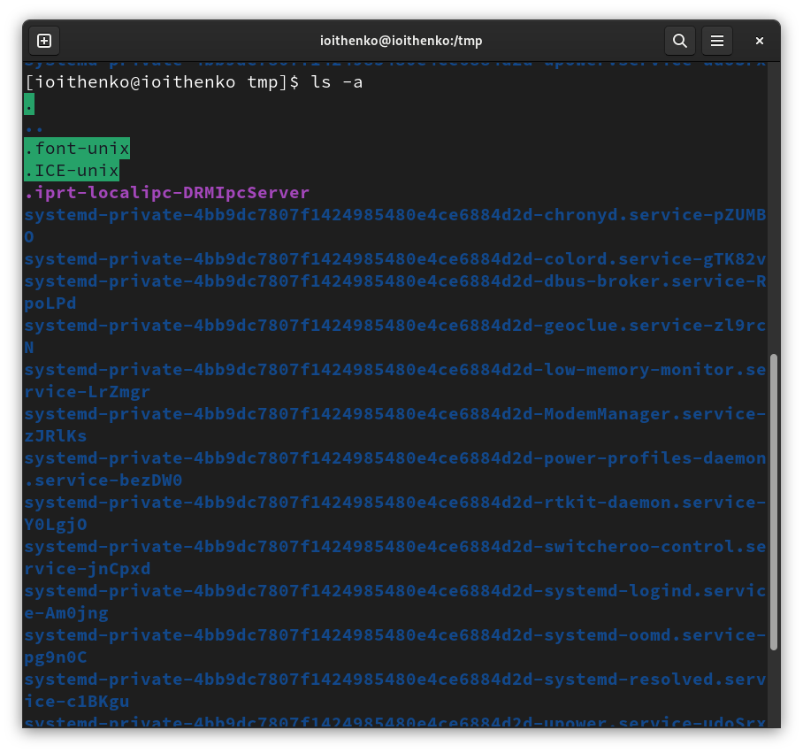
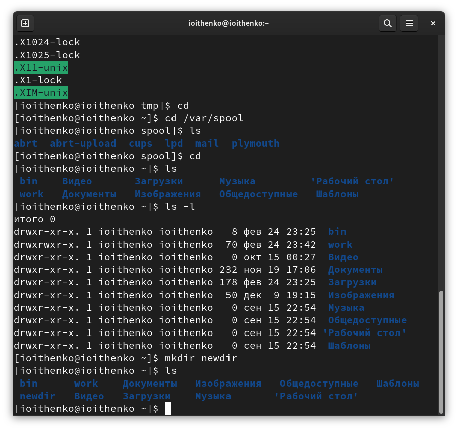
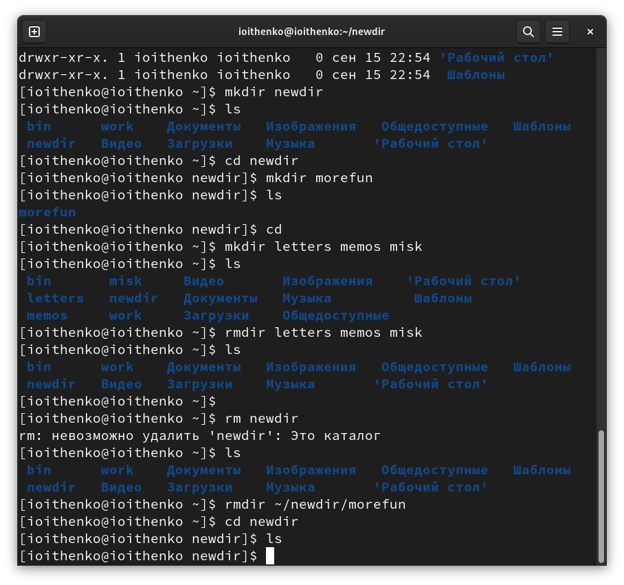
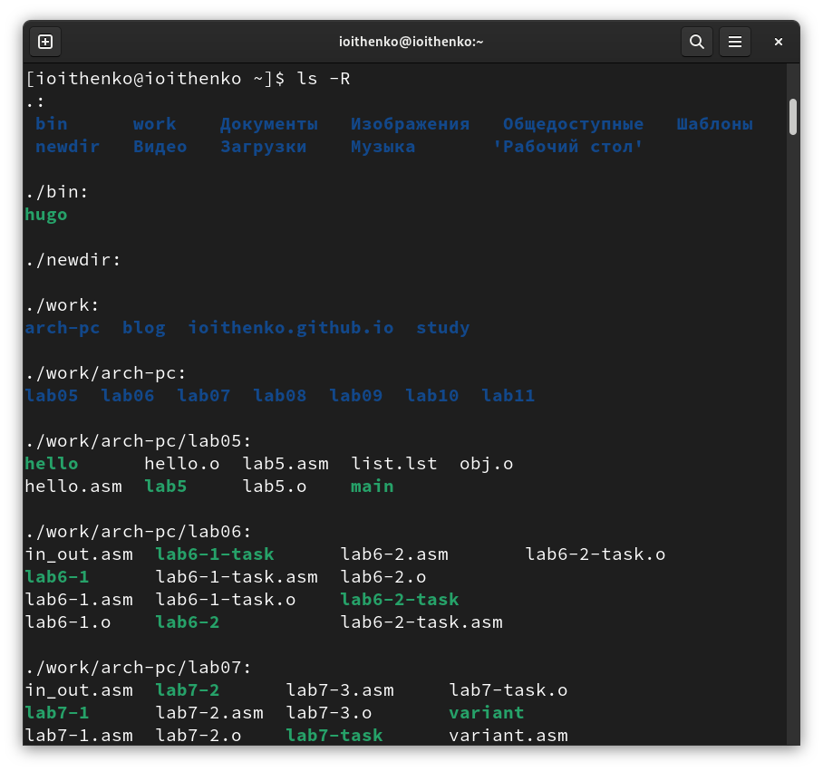
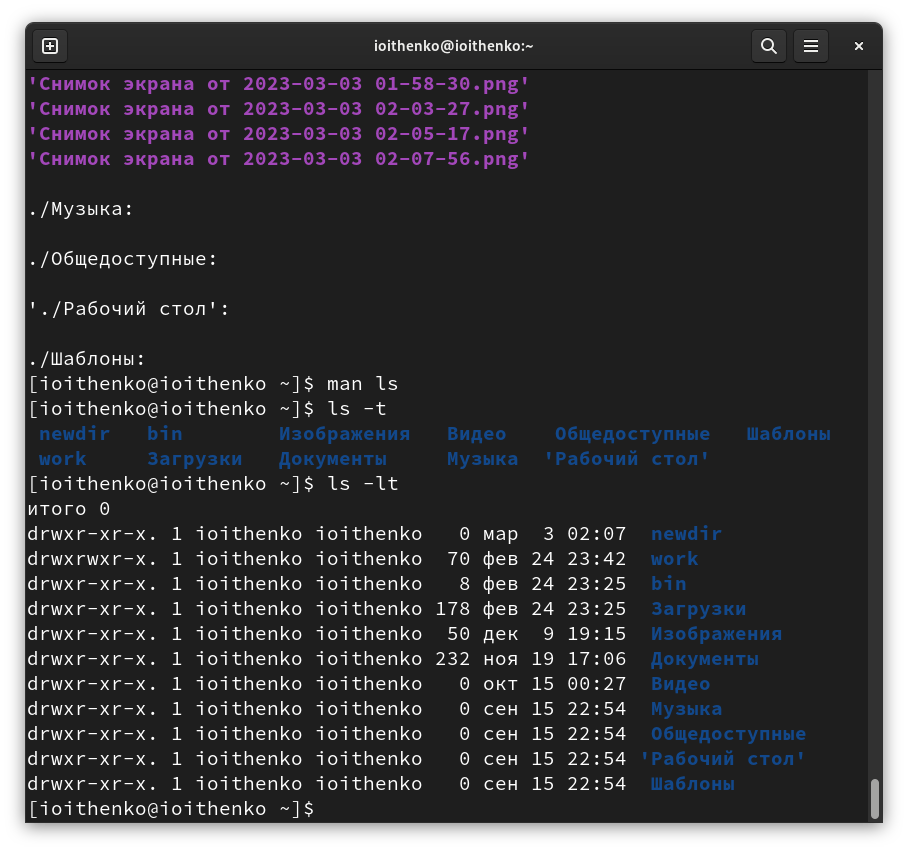
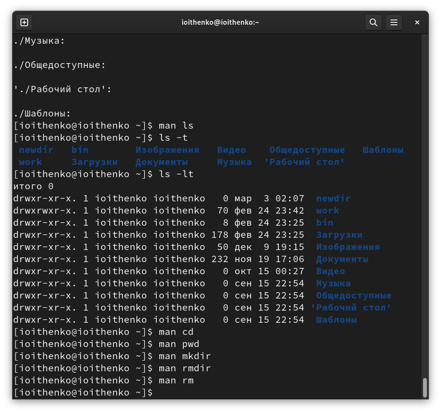
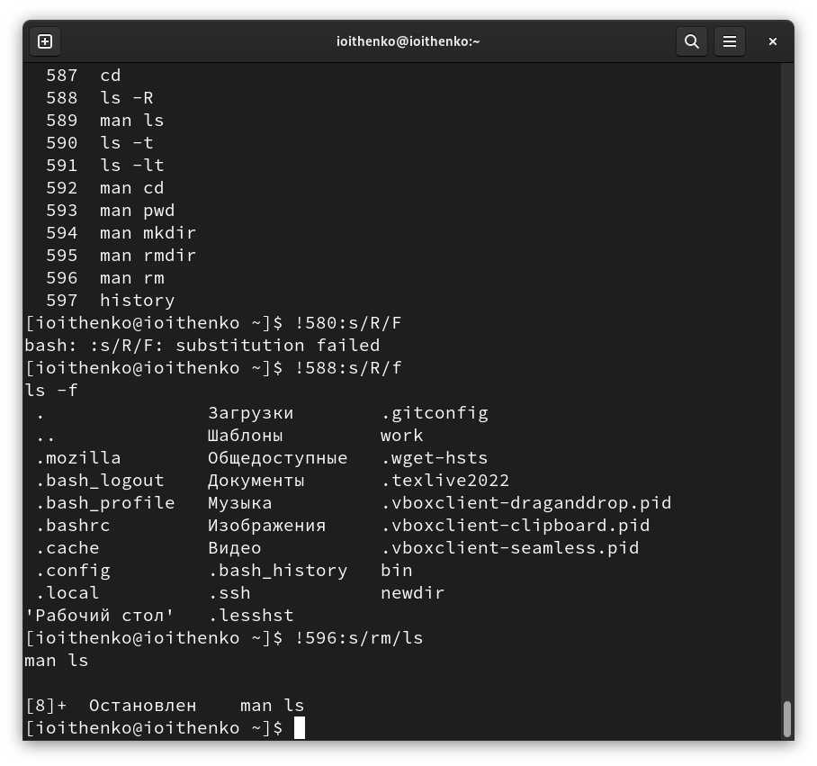

---
## Front matter
lang: ru-RU
title: Лабораторная работа №4
subtitle: Операционные системы
author:
  - Ищенко Ирина Олеговна
institute:
  - Российский университет дружбы народов, Москва, Россия
date: 3 марта 2023

## i18n babel
babel-lang: russian
babel-otherlangs: english

## Formatting pdf
toc: false
toc-title: Содержание
slide_level: 2
aspectratio: 169
section-titles: true
theme: metropolis
header-includes:
 - \metroset{progressbar=frametitle,sectionpage=progressbar,numbering=fraction}
 - '\makeatletter'
 - '\beamer@ignorenonframefalse'
 - '\makeatother'
---

## Докладчик

:::::::::::::: {.columns align=center}
::: {.column width="70%"}

  * Ищенко Ирина Олеговна
  * НПИбд-01-22

:::
::: {.column width="30%"}

:::
::::::::::::::

## Цели и задачи

Приобретение практических навыков взаимодействия пользователя с системой посредством командной строки.

# Выполнение лабораторной работы

## Команды pwd, cd

{#fig:001 width=50%}

## ls

{#fig:002 width=50%}

## Владелец каталогов

{#fig:003 width=50%}

## Создание и удаление каталогов

{#fig:004 width=50%}

## Удаление каталогов

{#fig:005 width=50%}

## ls -R

Опция команды  ls для просмотра содержимое не только указанного каталога, но и подкаталогов, входящих в него.

{#fig:006 width=40%}

## ls -lt

Опция команды ls, позволяющий отсортировать по времени последнего изменения выводимый список содержимого каталога с развёрнутым описанием файлов.

{#fig:007 width=40%}

## Команда man

{#fig:008 width=50%}

## Модификации

{#fig:009 width=50%}

# Вывод

## Вывод

В ходе выполнения лабораторной работы я приобрела практических навыков взаимодействия пользователя с системой посредством командной строки.

