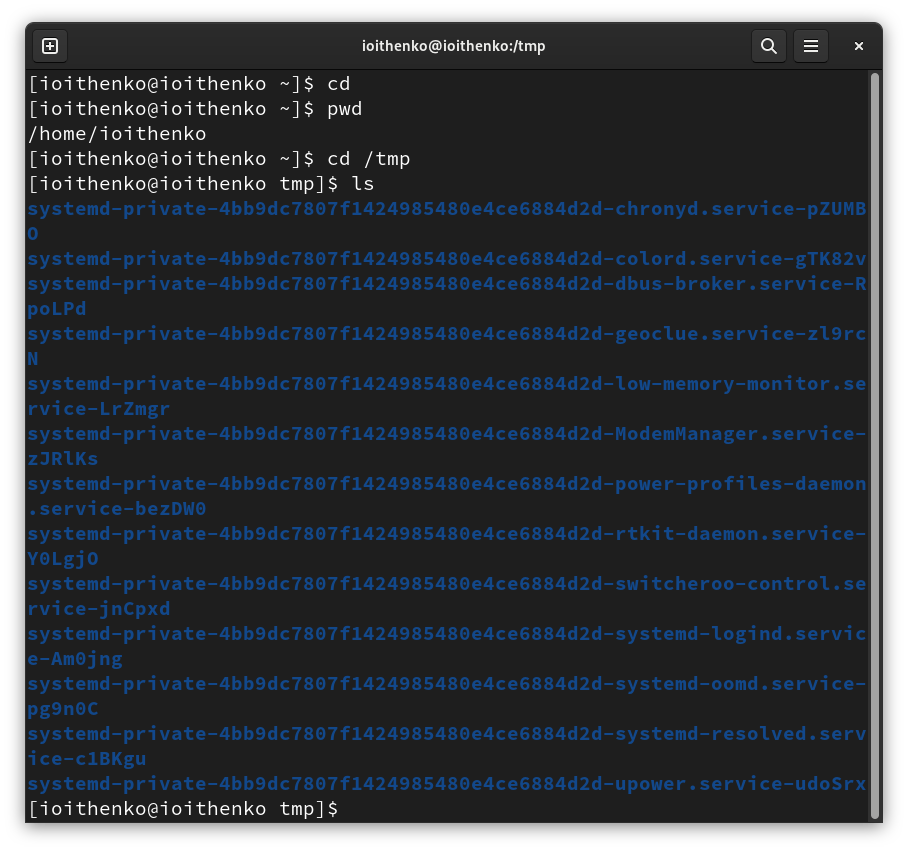
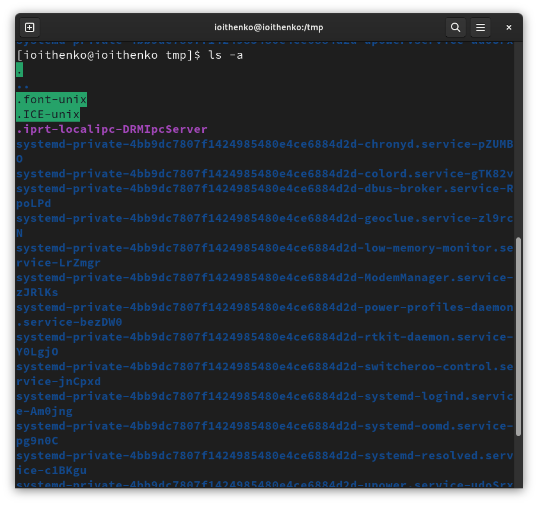
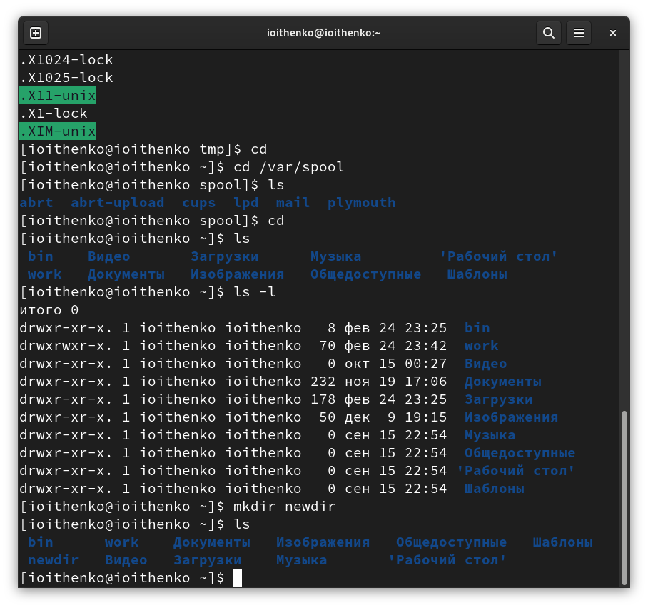
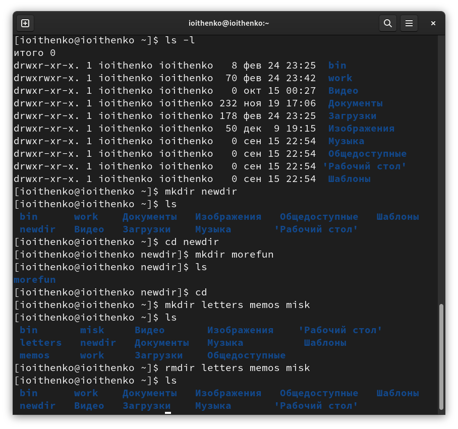
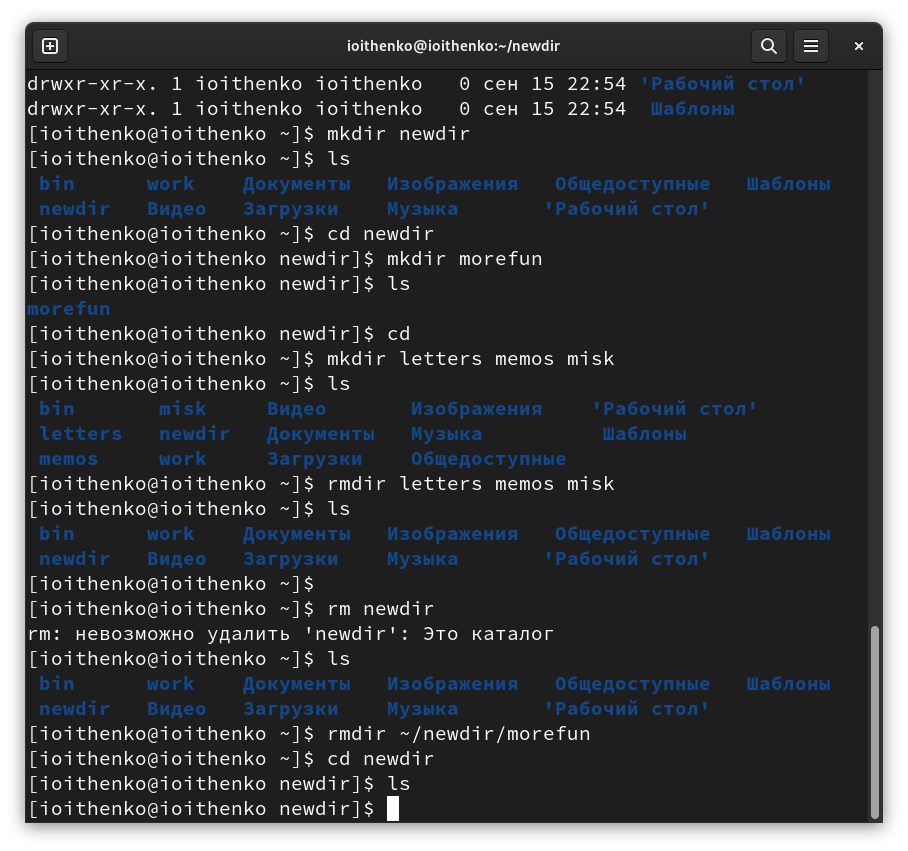
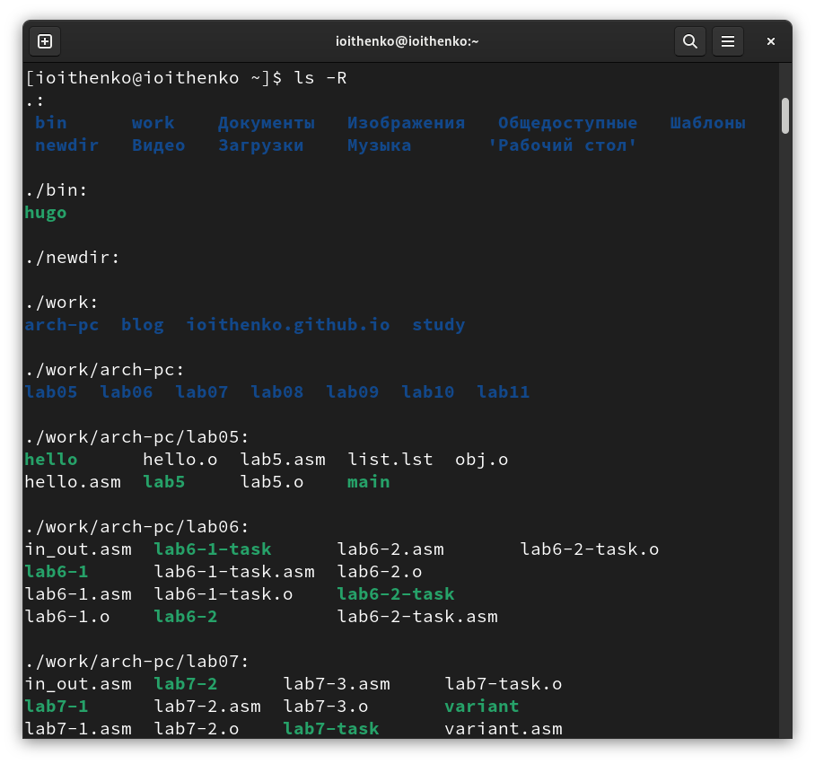
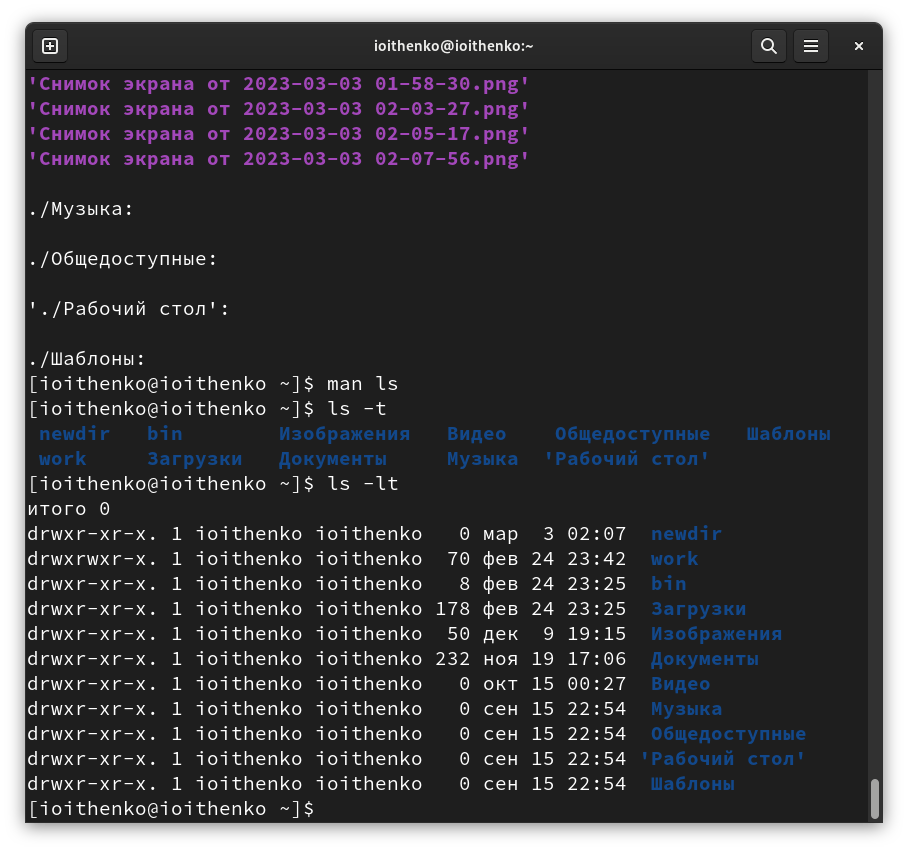
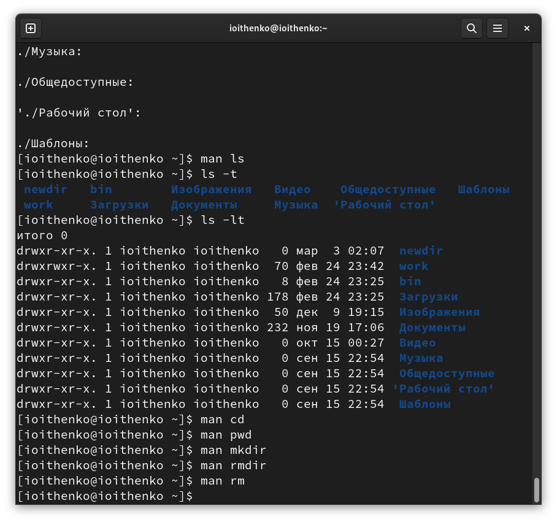
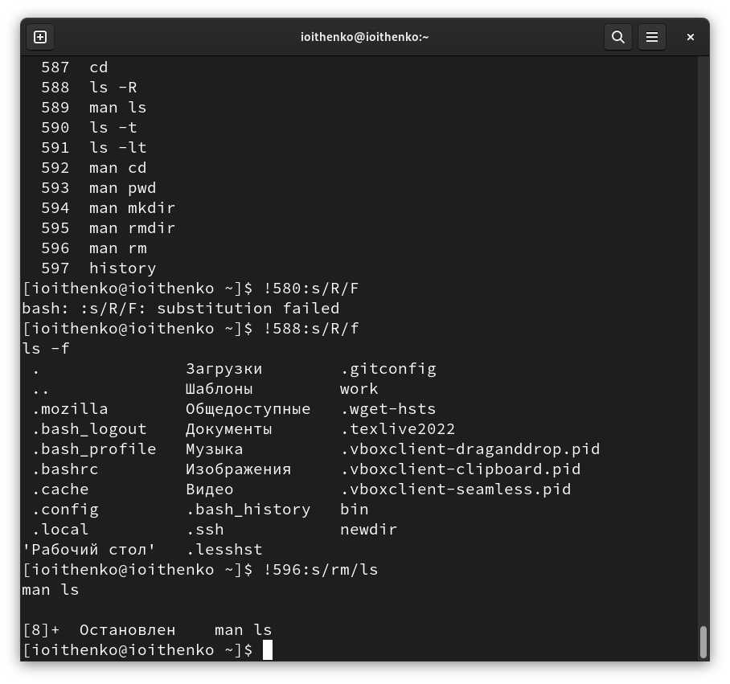

---
## Front matter
title: "Отчёт по лабораторной работе №4"
subtitle: "Дисциплина: Операционные системы"
author: "Ищенко Ирина Олеговна"

## Generic otions
lang: ru-RU
toc-title: "Содержание"

## Bibliography
bibliography: bib/cite.bib
csl: pandoc/csl/gost-r-7-0-5-2008-numeric.csl

## Pdf output format
toc: true # Table of contents
toc-depth: 2
lof: true # List of figures
lot: true # List of tables
fontsize: 12pt
linestretch: 1.5
papersize: a4
documentclass: scrreprt
## I18n polyglossia
polyglossia-lang:
  name: russian
  options:
	- spelling=modern
	- babelshorthands=true
polyglossia-otherlangs:
  name: english
## I18n babel
babel-lang: russian
babel-otherlangs: english
## Fonts
mainfont: PT Serif
romanfont: PT Serif
sansfont: PT Sans
monofont: PT Mono
mainfontoptions: Ligatures=TeX
romanfontoptions: Ligatures=TeX
sansfontoptions: Ligatures=TeX,Scale=MatchLowercase
monofontoptions: Scale=MatchLowercase,Scale=0.9
## Biblatex
biblatex: true
biblio-style: "gost-numeric"
biblatexoptions:
  - parentracker=true
  - backend=biber
  - hyperref=auto
  - language=auto
  - autolang=other*
  - citestyle=gost-numeric
## Pandoc-crossref LaTeX customization
figureTitle: "Рис."
tableTitle: "Таблица"
listingTitle: "Листинг"
lofTitle: "Список иллюстраций"
lotTitle: "Список таблиц"
lolTitle: "Листинги"
## Misc options
indent: true
header-includes:
  - \usepackage{indentfirst}
  - \usepackage{float} # keep figures where there are in the text
  - \floatplacement{figure}{H} # keep figures where there are in the text
---

# Цель работы

Приобретение практических навыков взаимодействия пользователя с системой посредством командной строки.

# Теоретическое введение

Команда man используется для просмотра (оперативная помощь) в диалоговом режиме руководства (manual) по основным командам операционной системы
типа Linux.

Команда cd используется для перемещения по файловой системе операционной системы типа Linux.

Для определения абсолютного пути к текущему каталогу используется
команда pwd (print working directory).

Команда ls используется для просмотра содержимого каталога.

Команда mkdir используется для создания каталогов.

Команда rm используется для удаления файлов и/или каталогов.

Для вывода на экран списка ранее выполненных команд используется команда history. Выводимые на экран команды в списке нумеруются. К любой
команде из выведенного на экран списка можно обратиться по её номеру в списке,
воспользовавшись конструкцией !<номер_команды>

# Выполнение лабораторной работы

Определяем полное имя вашего домашнего каталога с помощью команды pwd. 
Переходит в каталог /tmp с помощью команды cd.
Выведем на экран содержимое каталога /tmp (рис. @fig:001). Для этого используем команду ls с различными опциями (рис. @fig:002). При использовании ключа -а выводятся в том числе и скрытые каталоги.

{#fig:001 width=70%}

{#fig:002 width=70%}

С помощью команды ls определяем, есть ли в каталоге /var/spool подкаталог с именем cron. Каталог отсутствует.
Перейдем в домашний каталог и выведем на экран его содержимое. Определяем, кто является владельцем файлов и подкаталогов с помощью команды ls -l. Владельцем каталогов является ioithenko (рис. @fig:003).

{#fig:003 width=70%}

В домашнем каталоге создаем новый каталог с именем newdir.
В каталоге ~/newdir создаем новый каталог с именем morefun.
В домашнем каталоге создаем одной командой три новых каталога с именами
letters, memos, misk. Затем удаляем эти каталоги одной командой (рис. @fig:004).

{#fig:004 width=70%}

Попробуем удалить ранее созданный каталог ~/newdir командой rm. Каталог не был удален, так как командой rm можно удалить только пустые каталоги.
Удаляем каталог ~/newdir/morefun из домашнего каталога. Каталог удалён (рис. @fig:005).

{#fig:005 width=70%}

С помощью команды man определяем, какую опцию команды ls нужно использовать для просмотра содержимое не только указанного каталога, но и подкаталогов, входящих в него. Чтобы рекурсивно посмотреть содержимое каталогов используется ключ -R (рис. @fig:006).

{#fig:006 width=70%}

С помощью команды man определяем набор опций команды ls, позволяющий отсортировать по времени последнего изменения выводимый список содержимого каталога с развёрнутым описанием файлов. Ключ -lt (рис. @fig:007).

{#fig:007 width=70%}

Используем команду man для просмотра описания следующих команд: cd, pwd, mkdir, rmdir, rm (рис. @fig:008). Поясним основные опции этих команд:
cd используется для перехода в нужный каталог.
pwd - команда, позволяющая узнать полный путь к исходному файлу.
mkdir создает новые директории/каталоги.
rmdir удаляет каталоги.
rm - команда для удаления файлов и пустых каталогов.

{#fig:008 width=70%}

Используя информацию, полученную при помощи команды history, выполним модификацию и исполнение нескольких команд из буфера команд (рис. @fig:009).

{#fig:009 width=70%}

# Контрольные вопросы

1. Что такое командная строка?

Это специальная программа, которая позволяет управлять компьютером путем ввода текстовых команд с клавиатуры.
2. При помощи какой команды можно определить абсолютный путь текущего каталога? Приведите пример.

При помощи команды realpath. Например если ввести realpath timeout, то выведется /home/mial/bin/timeout.
3. При помощи какой команды и каких опций можно определить только тип файлов и их имена в текущем каталоге? Приведите примеры.

Только тип файлов и их имена в текущем каталоге можно определить с помощью команды ls -F.
4. Каким образом отобразить информацию о скрытых файлах? Приведите примеры.

Отобразить информацию о скрытых файлах можно с помощью команды ls -a.
5. При помощи каких команд можно удалить файл и каталог? Можно ли это сделать одной и той же командой? Приведите примеры.

Удалить файл и каталог можно с помощью команд rm и rmdir. Это нельзя сделать одной и той же командой, так как rmdir используется чтобы удалять пустые файлы, а rm используется чтобы удалить не пустые файлы.
6. Каким образом можно вывести информацию о последних выполненных пользователем командах?

При помощи команды history.
7. Как воспользоваться историей команд для их модифицированного выполнения? Приведите примеры.

Это можно сделать с помощью следующей команды: !<номер_команды>:s/<что_меняем>/<на_что_меняем>. Например: history ls -F !282:s/F/a.
8. Приведите примеры запуска нескольких команд в одной строке.
Например: mkdir newdir; cd newdir; ls.
9. Дайте определение и приведите примера символов экранирования.

Экранирование - это замена в тексте управляющих символов на соответствующие текстовые подстановки. Один из видов управляющих последовательностей. Пример символа : "".
10. Охарактеризуйте вывод информации на экран после выполнения команды ls с опцией l.

После выполнения команды ls с опцией l выводится подробный список файлов, в котором отображается владелец, группа, дата создания размер и т.д.
11. Что такое относительный путь к файлу? Приведите примеры использования относительного и абсолютного пути при выполнении какой-либо команды.

Относительный путь к файлу - это путь к файлу относительно текущей папки. При импользовании команды pwd на экран выведется относительный путь текущей директории, а при команде realpath на экран выведется абсолютный путь текущей директории.
12. Как получить информацию об интересующей вас команде?

С помощью команды man.
13. Какая клавиша или комбинация клавиш служит для автоматического дополнения вводимых команд?

Клавиша tab cлужит для автоматического дополнения вводимых команд.

# Выводы

В ходе выполнения лабораторной работы я приобрела практических навыков взаимодействия пользователя с системой посредством командной строки.
