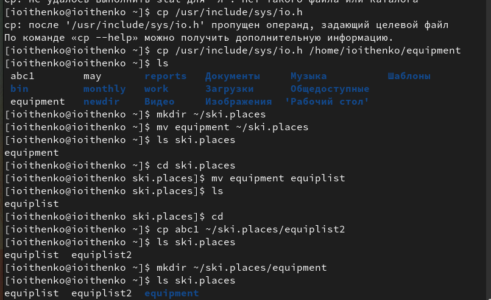
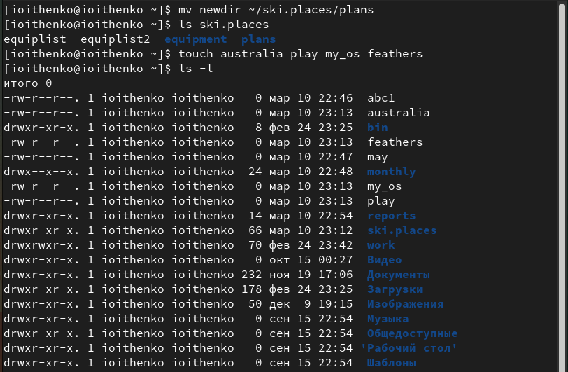
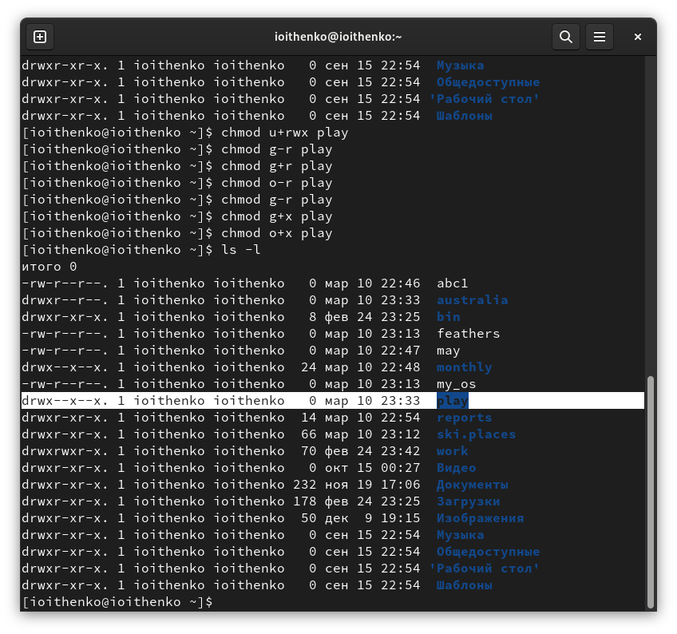
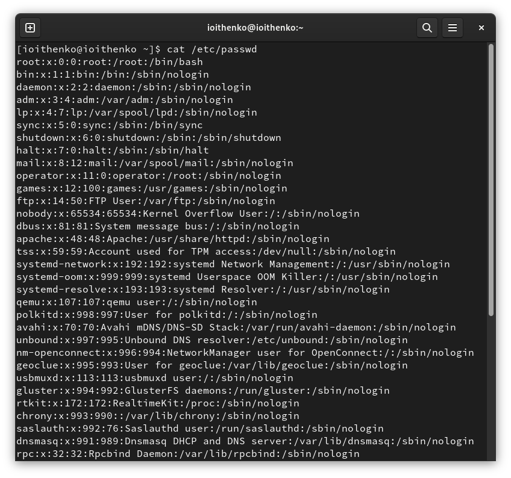
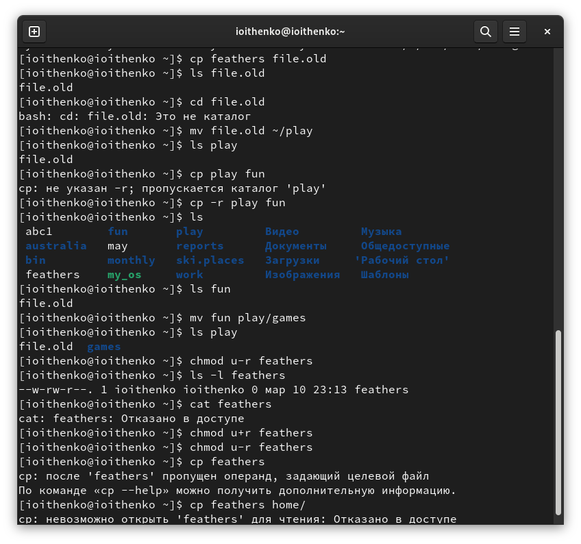
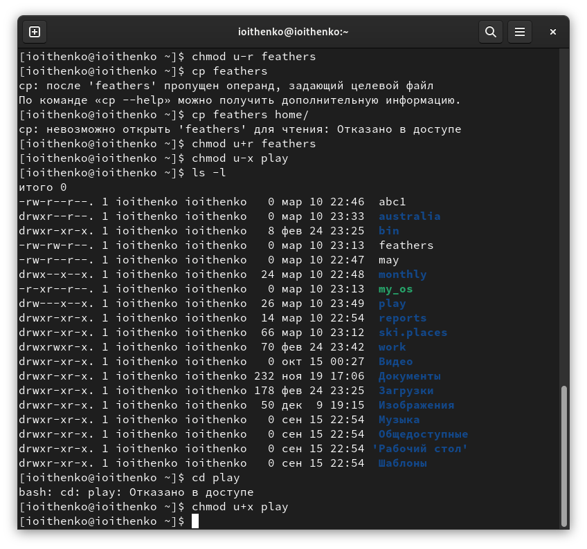

---
## Front matter
lang: ru-RU
title: Лабораторная работа №5
subtitle: Анализ файловой системы Linux. Команды для работы с файлами и каталогами

author:
  - Ищенко Ирина Олеговна
institute:
  - Российский университет дружбы народов, Москва, Россия
date: 11 марта 2023

## i18n babel
babel-lang: russian
babel-otherlangs: english

## Formatting pdf
toc: false
toc-title: Содержание
slide_level: 2
aspectratio: 169
section-titles: true
theme: metropolis
header-includes:
 - \metroset{progressbar=frametitle,sectionpage=progressbar,numbering=fraction}
 - '\makeatletter'
 - '\beamer@ignorenonframefalse'
 - '\makeatother'
---

## Докладчик

:::::::::::::: {.columns align=center}
::: {.column width="70%"}

  * Ищенко Ирина Олеговна
  * НПИбд-01-22
  

:::
::: {.column width="30%"}

:::
::::::::::::::

## Цель

Ознакомление с файловой системой Linux, её структурой, именами и содержанием каталогов. Приобретение практических навыков по применению команд для работы с файлами и каталогами, по управлению процессами (и работами), по проверке использования диска и обслуживанию файловой системы

# Выполнение работы

## Копирование и перемещение

{#fig:001 width=50%}

## Перемещение и переименование

{#fig:002 width=50%}

## Право доступа

{#fig:003 width=50%}

## Команда cat

{#fig:004 width=50%}

## Cp, mv, chmod

{#fig:005 width=50%}

## Лишение права доступа

{#fig:006 width=50%}

## Утилиты

mount - утилита командной строки в UNIX-подобных операционных системах. Применяется для монтирования файловых систем.

fsck - это утилита командной строки, которая позволяет выполнять проверки согласованности и интерактивное исправление в одной или нескольких файловых системах Linux.

mkfs - используется для создания файловой системы Linux на некотором устройстве, обычно в разделе жёсткого диска.

kill - является встроенной командой командной оболочки, предназначенной для отправки системных сигналов определенным процессам.

# Вывод

## Вывод

В ходе лабораторной работв я знакомилась с файловой системой Linux, её структурой, именами и содержанием каталогов, приобрела практические навыки по применению команд для работы с файлами и каталогами, по управлению процессами (и работами), по проверке использования диска и обслуживанию файловой системы.
