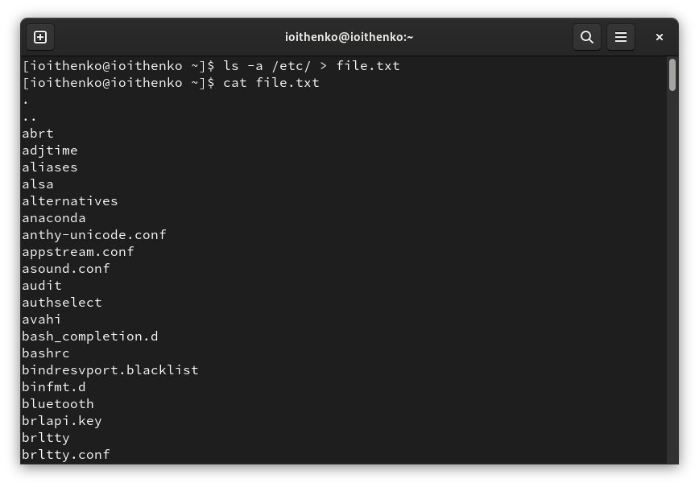
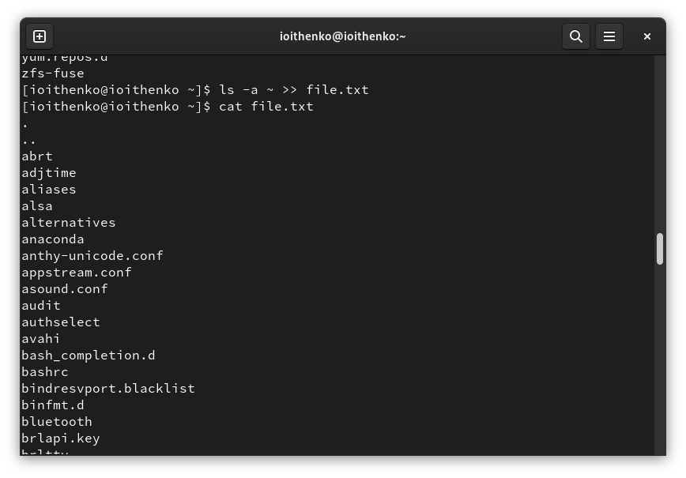
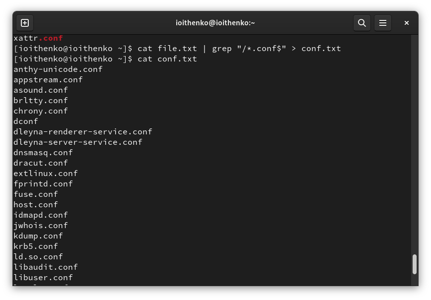
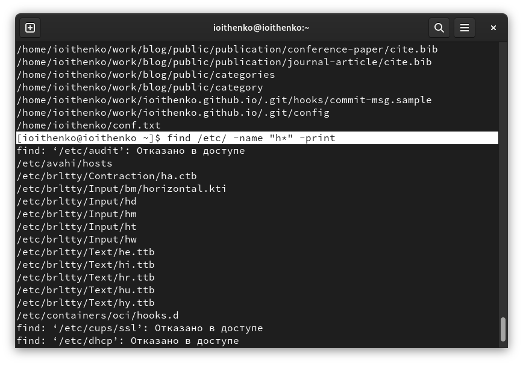
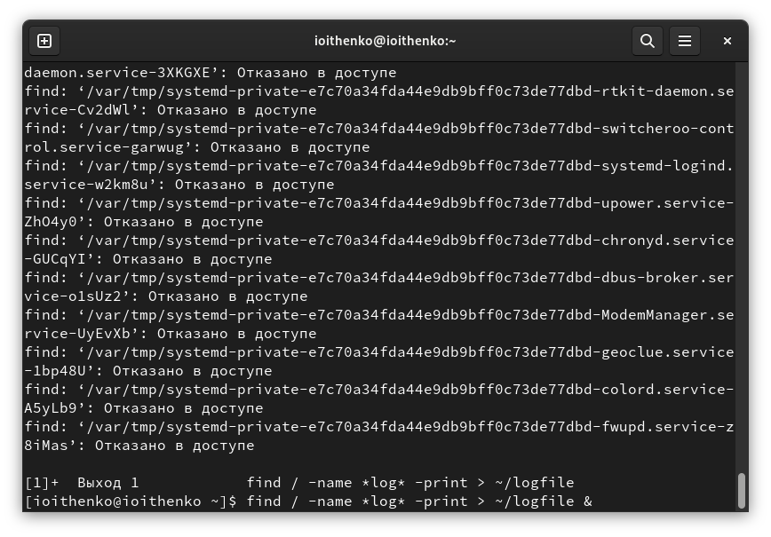
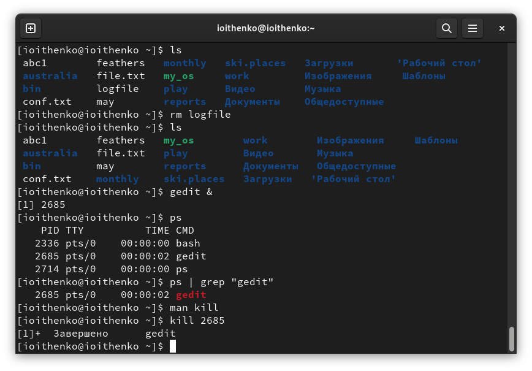
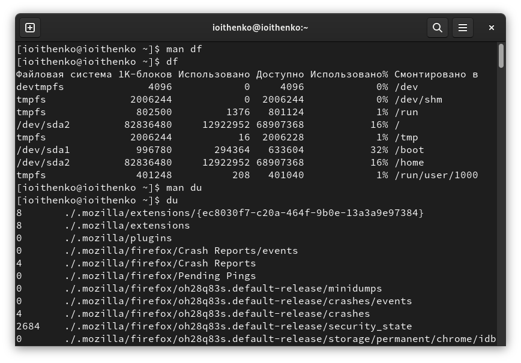
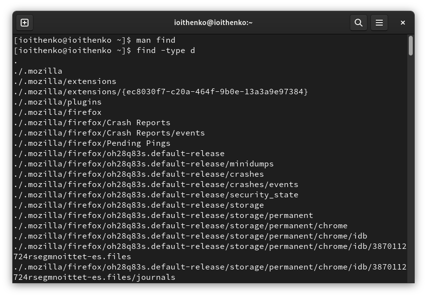

---
## Front matter
lang: ru-RU
title: Лабораторная работа №6
subtitle: Операционные системы
author:
  - Ищенко Ирина Олеговна
institute:
  - Российский университет дружбы народов, Москва, Россия
date: 15 марта 2023

## i18n babel
babel-lang: russian
babel-otherlangs: english

## Formatting pdf
toc: false
toc-title: Содержание
slide_level: 2
aspectratio: 169
section-titles: true
theme: metropolis
header-includes:
 - \metroset{progressbar=frametitle,sectionpage=progressbar,numbering=fraction}
 - '\makeatletter'
 - '\beamer@ignorenonframefalse'
 - '\makeatother'
---

## Докладчик

:::::::::::::: {.columns align=center}
::: {.column width="70%"}

  * Ищенко Ирина Олеговна
  * НПИбд-01-22

:::
::: {.column width="30%"}

:::
::::::::::::::

## Цель работы

- Ознакомление с инструментами поиска файлов и фильтрации текстовых данных.
- Приобретение практических навыков: по управлению процессами (и заданиями), по проверке использования диска и обслуживанию файловых систем.

# Выполнение лабораторной работы

## Запись названия файлов в отдельный файл

{#fig:001 width=60%}

## Дополнение записи в файле

{#fig:002 width=60%}

## Запись в текстовый файл

{#fig:003 width=60%}

## Поиск файла

{#fig:004 width=60%}

## Запуск в фоновом режиме и запись в файл

{#fig:005 width=60%}

## Прерывание процесса по его идентификатору

{#fig:006 width=60%}

## df и du

{#fig:007 width=60%}

## Все директории в домашнем каталоге

{#fig:008 width=60%}

# Вывод

## Вывод

В ходе лабораторной работы я ознакомилась с инструментами поиска файлов и фильтрации текстовых данных, а также приобрела практические навыки: по управлению процессами (и заданиями), по проверке использования диска и обслуживанию файловых систем.
