---
## Front matter
lang: ru-RU
title: Лабораторная работа №7
subtitle: Операционные системы
author:
  - Ищенко Ирина Олеговна
institute:
  - Российский университет дружбы народов, Москва, Россия
 
date: 25 марта 2023

## i18n babel
babel-lang: russian
babel-otherlangs: english

## Formatting pdf
toc: false
toc-title: Содержание
slide_level: 2
aspectratio: 169
section-titles: true
theme: metropolis
header-includes:
 - \metroset{progressbar=frametitle,sectionpage=progressbar,numbering=fraction}
 - '\makeatletter'
 - '\beamer@ignorenonframefalse'
 - '\makeatother'
---

## Докладчик

:::::::::::::: {.columns align=center}
::: {.column width="70%"}

  * Ищенко Ирина Олеговна
  * НПИбд-01-22
  
:::
::: {.column width="30%"}

:::
::::::::::::::

## Цель

Освоение основных возможностей командной оболочки Midnight Commander. Приобретение навыков практической работы по просмотру каталогов и файлов; манипуляций с ними.

# Выполнение лабораторной работы

## Копирование файла

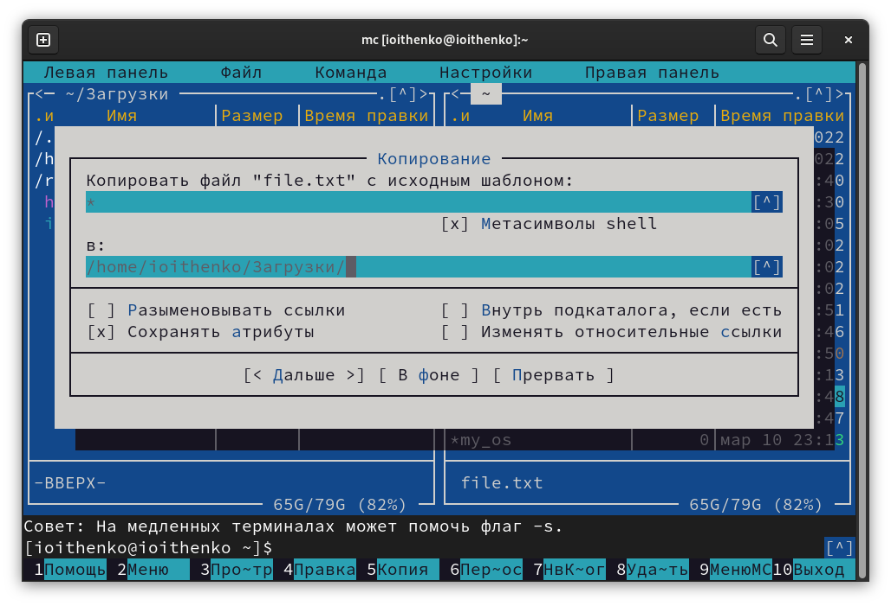{ #fig:001 width=50% }

## Создание каталога

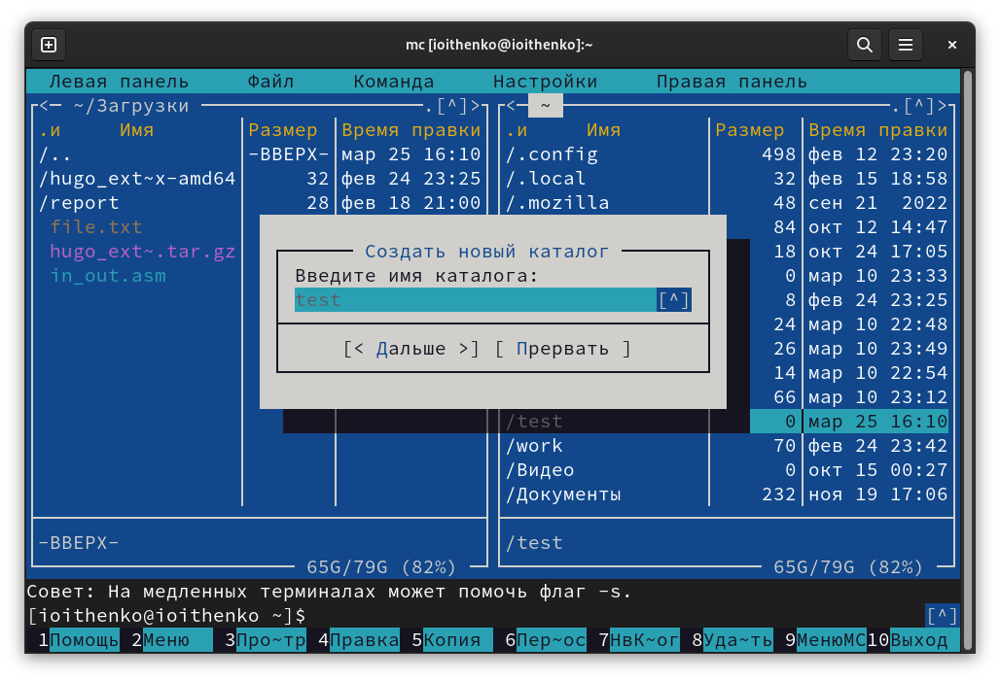{ #fig:002 width=50% }

## Редактирование файла

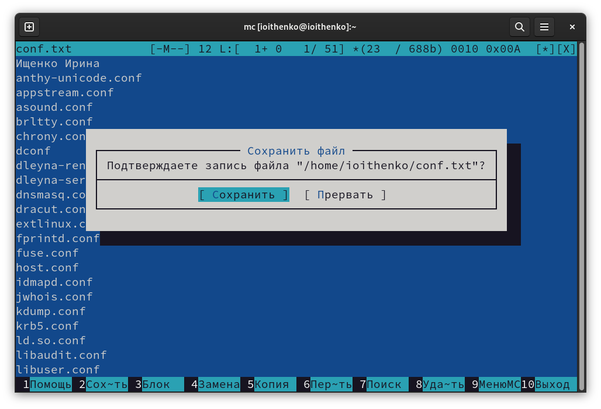{ #fig:003 width=50% }

## Поиск файла

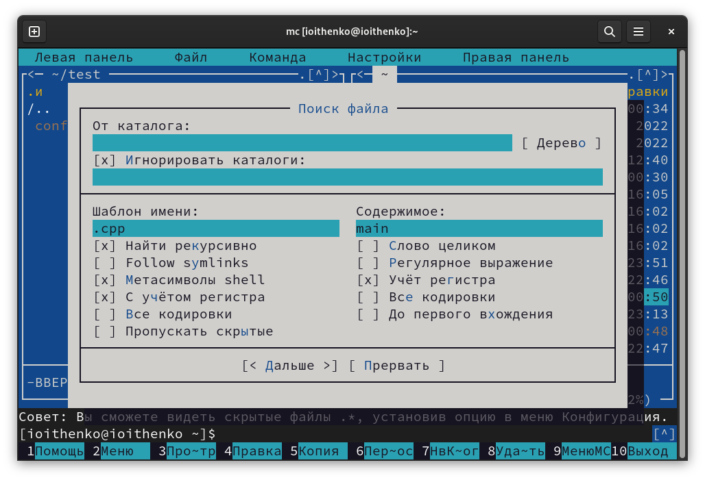{ #fig:004 width=50% }

## Последняя выполненная команда

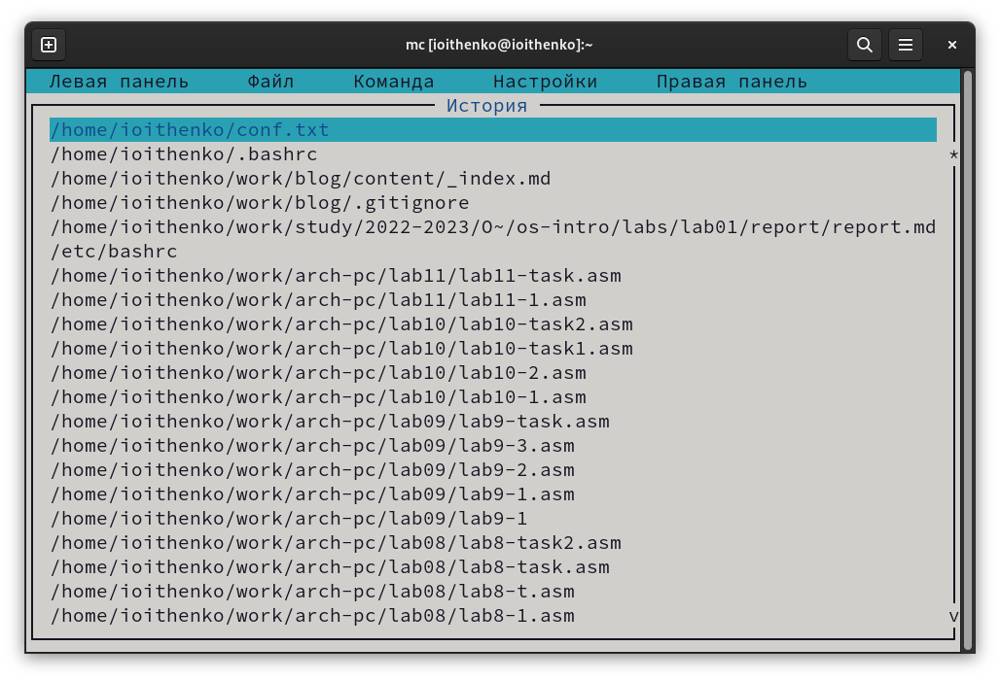{ #fig:005 width=50% }

## Удаление строки текста 
 
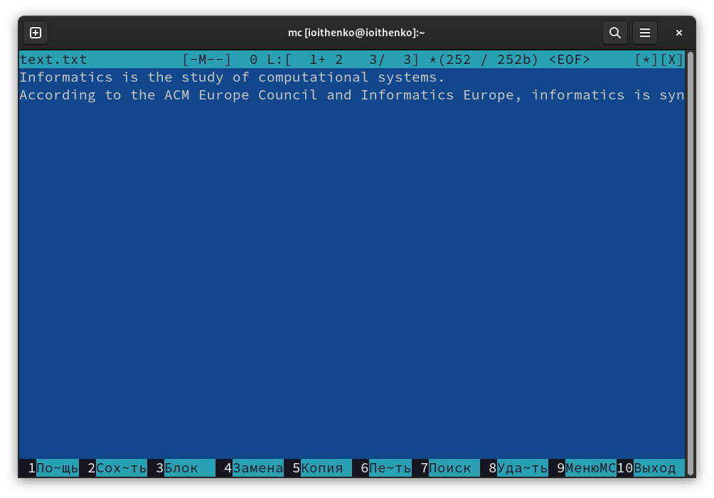{ #fig:006 width=50% }

## Копирование фрагмента текста

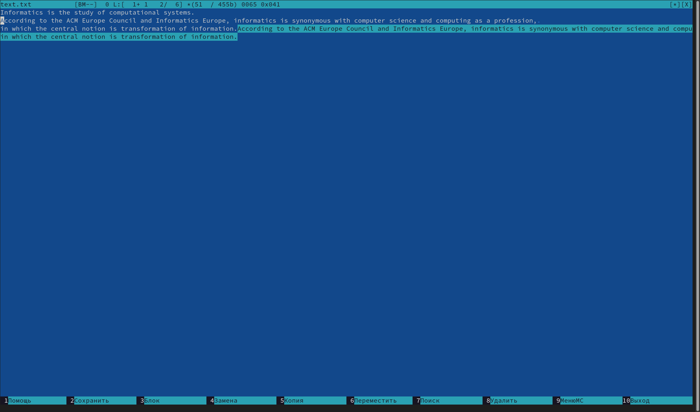{ #fig:007 width=50% }

## Перенос текста
 
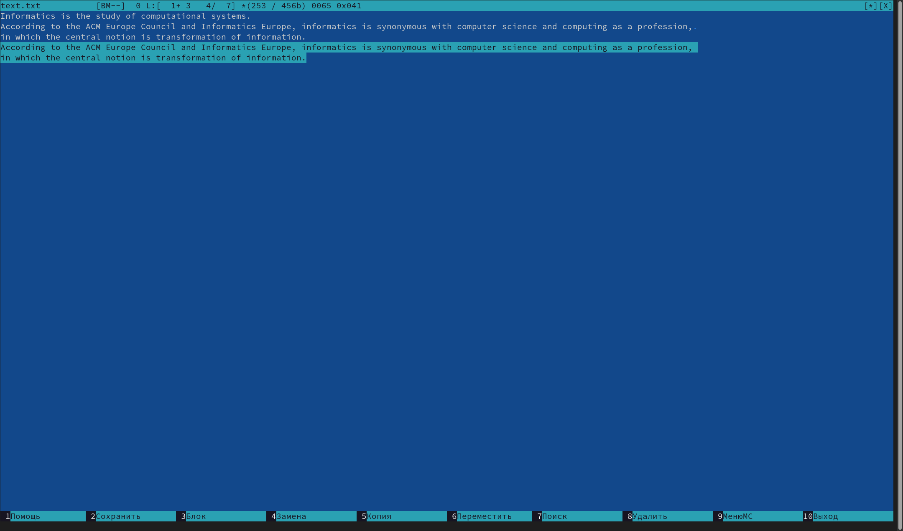{ #fig:008 width=50% }

## Переход в начало и конец файла

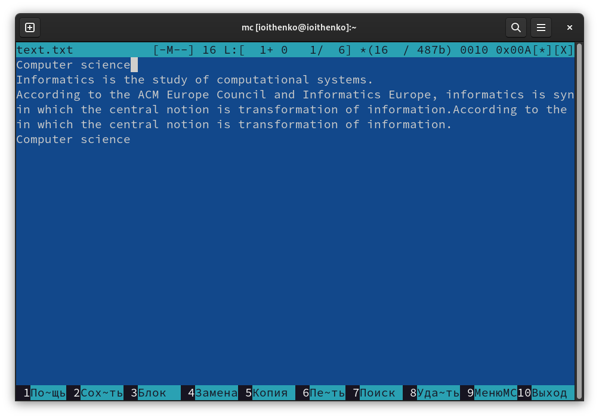{ #fig:009 width=50% }

## Изменение подсветки синтаксиса

:::::::::::::: {.columns align=center}
::: {.column width="50%"}

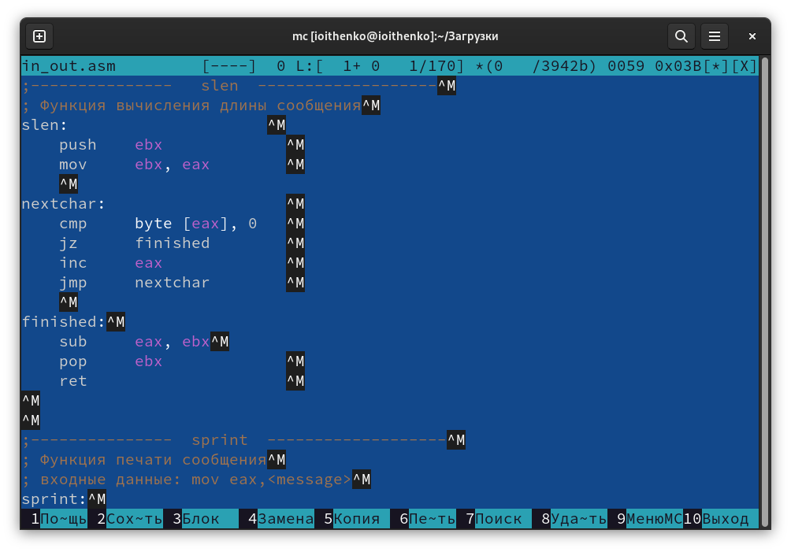{ #fig:010 width=70% }

:::
::: {.column width="50%"}

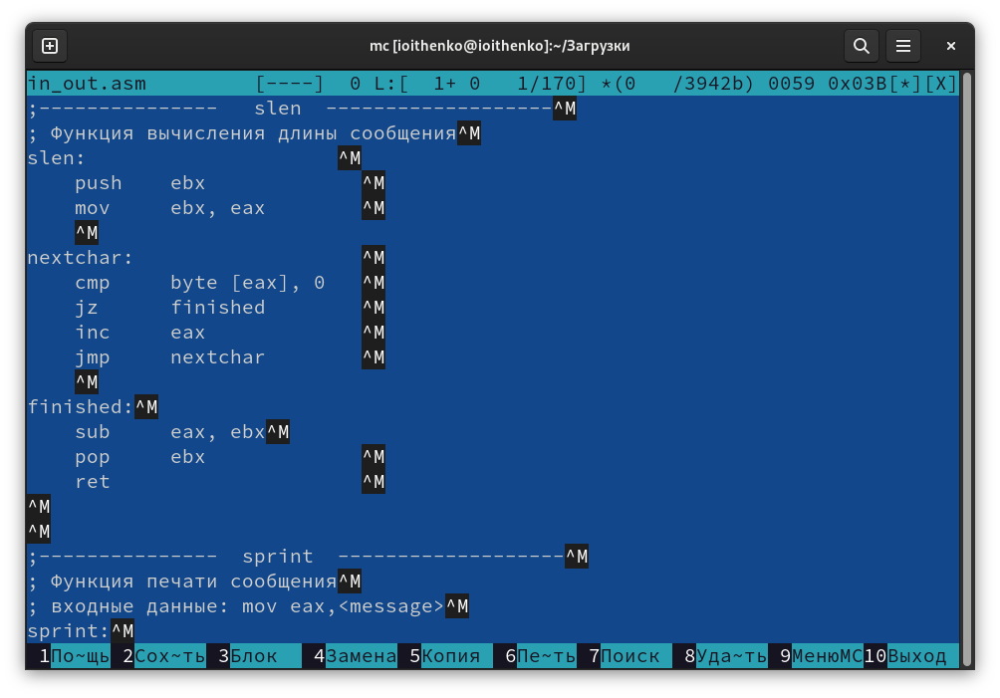{ #fig:011 width=70% }

:::
::::::::::::::

## Вывод

В ходе выполнения лабораторной работы я освоила основные возможности командной оболочки Midnight Commander. Приобрела навыки практической работы по просмотру каталогов и файлов; манипуляций с ними.

