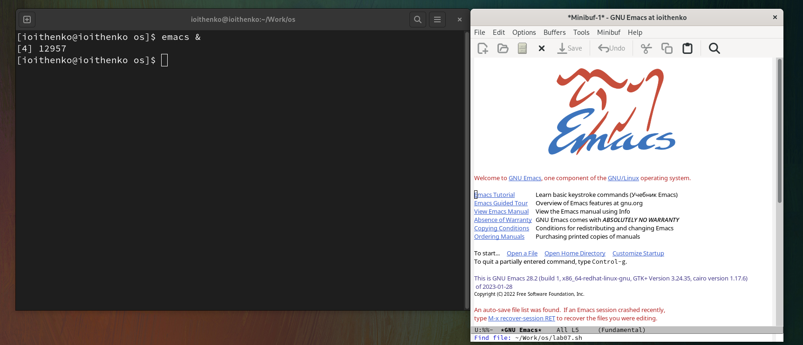
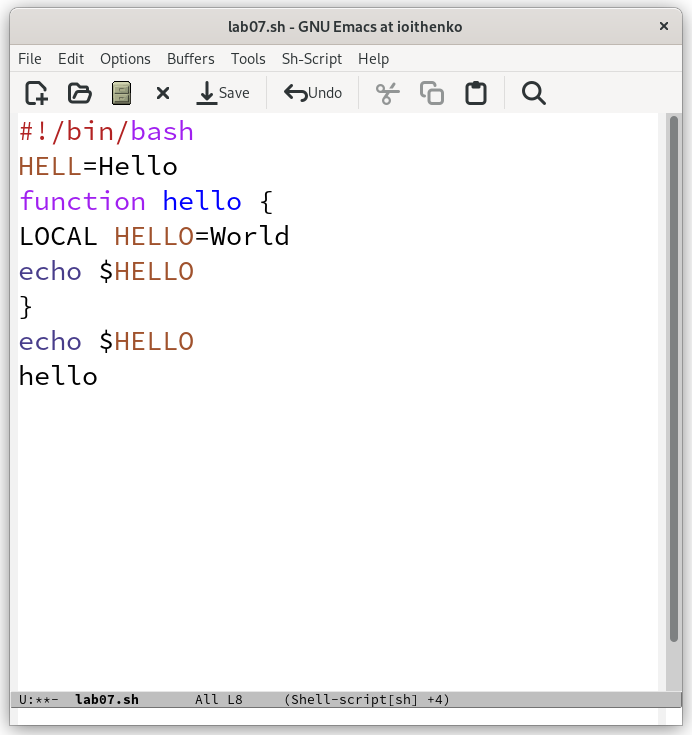
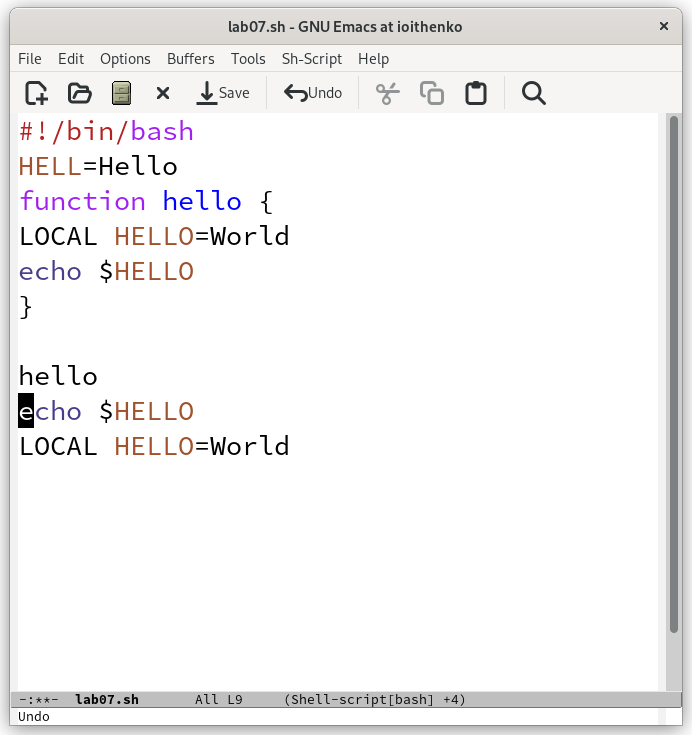
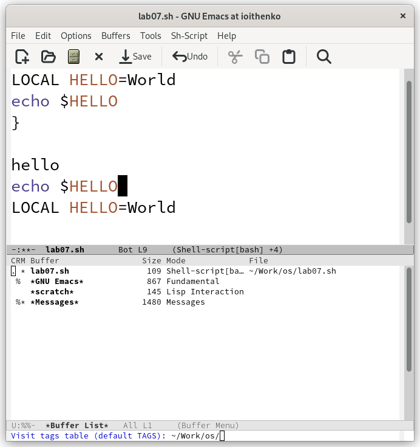
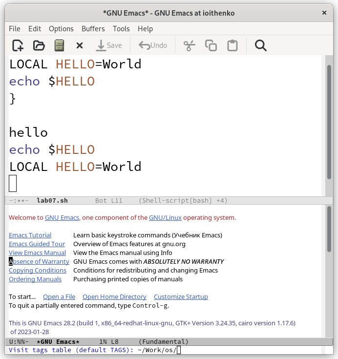
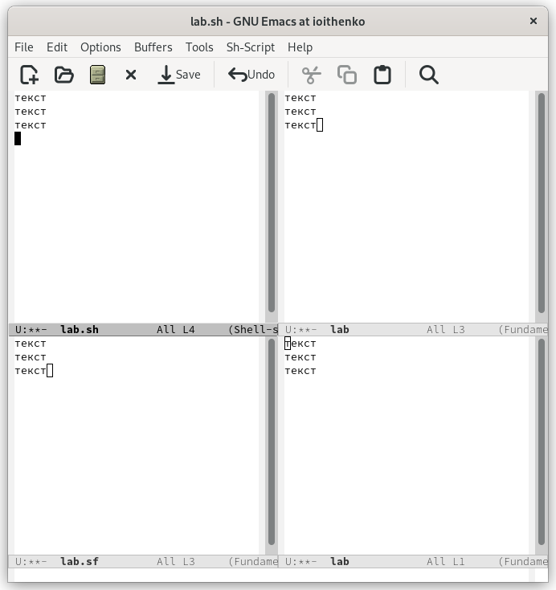
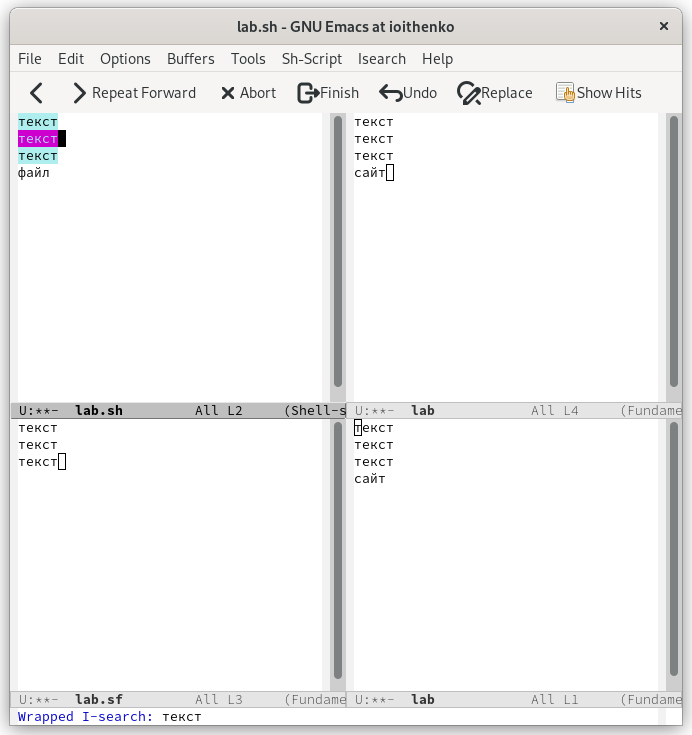
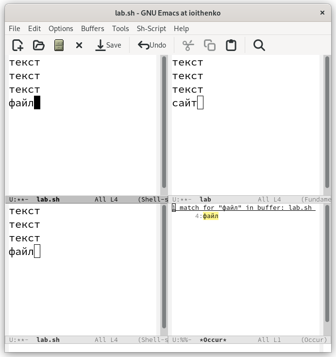

---
## Front matter
lang: ru-RU
title: Лабораторная работа №9
subtitle: Операционные системы
author:
  - Ищенко Ирина Олеговна
institute:
  - Российский университет дружбы народов, Москва, Россия
date: 07 апреля 2023

## i18n babel
babel-lang: russian
babel-otherlangs: english

## Formatting pdf
toc: false
toc-title: Содержание
slide_level: 2
aspectratio: 169
section-titles: true
theme: metropolis
header-includes:
 - \metroset{progressbar=frametitle,sectionpage=progressbar,numbering=fraction}
 - '\makeatletter'
 - '\beamer@ignorenonframefalse'
 - '\makeatother'
---

## Докладчик

:::::::::::::: {.columns align=center}
::: {.column width="70%"}

  * Ищенко Ирина Олеговна
  * НПИбд-01-22

:::
::: {.column width="30%"}

:::
::::::::::::::

## Цель 

Познакомиться с операционной системой Linux. Получить практические навыки работы с редактором Emacs.

# Выполнение лабораторной работы

## Открытие emacs

{ #fig:001 width=50% }

## Заданный текст

{ #fig:002 width=50% }

## Введенный текст после нескольких модификаций

{ #fig:003 width=50% }

## Список активных буферов

{ #fig:004 width=50% }

## Перемещение между буферами

{ #fig:005 width=50% }

## Открытие и заполнение нового файла в 4 окнах

{ #fig:006 width=50% }

## Поиск в тексте с помощью C+s

{ #fig:007 width=50% }

## Поиск в тексте с помощью M+s o

{ #fig:008 width=50% }

## Вывод

В ходе выполнения лабораторной работы я познакомилась с операционной системой Linux, а также получила практические навыки работы с редактором Emacs.

