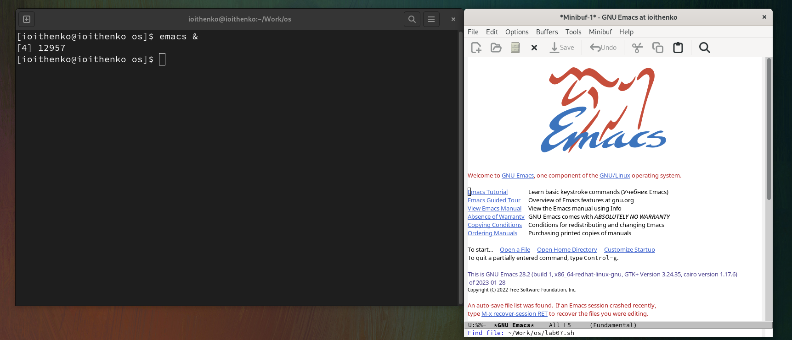
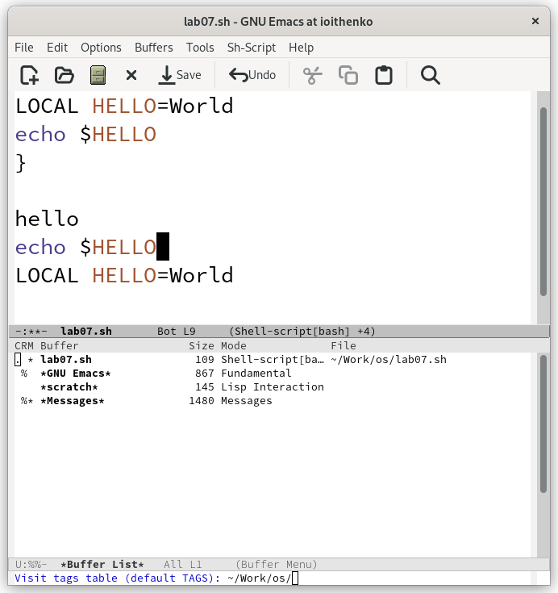
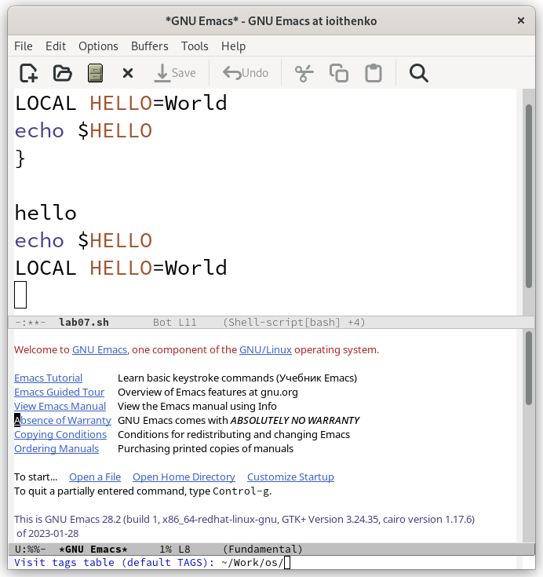
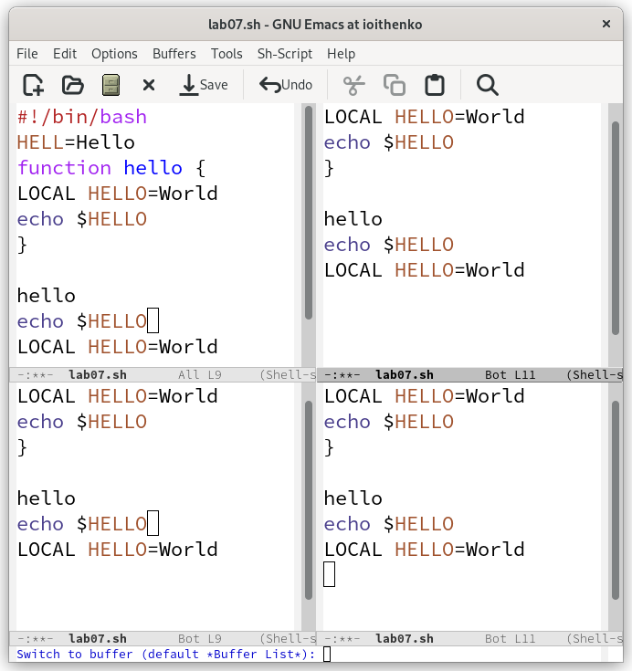
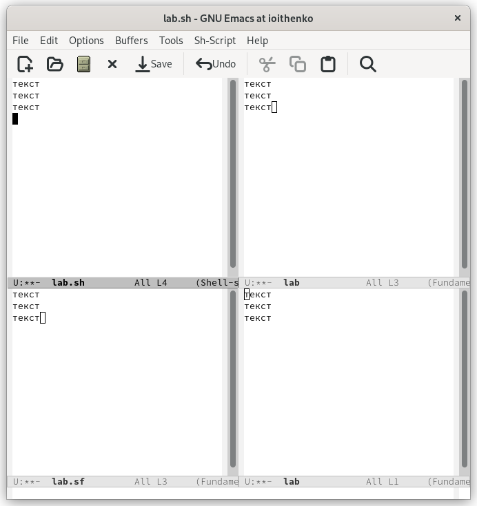
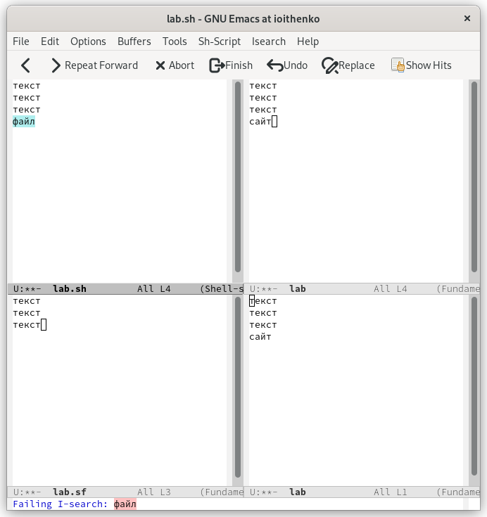

---
## Front matter
title: "Лабораторная работа №9"
subtitle: "Операционные системы"
author: "Ищенко Ирина Олеговна"

## Generic otions
lang: ru-RU
toc-title: "Содержание"

## Bibliography
bibliography: bib/cite.bib
csl: pandoc/csl/gost-r-7-0-5-2008-numeric.csl

## Pdf output format
toc: true # Table of contents
toc-depth: 2
lof: true # List of figures
lot: true # List of tables
fontsize: 12pt
linestretch: 1.5
papersize: a4
documentclass: scrreprt
## I18n polyglossia
polyglossia-lang:
  name: russian
  options:
	- spelling=modern
	- babelshorthands=true
polyglossia-otherlangs:
  name: english
## I18n babel
babel-lang: russian
babel-otherlangs: english
## Fonts
mainfont: PT Serif
romanfont: PT Serif
sansfont: PT Sans
monofont: PT Mono
mainfontoptions: Ligatures=TeX
romanfontoptions: Ligatures=TeX
sansfontoptions: Ligatures=TeX,Scale=MatchLowercase
monofontoptions: Scale=MatchLowercase,Scale=0.9
## Biblatex
biblatex: true
biblio-style: "gost-numeric"
biblatexoptions:
  - parentracker=true
  - backend=biber
  - hyperref=auto
  - language=auto
  - autolang=other*
  - citestyle=gost-numeric
## Pandoc-crossref LaTeX customization
figureTitle: "Рис."
tableTitle: "Таблица"
listingTitle: "Листинг"
lofTitle: "Список иллюстраций"
lotTitle: "Список таблиц"
lolTitle: "Листинги"
## Misc options
indent: true
header-includes:
  - \usepackage{indentfirst}
  - \usepackage{float} # keep figures where there are in the text
  - \floatplacement{figure}{H} # keep figures where there are in the text
---

# Цель работы

Познакомиться с операционной системой Linux. Получить практические навыки работы с редактором Emacs.

# Теоретическое введение

Буфер — объект, представляющий какой-либо текст.

Буфер может содержать что угодно, например, результаты компиляции программы или встроенные подсказки. Практически всё взаимодействие с пользователем, в том числе интерактивное, происходит посредством буферов.

Фрейм соответствует окну в обычном понимании этого слова. Каждый
фрейм содержит область вывода и одно или несколько окон Emacs.

Окно — прямоугольная область фрейма, отображающая один из буферов.

Каждое окно имеет свою строку состояния, в которой выводится следующая информация: название буфера, его основной режим, изменялся ли текст буфера и как далеко вниз
по буферу расположен курсор. Каждый буфер находится только в одном из возможных
основных режимов. Существующие основные режимы включают режим Fundamental
(наименее специализированный), режим Text, режим Lisp, режим С, режим Texinfo и другие. Под второстепенными режимами понимается список режимов, которые включены в данный момент в буфере выбранного окна.

Область вывода — одна или несколько строк внизу фрейма, в которой
Emacs выводит различные сообщения, а также запрашивает подтверждения и дополнительную информацию от пользователя.

Минибуфер используется для ввода дополнительной информации и всегда отображается в области вывода.

Точка вставки — место вставки (удаления) данных в буфере.

# Выполнение лабораторной работы

1. Открываю emacs (рис. @fig:001): 

{ #fig:001 width=70% }

2. Создаю файл lab07.sh, воспользовавшись комбинацией клавиш C+x, C+f. 
Далее я буду использовать следующие сокращения: C – Ctrl, S – Shift, M – Meta, X – Shift+x (S+x), % - Shift+x (S+x) и т.д.

3. Набираю текст, представленный в задании (рис. @fig:002):

{ #fig:002 width=70% }

4. Сохраняю файл, применив комбинацию клавиш C+x C+s.

5. С помощью различных комбинаций клавиш выполняю стандартные процедуры редактирования текста (рис. @fig:003):
	
Вырезаю целую строку (C+k);

Вставляю эту строку в конец файла (C+y);
	
Выделяю область текста (C+space);

Копирую область в буфер обмена(M+w);

Вставляю скопированную область в конец файла(C+y);

Вновь выделяю эту область (C+space) и вырезаю ее (C+w);

Отменяю последнее действие (C+/).

{ #fig:003 width=70% }

6. Использую команды по перемещению курсора:

Перемещаю курсор в начало строки (C+a);

Перемещаю курсор в конец строки (C+e);

Перемещаю курсор в начало буфера (M+<);

Перемещаю курсор в конец буфера (M+>).

7. Управляю буферами (рис. @fig:004): 

Вывожу список активных буферов на экран с помощью сочетания клавиш C+x C+b:

{ #fig:004 width=70% }

Перемещаюсь во вновь открытое окно со списком открытых буферов с помощью сочетания клавиш C+x o, а затем переключаюсь на другой буфер (рис. @fig:005).

{ #fig:005 width=70% }

Закрываю это окно сочетанием клавиш C+x 0.

Вновь переключаюсь между буферами, но уже не выводя их на экран с помощью сочетания клавиш C+x b.

8. Управляю окнами (рис. @fig:006):

Делю фрейм на 4 части с мощью сочетаний клавиш C+x 2 (разделить по горизонтали) и C+x 3 (разделить по вертикали).

{ #fig:006 width=70% }

В каждом из 4 окон открываю новый файл(буфер) и ввожу там некоторый текст (рис. @fig:007):

{ #fig:007 width=70% }

9. Выполняю поиск (рис. @fig:008):

Переключаюсь в режим поиска, нажимая C+s и выполняю поиск нескольких слов в тексте файла.

{ #fig:008 width=70% }

Переключаюсь между результатами с помощью сочетания клавиш C+s (рис. @fig:009):

{ #fig:009 width=70% }

Выхожу из режима поиска, нажав C+g.

Перехожу в режим поиска и замены, воспользовавшись сочетанием клавиш M+%, ввожу текст, который следует заменить, затем ввожу текст для замены и подтверждаю замену, нажав !. 

Нажав сочетание клавиш M+s o пробую другой режим поиска (рис. @fig:0010).
Можно увидеть, как отличается этот режим поиска от используемого в выше: информация о найденных элементах появилась в другом окне, отобразилась информация о количестве найденных элементов и о строках, в которых они располагаются. 

{ #fig:0010 width=70% }

# Вывод
В ходе выполнения лабораторной работы я познакомилась с операционной системой Linux, а также получила практические навыки работы с редактором Emacs.

# Ответы на контрольные вопросы

1.	Кратко охарактеризуйте редактор emacs.

Emacs это мощный экранный редактор текста, написанный на языке высокого уровня Elisp.

2.	Какие особенности данного редактора могут сделать его сложным для освоения новичком?

Сложности могут возникнуть в запоминании большого количества сложный комбинаций клавиш, используемых emacs, а также на клавиатуре для IBM PC совместимых ПК клавиши Meta нет, но вместо неё можно использовать Alt или Esc.

3.	Своими словами опишите, что такое буфер и окно в терминологии emacs’а.

Буфер — объект, представляющий какой-либо текст.

Окно — прямоугольная область фрейма, отображающая один из буферов.

4.	Можно ли открыть больше 10 буферов в одном окне?

Да, можно.

5.	Какие буферы создаются по умолчанию при запуске emacs?

По умолчанию при открытии Emacs создает два буфера — scratch и Messages.

6.	Какие клавиши вы нажмёте, чтобы ввести следующую комбинацию C-c | и C-c C-|?

Ctrl+C Shift+\ и Ctrl+C Ctrl+Shift+\.

7.	Как поделить текущее окно на две части?

Ctrl+2 разделить по горизонтали.
Ctrl+3 разделить по вертикали.

8.	В каком файле хранятся настройки редактора emacs?

В файле .emacs хранятся настройки редактора emacs

9.	Какую функцию выполняет клавиша <– и можно ли её переназначить?

Backspace – стереть символ. Ее можно переобозначить.

10.	Какой редактор вам показался удобнее в работе vi или emacs? Поясните почему.

Для работы с маленькими файлами вполне удобно использовать vi, однако emacs несколько удобнее и имеет более расширенный функционал.
