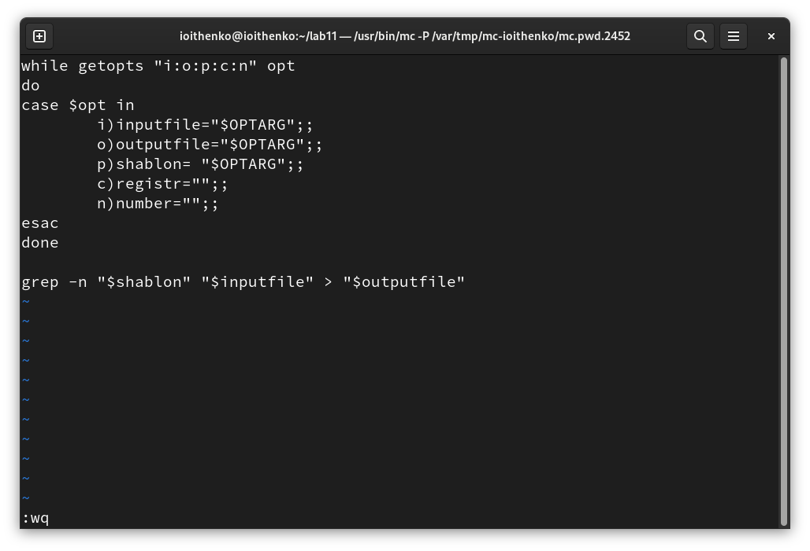
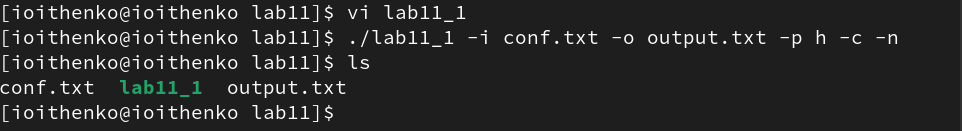
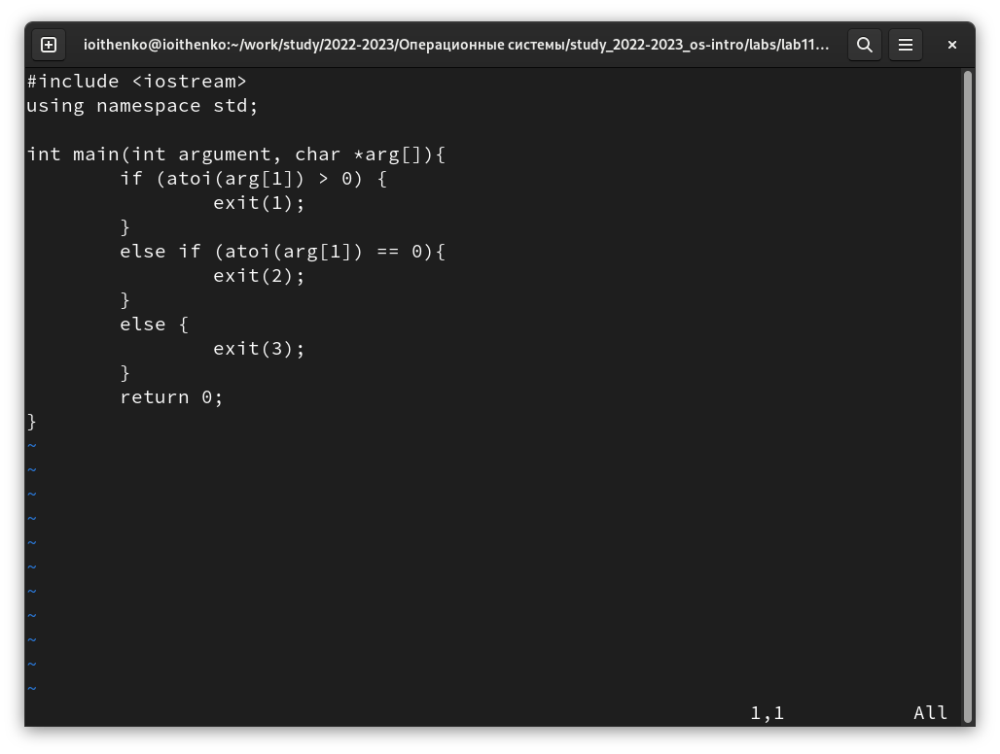
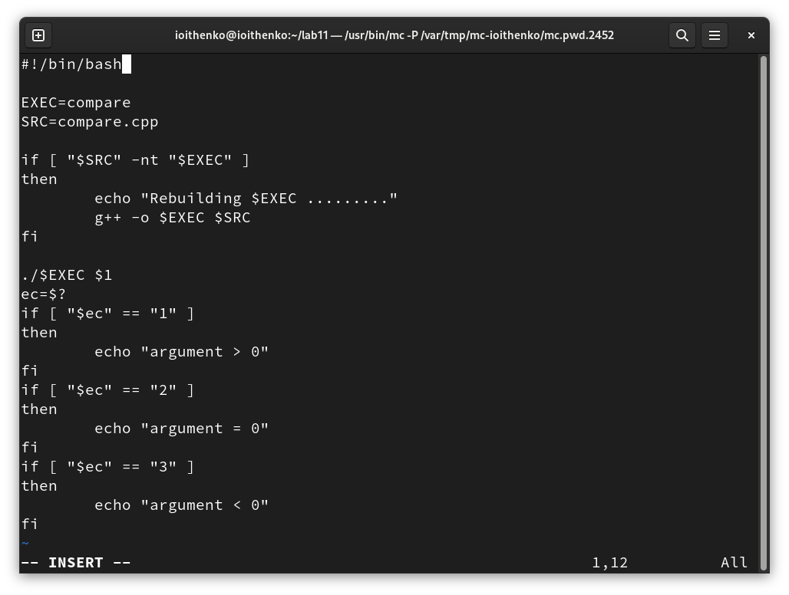
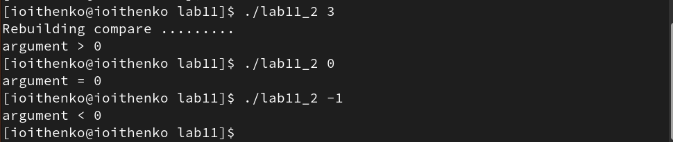
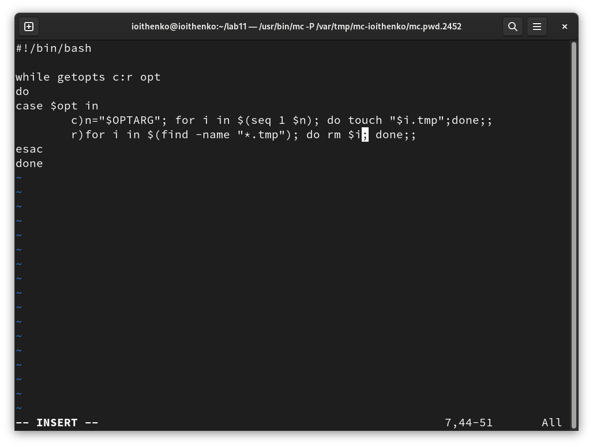
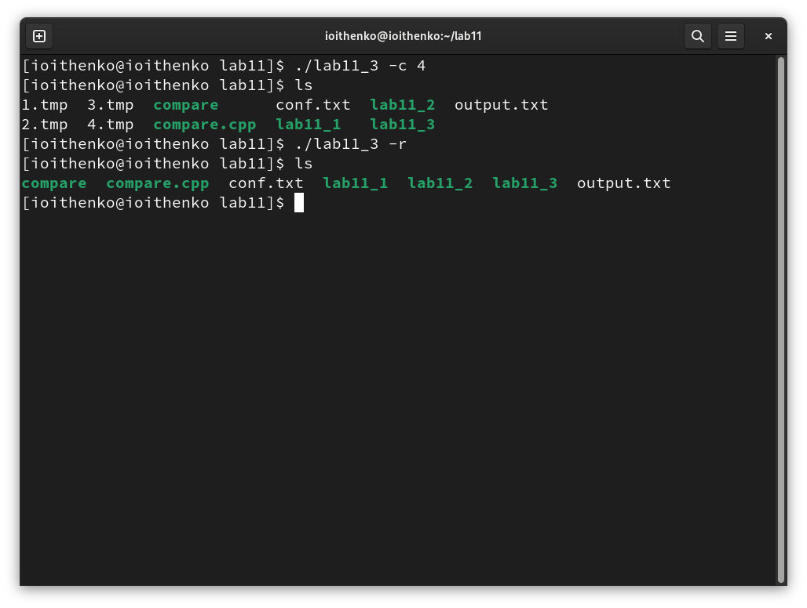
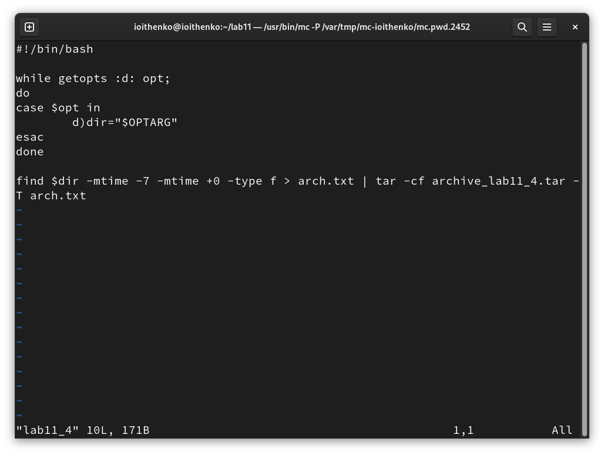
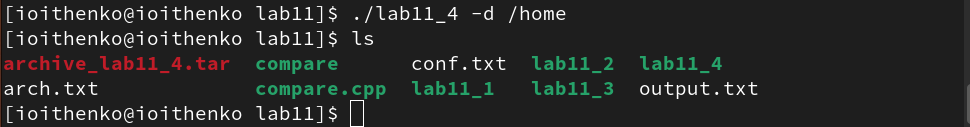

---
## Front matter
lang: ru-RU
title: Лабораторная работа №11
subtitle: Операционные системы
author:
  - Ищенко Ирина Олеговна
institute:
  - Российский университет дружбы народов, Москва, Россия
date: 22 апреля 2023

## i18n babel
babel-lang: russian
babel-otherlangs: english

## Formatting pdf
toc: false
toc-title: Содержание
slide_level: 2
aspectratio: 169
section-titles: true
theme: metropolis
header-includes:
 - \metroset{progressbar=frametitle,sectionpage=progressbar,numbering=fraction}
 - '\makeatletter'
 - '\beamer@ignorenonframefalse'
 - '\makeatother'
---

## Докладчик

:::::::::::::: {.columns align=center}
::: {.column width="70%"}

  * Ищенко Ирина Олеговна
  * НПИбд-01-22

:::
::: {.column width="30%"}

:::
::::::::::::::

## Цель 

Изучить основы программирования в оболочке ОС UNIX. Научится писать более
сложные командные файлы с использованием логических управляющих конструкций и циклов.

# Выполнение лабораторной работы

## Анализ командной строки с несколькими ключами

{ #fig:001 width=50% }

## Анализ командной строки с несколькими ключами

{ #fig:002 width=50% }

## Сравнение числа с нулем

{ #fig:003 width=50% }

## Сравнение числа с нулем

{ #fig:004 width=50% }

## Сравнение числа с нулем

{ #fig:005 width=50% }

## Создание и удаление файлов

{ #fig:006 width=50% }

## Создание и удаление файлов

{ #fig:007 width=50% }

## Создание архива файлов

{ #fig:008 width=50% }

## Создание архива файлов

{ #fig:009 width=50% }

## Вывод

В ходе выполнения лабораторной работы я изучила основы программирования в командной оболочке OC UNIX, а также научилась писать более сложные командные файлы с использованием логических управляющих конструкций и циклов.
