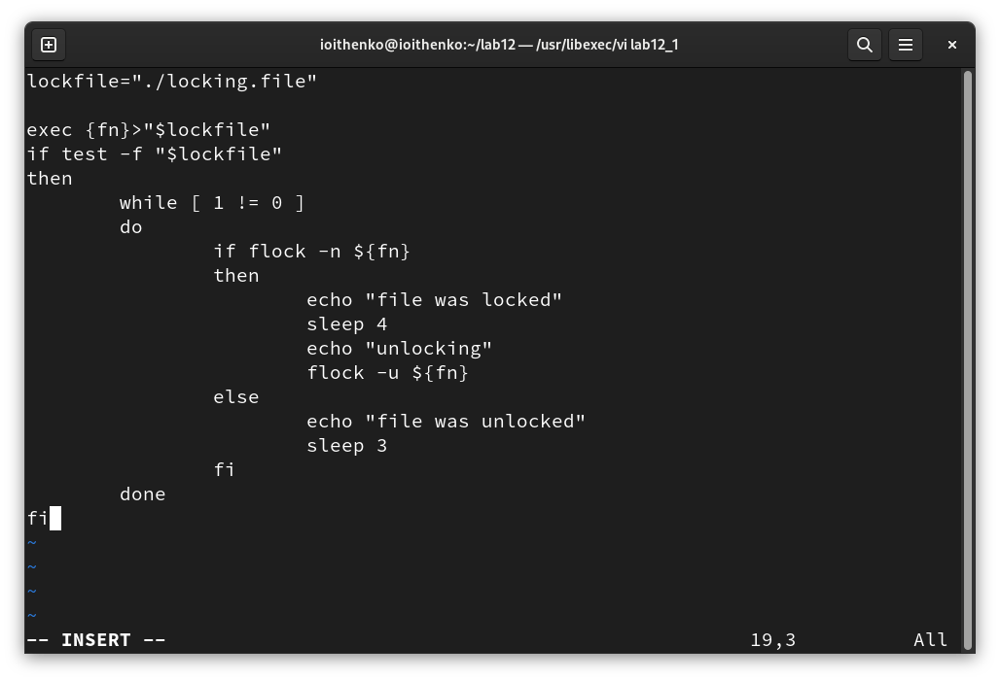
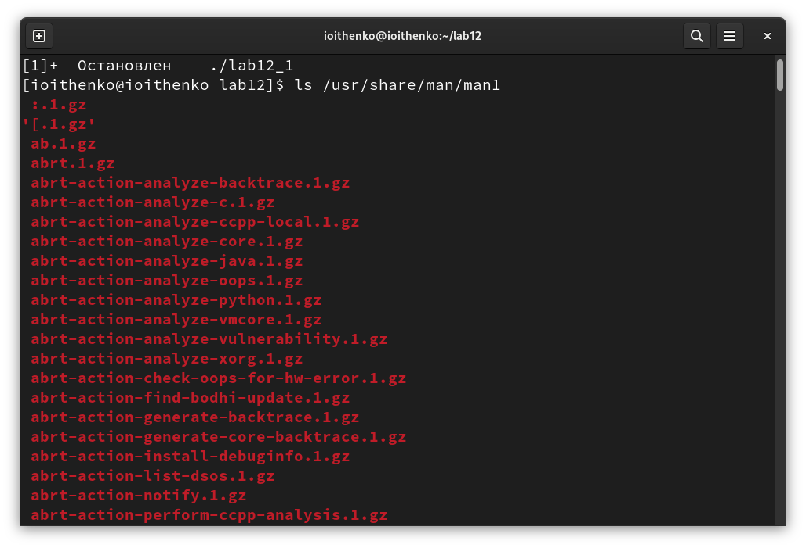

---
## Front matter
title: "Лабораторная работа №12"
subtitle: "Операционные системы"
author: "Ищенко Ирина Олеговна"

## Generic otions
lang: ru-RU
toc-title: "Содержание"

## Bibliography
bibliography: bib/cite.bib
csl: pandoc/csl/gost-r-7-0-5-2008-numeric.csl

## Pdf output format
toc: true # Table of contents
toc-depth: 2
lof: true # List of figures
lot: true # List of tables
fontsize: 12pt
linestretch: 1.5
papersize: a4
documentclass: scrreprt
## I18n polyglossia
polyglossia-lang:
  name: russian
  options:
	- spelling=modern
	- babelshorthands=true
polyglossia-otherlangs:
  name: english
## I18n babel
babel-lang: russian
babel-otherlangs: english
## Fonts
mainfont: PT Serif
romanfont: PT Serif
sansfont: PT Sans
monofont: PT Mono
mainfontoptions: Ligatures=TeX
romanfontoptions: Ligatures=TeX
sansfontoptions: Ligatures=TeX,Scale=MatchLowercase
monofontoptions: Scale=MatchLowercase,Scale=0.9
## Biblatex
biblatex: true
biblio-style: "gost-numeric"
biblatexoptions:
  - parentracker=true
  - backend=biber
  - hyperref=auto
  - language=auto
  - autolang=other*
  - citestyle=gost-numeric
## Pandoc-crossref LaTeX customization
figureTitle: "Рис."
tableTitle: "Таблица"
listingTitle: "Листинг"
lofTitle: "Список иллюстраций"
lotTitle: "Список таблиц"
lolTitle: "Листинги"
## Misc options
indent: true
header-includes:
  - \usepackage{indentfirst}
  - \usepackage{float} # keep figures where there are in the text
  - \floatplacement{figure}{H} # keep figures where there are in the text
---

# Цель работы

Изучить основы программирования в оболочке ОС UNIX. Научиться писать более
сложные командные файлы с использованием логических управляющих конструкций
и циклов.

# Задание

1. Написать командный файл, реализующий упрощённый механизм семафоров. Командный файл должен в течение некоторого времени t1 дожидаться освобождения ресурса, выдавая об этом сообщение, а дождавшись его освобождения, использовать его в течение некоторого времени t2<>t1, также выдавая информацию о том, что ресурс используется соответствующим командным файлом (процессом). Запустить командный файл в одном виртуальном терминале в фоновом режиме, перенаправив его вывод в другой, в котором также запущен этот файл, но не фоновом, а в привилегированном режиме. Доработать программу так, чтобы имелась возможность взаимодействия трёх и более процессов.

2. Реализовать команду man с помощью командного файла. Изучите содержимое каталога /usr/share/man/man1. В нем находятся архивы текстовых файлов, содержащих справку по большинству установленных в системе программ и команд. Каждый архив можно открыть командой less сразу же просмотрев содержимое справки. Командный файл должен получать в виде аргумента командной строки название команды и в виде результата выдавать справку об этой команде или сообщение об отсутствии справки, если соответствующего файла нет в каталоге man1.

3. Используя встроенную переменную $RANDOM, напишите командный файл, генерирующий случайную последовательность букв латинского алфавита. Учтите, что $RANDOM выдаёт псевдослучайные числа в диапазоне от 0 до 32767.

# Теоретическое введение

Преимущества и недостатки Bash:

Многие языки программирования намного удобнее и понятнее для пользователя. Например, Python более быстр, так как компилируется байтами. Однако главное преимущество Bash – его повсеместное распространение. Более того, Bash позволяет очень легко работать с файловой системой без лишних конструкций (в отличие от других языков программирования). Но относительно таких bash очень сжат. То есть, например, C имеет гораздо более широкие возможности для разработчика.

# Выполнение лабораторной работы

1. Я написала командный файл, реализующий упрощенный механизм семафоров (рис. [-@fig:001]).

{ #fig:001 width=90% }

Затем я добавила право на исполнение файла и выполнила его (рис. [-@fig:002]).

{ #fig:002 width=90% }

2. Я просмотрела содержимое каталога /usr/share/man/man1 (рис. [-@fig:003]).

{ #fig:003 width=90% }

Я написала командный файл, позволяющий реализовать команду man с помощью команды less, которая выдает содержимое справки по команде (рис. [-@fig:004]).

{ #fig:004 width=90% }

Затем я добавила право на исполнение файла и выполнила его (рис. [-@fig:005]), (рис. [-@fig:006]).

{ #fig:005 width=90% }

{ #fig:006 width=90% }

3. Я написала командный файл, который генерировал случайную последовательность букв латинского алфавита (рис. [-@fig:007]).

{ #fig:007 width=90% }

Затем я добавила право на исполнение файла и выполнила его (рис. [-@fig:008]).

{ #fig:008 width=90% }

# Вывод

В ходе выполнения лабораторной работы я изучила основы программирования в оболочке ОС UNIX, а также научилась писать более сложные командные файлы с использованием логических управляющих конструкций и циклов. 

# Выполнение заданий самостоятельной работы 

Контрольные вопросы

1.	Найдите синтаксическую ошибку в следующей строке: 1 while [$1 != "exit"]

Между скобками должны быть пробелы, иначе символы в скобках и сами скобки буду восприняты как один элемент.

2.	Как объединить (конкатенация) несколько строк в одну?

cat file.txt | xargs 

3.	Найдите информацию об утилите seq. Какими иными способами можно реализовать её функционал при программировании на bash?

Команда seq выводит последовательность целых или действительных чисел, подходящую для передачи в другие программы. Реализовать ее функционал можно командой for n in {1..5} do <КОМАНДА> done

4.	Какой результат даст вычисление выражения $((10/3))?
Вычисление этого выражения даст результат 3
5.	Укажите кратко основные отличия командной оболочки zsh от bash.

Zsh очень сильно упрощает работу. Но существуют различия. Например, в zsh после for обязательно вставлять пробел, нумерация массивов в zsh начинается с 1. Если вы собираетесь писать скрипт, который будет запускать множество разработчиков, то рекомендуется Bash. Если скрипты вам не нужны - Zsh.

6.	Проверьте, верен ли синтаксис данной конструкции 1 for ((a=1; a <= LIMIT; a++))

Да, этот синтаксис верен.

7.	Сравните язык bash с какими-либо языками программирования. Какие преимущества у bash по сравнению с ними? Какие недостатки?

Многие языки программирования намного удобнее и понятнее для пользователя. Например, Python более быстр, так как компилируется байтами. Однако главное преимущество Bash – его повсеместное распространение. Более того, Bash позволяет очень легко работать с файловой системой без лишних конструкций (в отличие от других языков программирования). Но относительно таких bash очень сжат. То есть, например, C имеет гораздо более широкие возможности для разработчика.

