---
## Front matter
lang: ru-RU
title: Лабораторная работа №13
subtitle: Операционные системы
author:
  - Ищенко Ирина Олеговна
institute:
  - Российский университет дружбы народов, Москва, Россия
date: 6 мая 2023

## i18n babel
babel-lang: russian
babel-otherlangs: english

## Formatting pdf
toc: false
toc-title: Содержание
slide_level: 2
aspectratio: 169
section-titles: true
theme: metropolis
header-includes:
 - \metroset{progressbar=frametitle,sectionpage=progressbar,numbering=fraction}
 - '\makeatletter'
 - '\beamer@ignorenonframefalse'
 - '\makeatother'
---

## Докладчик

:::::::::::::: {.columns align=center}
::: {.column width="70%"}

  * Ищенко Ирина Олеговна
  * НПИбд-01-22

:::
::: {.column width="30%"}

:::
::::::::::::::

## Цель работы

Приобрести простейшие навыки разработки, анализа, тестирования и отладки приложений в ОС типа UNIX/Linux на примере создания на языке программирования
С калькулятора с простейшими функциями.

# Выполнение лабораторной работы

## Выполнение лабораторной работы

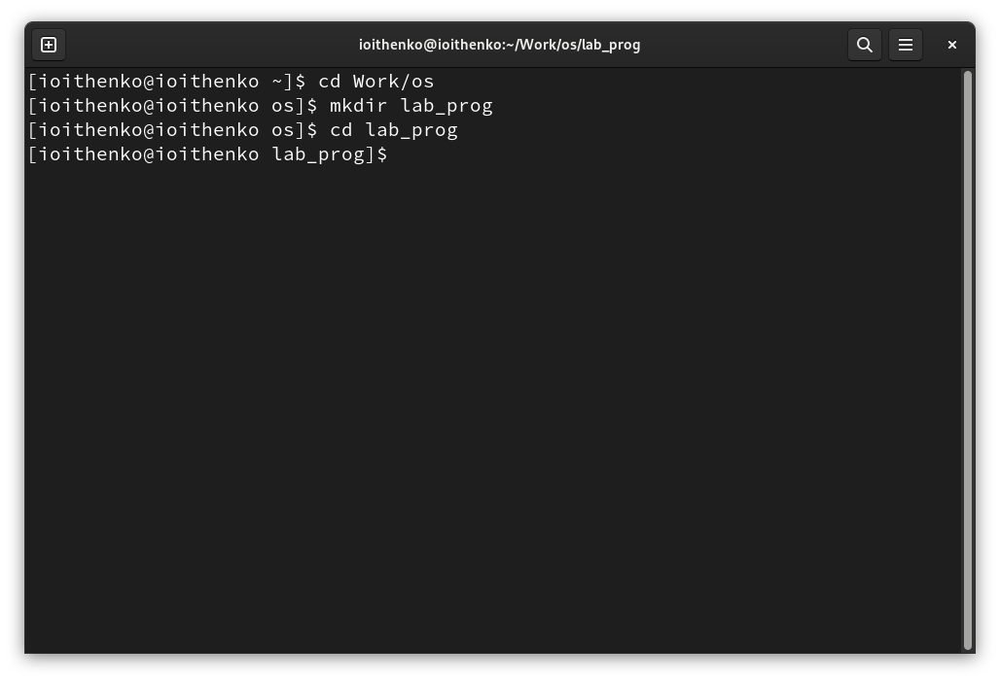{ #fig:001 width=70% }

## Выполнение лабораторной работы

Создаю файлы calculate.h, calculate.c, main.c и заполняю их, согласно описанию лабораторной работы:

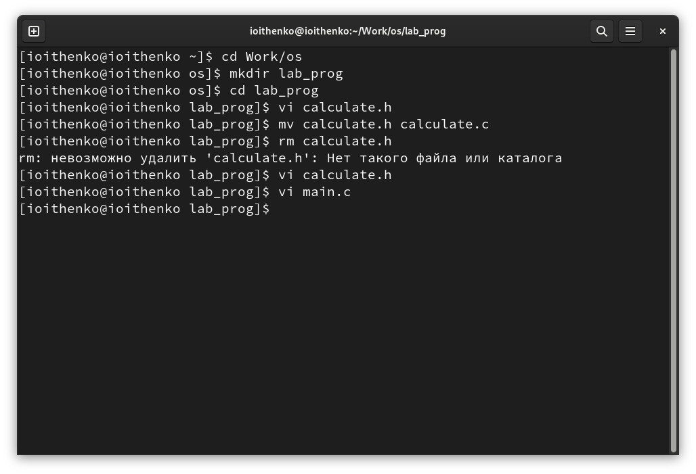{ #fig:002 width=70% }

## Выполнение лабораторной работы

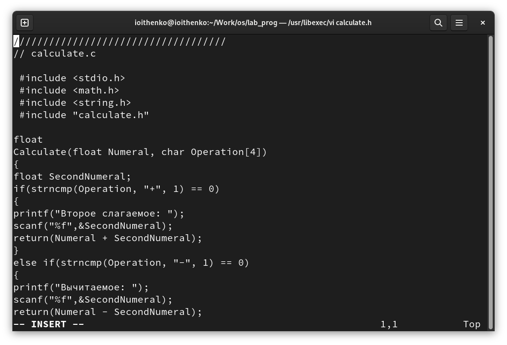{ #fig:003 width=70% }

## Выполнение лабораторной работы

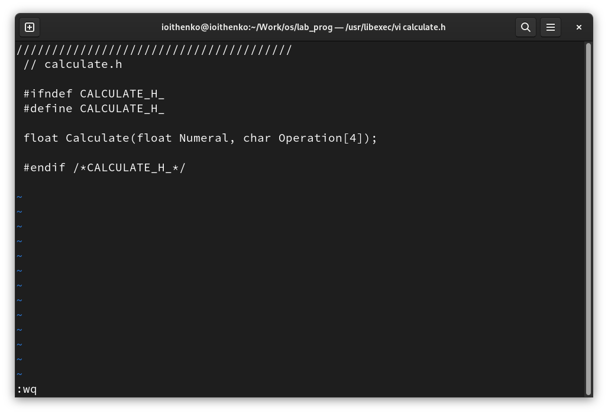{ #fig:004 width=70% }

## Выполнение лабораторной работы

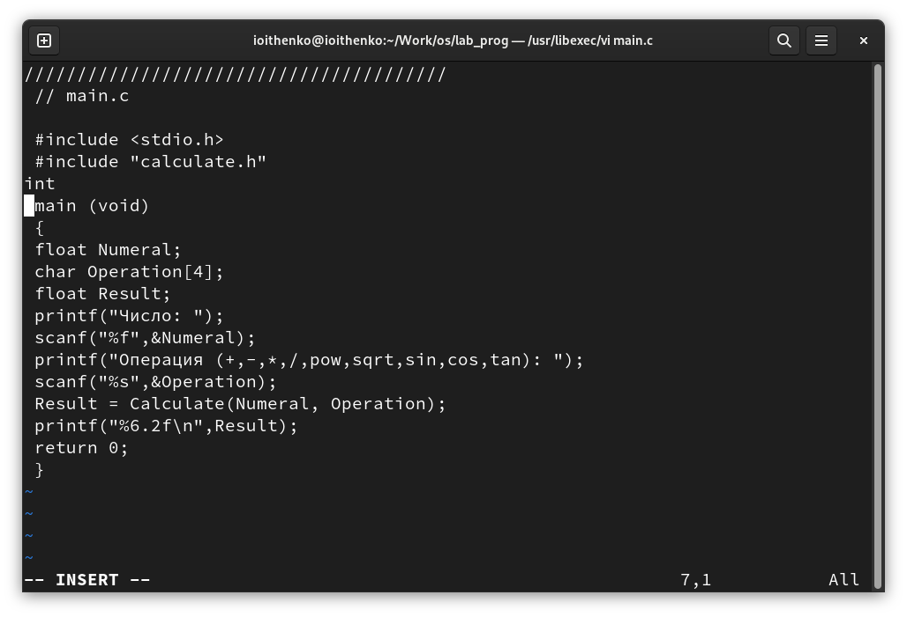{ #fig:005 width=70% }

## Выполнение лабораторной работы

3. Выполняю компиляцию программы посредством gcc:

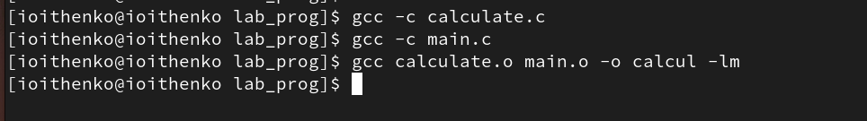{ #fig:006 width=70% }

## Выполнение лабораторной работы

4. Создаю. Makefile с содержанием, согласно описанию лабораторной работы, при этом немного изменяю его:

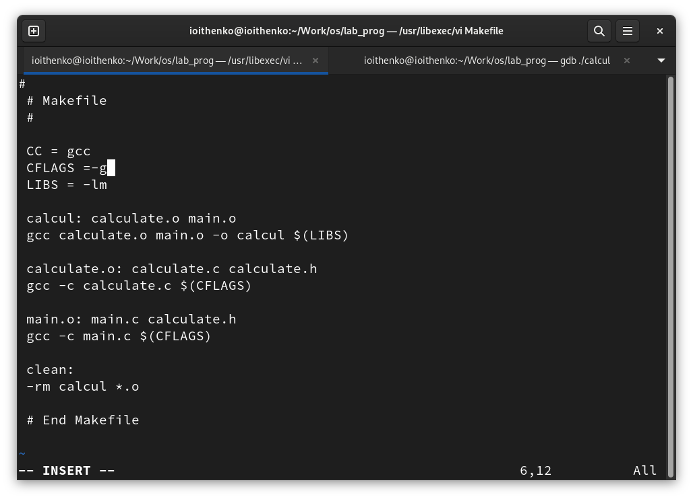{ #fig:007 width=55% }

## Выполнение лабораторной работы

5. С помощью gdb выполняю отладку программы calcul:

Запускаю отладчик GDB, загрузив в него программу для отладки.

Запускаю программу внутри отладчика, введя команду run:

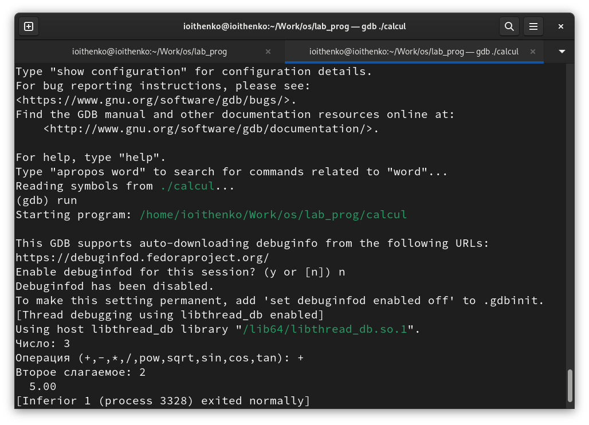{ #fig:008 width=45% }

## Выполнение лабораторной работы

Постранично просматриваю исходный код с помощью команды list.

Просматриваю строки с 12 по 15 основного файла с помощью команды list с параметрами:

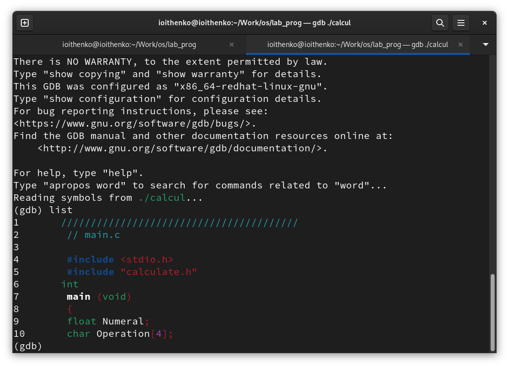{ #fig:009 width=70% }

## Выполнение лабораторной работы

Просматриваю определённые строки не основного файла с помощью команды list с параметрами:

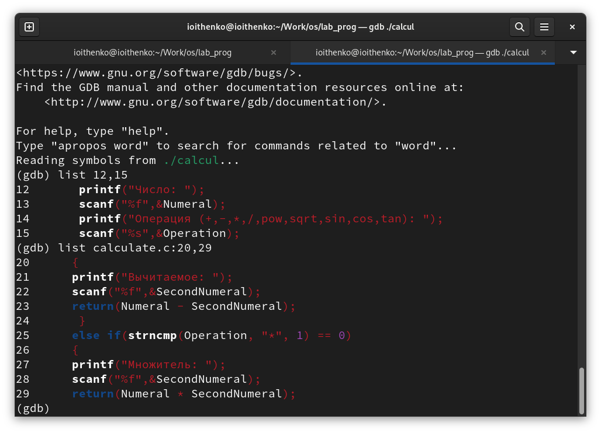{ #fig:010 width=70% }

## Выполнение лабораторной работы

Устанавливаю точку останова в файле calculate.c на строке номер 21 и вывожу информацию об имеющихся в проекте точках останова:

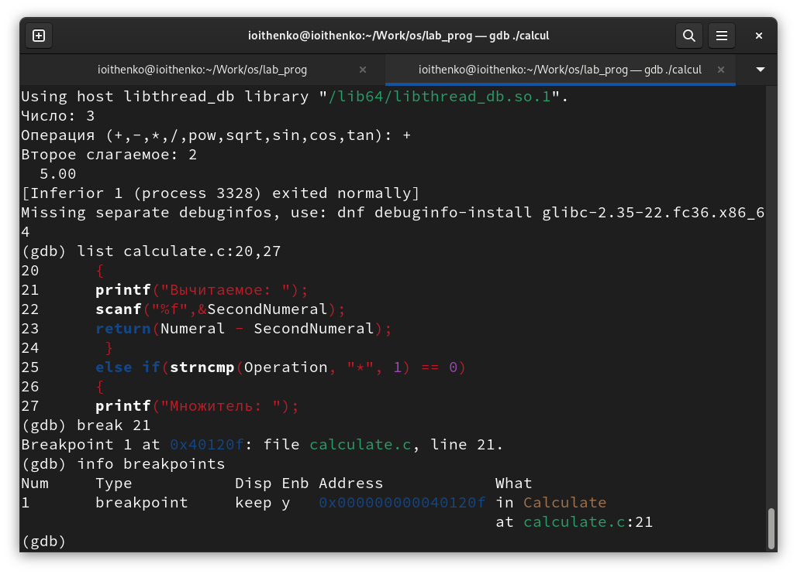{ #fig:011 width=70% }

## Выполнение лабораторной работы

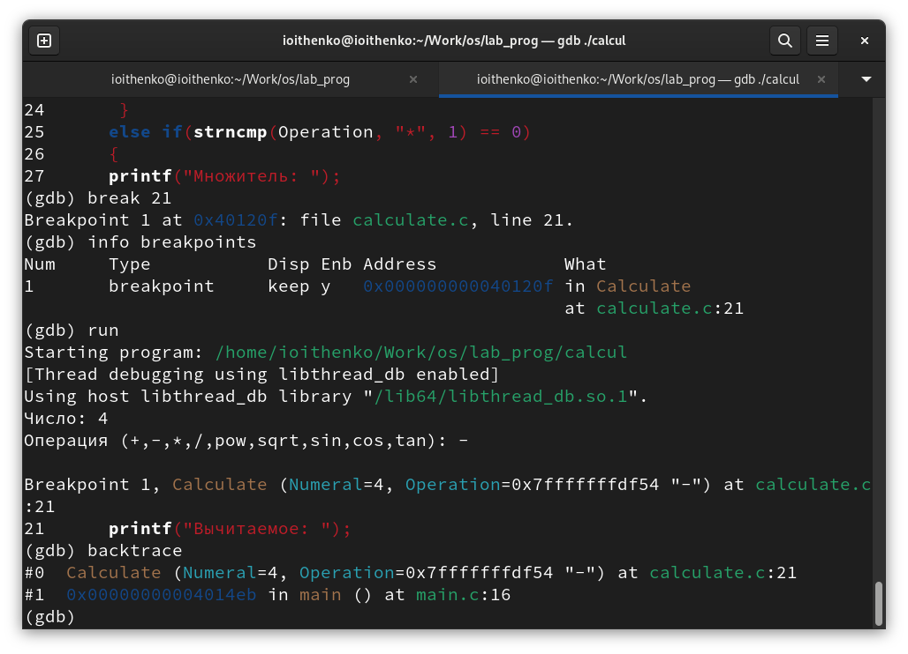{ #fig:012 width=70% }

## Выполнение лабораторной работы

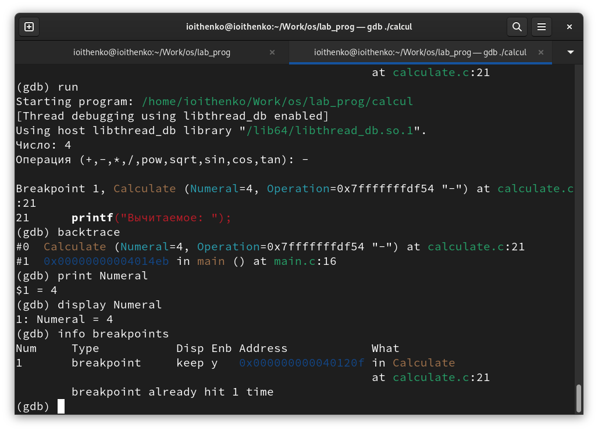{ #fig:013 width=70% }

## Выполнение лабораторной работы

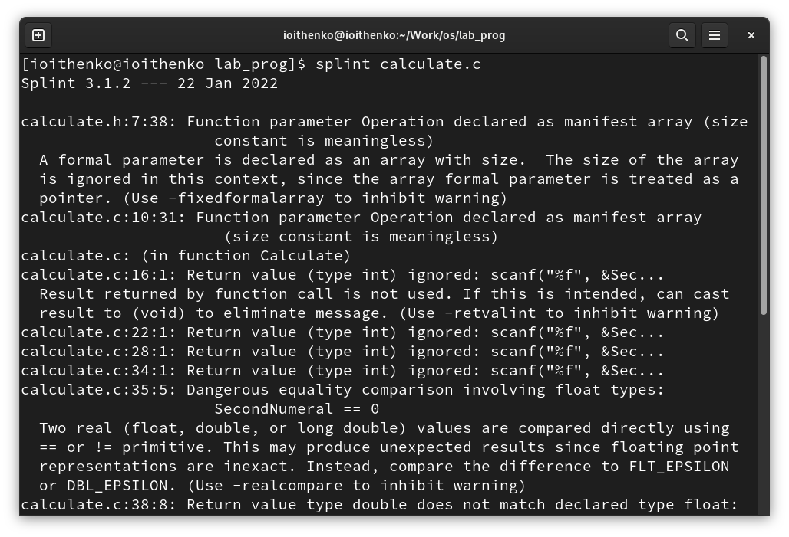{ #fig:014 width=50% }

## Выполнение лабораторной работы

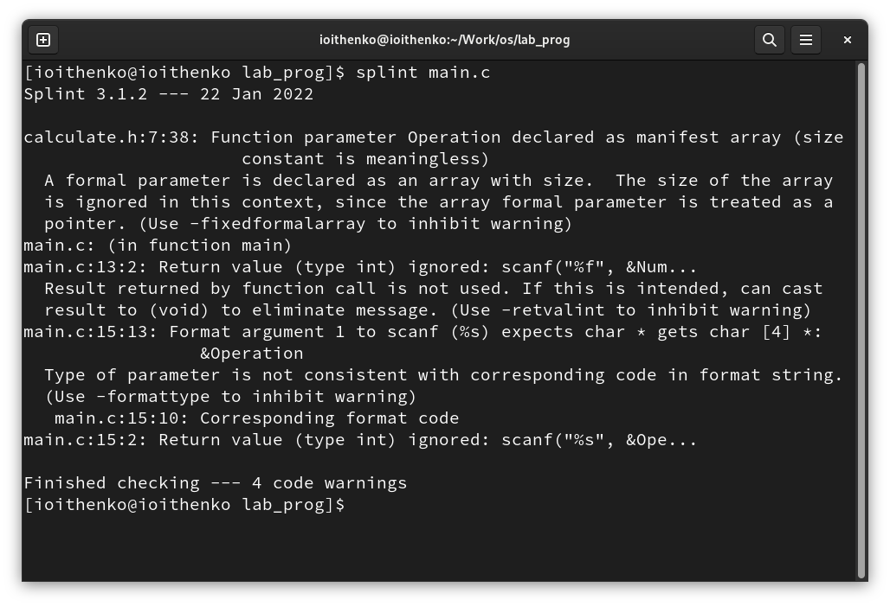{ #fig:015 width=70% }

## Вывод

В ходе выполнения лабораторной работы я приобрела простейшие навыки разработки, анализа, тестирования и отладки приложений в ОС типа UNIX/Linux на примере создания на языке программирования С калькулятора с простейшими функциями.

