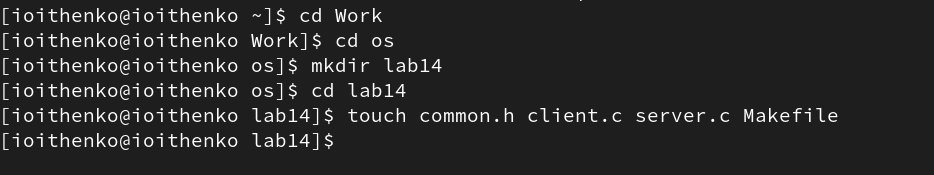
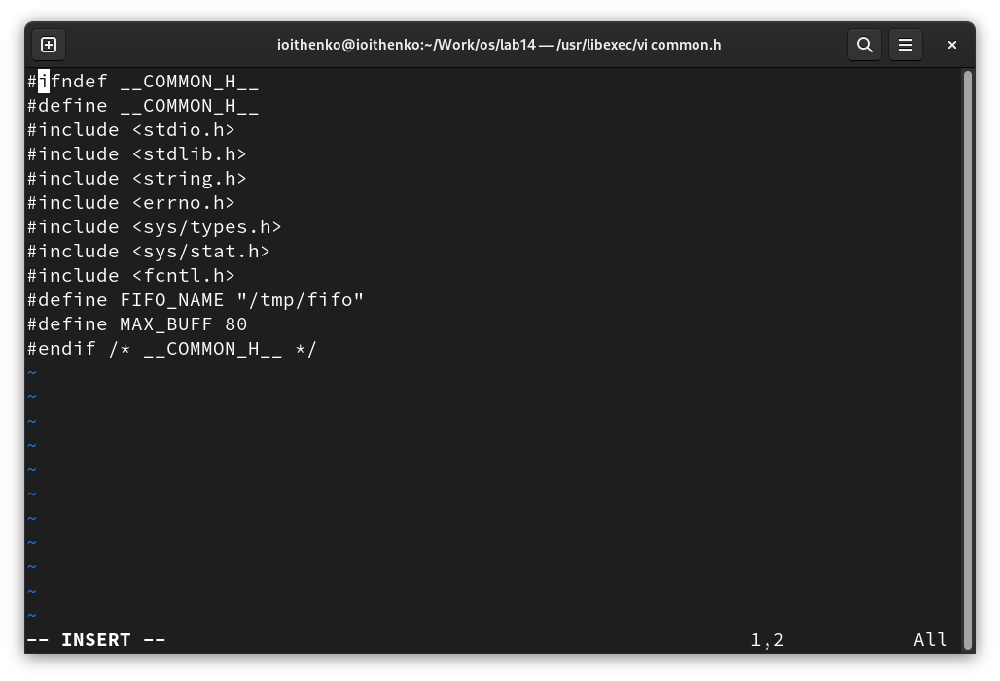
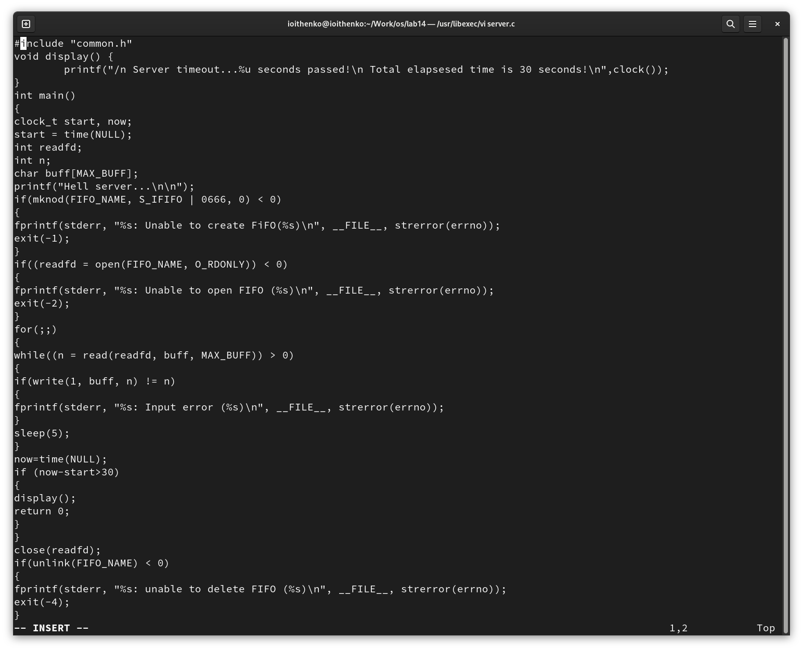
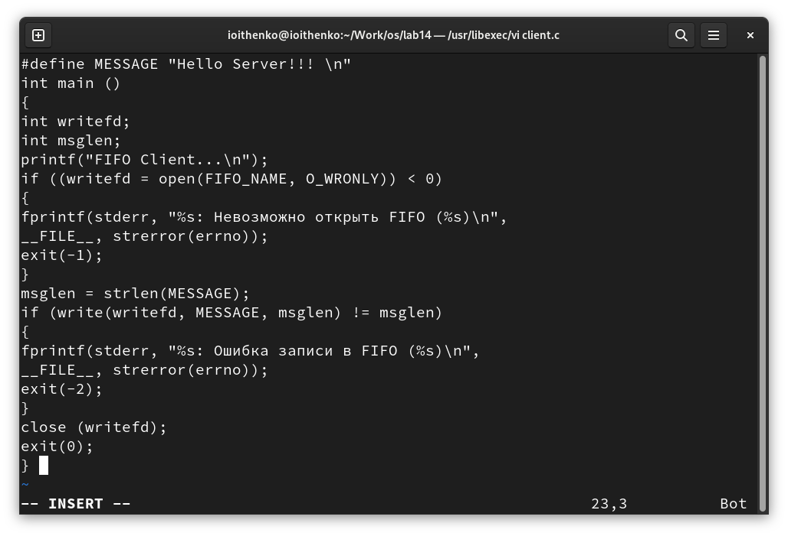
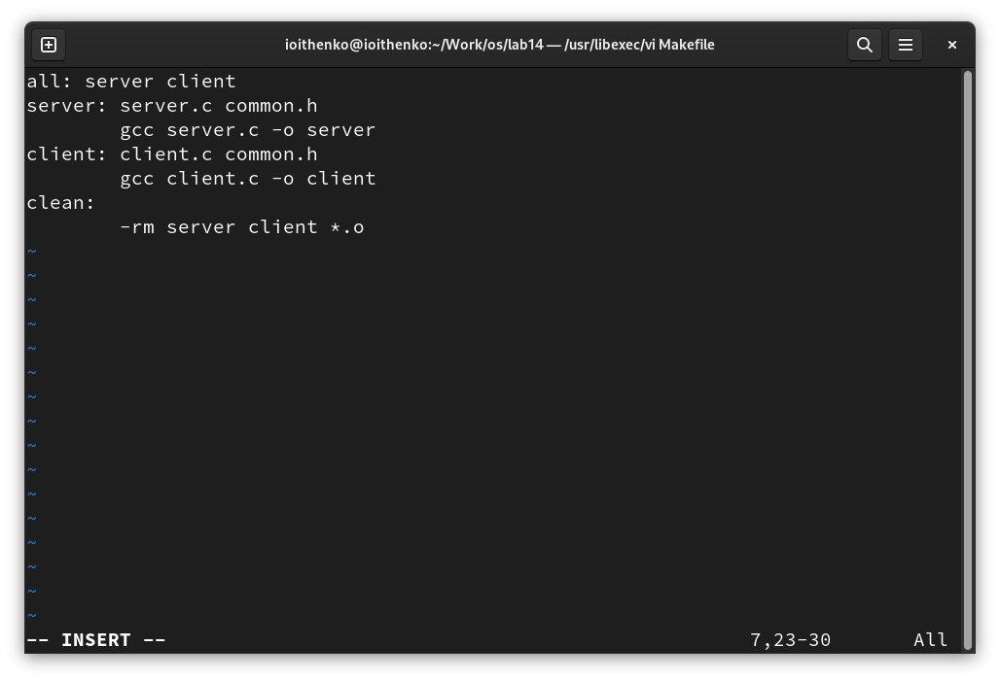
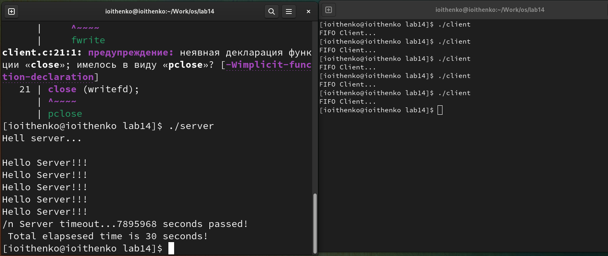

---
## Front matter
lang: ru-RU
title: Лабораторная работа №14
subtitle: Операционные системы
author:
  - Ищенко Ирина Олеговна
institute:
  - Российский университет дружбы народов, Москва, Россия
date: 12 мая 2023

## i18n babel
babel-lang: russian
babel-otherlangs: english

## Formatting pdf
toc: false
toc-title: Содержание
slide_level: 2
aspectratio: 169
section-titles: true
theme: metropolis
header-includes:
 - \metroset{progressbar=frametitle,sectionpage=progressbar,numbering=fraction}
 - '\makeatletter'
 - '\beamer@ignorenonframefalse'
 - '\makeatother'
---

## Докладчик

:::::::::::::: {.columns align=center}
::: {.column width="70%"}

  * Ищенко Ирина Олеговна
  * НПИбд-01-22

:::
::: {.column width="30%"}

:::
::::::::::::::

## Цель работы

Приобретение практических навыков работы с именованными каналами

# Выполнение лабораторной работы

## Создание файлов

{ #fig:001 width=60% }

## Заголовочный файл

{ #fig:002 width=40% }

## Сервер

{ #fig:003 width=40% }

## Клиент

{ #fig:004 width=40% }

## Makefile

{ #fig:005 width=40% }

## Запуск программ

{ #fig:006 width=50% }

## Вывод

В ходе выполнения лабораторной работы я приобрела практические навыки в работы с именованными каналами.
