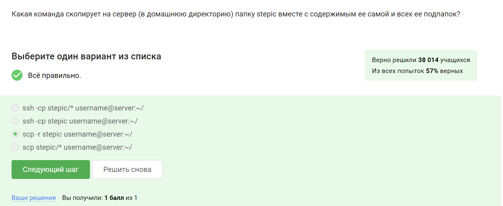
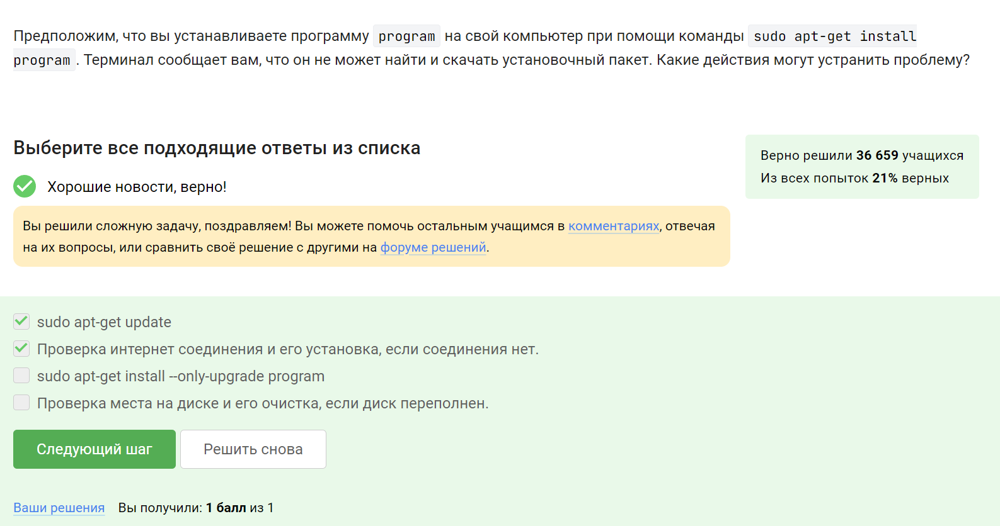
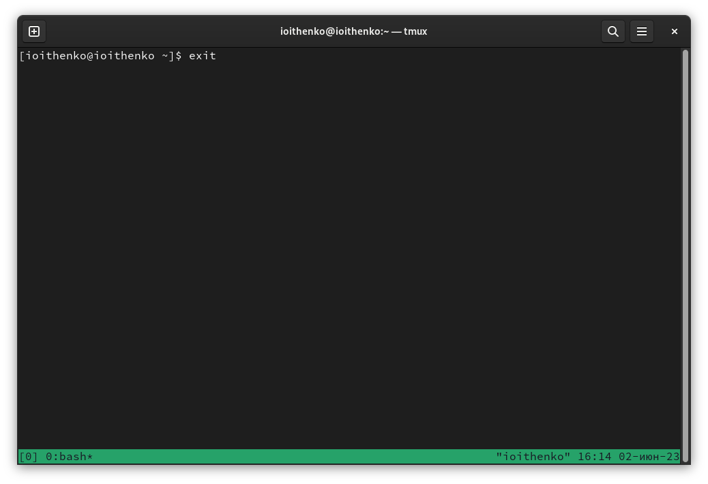
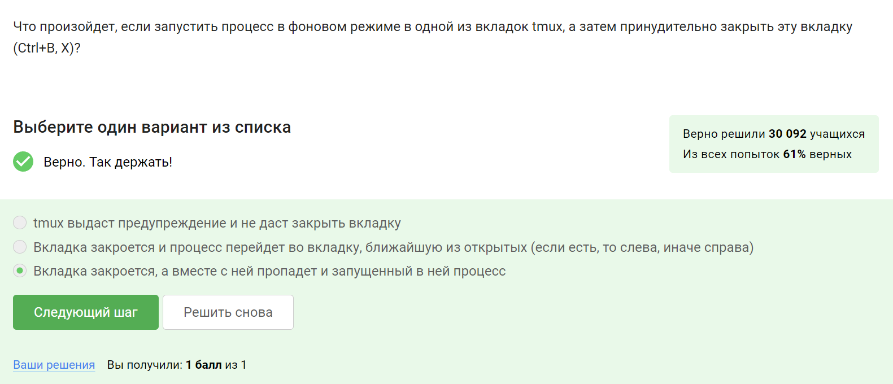

---
## Front matter
title: "Отчёт по внешнему курсу: Введение в Linux"
subtitle: "Глава 2. Работа на сервере"
author: "Ищенко Ирина Олеговна"

## Generic otions
lang: ru-RU
toc-title: "Содержание"

## Bibliography
bibliography: bib/cite.bib
csl: pandoc/csl/gost-r-7-0-5-2008-numeric.csl

## Pdf output format
toc: true # Table of contents
toc-depth: 2
lof: true # List of figures
lot: true # List of tables
fontsize: 12pt
linestretch: 1.5
papersize: a4
documentclass: scrreprt
## I18n polyglossia
polyglossia-lang:
  name: russian
  options:
	- spelling=modern
	- babelshorthands=true
polyglossia-otherlangs:
  name: english
## I18n babel
babel-lang: russian
babel-otherlangs: english
## Fonts
mainfont: PT Serif
romanfont: PT Serif
sansfont: PT Sans
monofont: PT Mono
mainfontoptions: Ligatures=TeX
romanfontoptions: Ligatures=TeX
sansfontoptions: Ligatures=TeX,Scale=MatchLowercase
monofontoptions: Scale=MatchLowercase,Scale=0.9
## Biblatex
biblatex: true
biblio-style: "gost-numeric"
biblatexoptions:
  - parentracker=true
  - backend=biber
  - hyperref=auto
  - language=auto
  - autolang=other*
  - citestyle=gost-numeric
## Pandoc-crossref LaTeX customization
figureTitle: "Рис."
tableTitle: "Таблица"
listingTitle: "Листинг"
lofTitle: "Список иллюстраций"
lotTitle: "Список таблиц"
lolTitle: "Листинги"
## Misc options
indent: true
header-includes:
  - \usepackage{indentfirst}
  - \usepackage{float} # keep figures where there are in the text
  - \floatplacement{figure}{H} # keep figures where there are in the text
---

# Выполнение курса

Переходим к первому разделу "Знакомство с сервером". Выбираем задачи, для которых может использоваться удаленный сервер (рис. @fig:001).
Отвечаем на вопрос, какой из ключей можно пеерсылать по интернету (рис. @fig:002). Пересылать можно ключ с пометкой pub (public - публичный, открытый), испольуется для ассиметричного шифрования. Закрытый ключ пересылать нельзя, у каждого пользователя он индивидуален.
Выполнить задание в терминале не удалось, так как к серверу подключиться не удалось.

{#fig:001 width=70%}

{#fig:002 width=70%}

Переходим к следующему разделу "Обмен файлами". Чтобы скопировать на сервер папку со всем ее содержимым и содержимым ее подпапок, нужно использовать команду копировария scp и ключ -r (рекурсивно) (рис. @fig:003).
Чтобы устранить проблему со скачиванием установочного пакета, трубется проверить интернет соединение или загрузить обновление (рис. @fig:004).
Отвечаем на вопрос, как можно использовать программу Filezilla (рис. @fig:005).

{#fig:003 width=70%} 

{#fig:004 width=70%}

{#fig:005 width=70%}

Переходим к следующему разделу "Запуск приложений". 
Отвечаем на вопрос по оптимизации работы программы, не адаптированной для терминала (рис. @fig:006). 

{#fig:006 width=70%}

Вывести справочную информацию о пргорамме можно с помощью команд man и help (рис. @fig:007). 

{#fig:007 width=70%}

Открываем справку о программе FastaQC (рис. @fig:008) и отвечаем на вопрос о том, какие форматы она поддерживает (рис. @fig:009).

{#fig:008 width=70%}

{#fig:009 width=70%}

Ответим на задание о программе clustal. Открываем справку о программе и находим опцию, позволяющую выполнить множественное выравнивание (multiple alignment) (рис. @fig:0010) и (рис. @fig:0011).

{#fig:0010 width=70%}

{#fig:0011 width=70%}

Переходим к разделу "Контроль запускаемых программ".
Ответим на задание о команде jobs. Запускаем первую программу в фоновом режиме, прерываем ее выполнение, запускаем вторую программу в фоновом режиме, приостанавливаем ее выполнение и используем команду (третья программа также запущена). Команда выведет информацию о запущенных и приостановленных программах - 2ой и 3ьей (рис. @fig:0012).

{#fig:0012 width=70%}
 
Различия jobs, top и ps: jobs  просто показывает запущенные программы, присваивая им порядковый номер 1,2,3... А top и ps показывают все процессы с их уникальным номером - идентификатором процесса (PID) (рис. @fig:0013).

{#fig:0013 width=70%}

С помощью команды kill -9 можно мгновенно завершить остановленный процесс. kill -18 возобновляет приостановленные программы (рис. @fig:0014). 
Если использовать kill (без опций) по отношению к процессу, который был приостановлен при помощи Ctrl+Z, то программа завершится, после того как возобновится (рис. @fig:0015).

{#fig:0014 width=70%}

{#fig:0015 width=70%}

Загружаем файл с программой, добавляем ему право на исполнение и запускаем (рис. @fig:0020). Вывод программы загружаем в  качестве ответа (рис. @fig:0021).

{#fig:0020 width=70%}

{#fig:0021 width=70%}

Переходим к следующему разделу "Ввод / вывод". 
По умолчанию поток ошибок выводится на экран (рис. @fig:0022).

{#fig:0022 width=70%}

2> -  Перенаправить стандартный поток ошибок в файл. Если файл не существует, он будет создан, если существовал, то будет перезаписан.

2>> - Перенаправить стандартный поток ошибок в файл. Если файл не существует, он будет создан, если существует — данные будут дописаны к нему в конец.

Отвечаем на задание (рис. @fig:0023).

{#fig:0023 width=70%}

Сообщения об ошибках от программ в конвейере выводятся на экран (рис. @fig:0024).

{#fig:0024 width=70%}

Переходим к следующему разделу "Скачивание файлов из интернета".
Отвечаем на вопрос о том, в какую директорию скачается файл и под каким именем (рис. @fig:0025).

{#fig:0025 width=70%}

Для того, чтобы команда wget не выводила сообщений на экран, используется опция -q (-quiet) (рис. @fig:0026).

{#fig:0026 width=70%}

Отвечаем на вопрос об опциях команды wget (рис. @fig:0027).

{#fig:0027 width=70%}

Переходим к следующему разделу "Работа с архивами". 
Отличие gzip от zip в том, что gzip удаляет архив после его распаковки (рис. @fig:0028).

{#fig:0028 width=70%}

Zip и tar могут создать архив из директории с файлами (рис. @fig:0029).

{#fig:0029 width=70%}

Чтобы запаковать файлы в указанный архив нужны опции: c - создать новый архив; j - перенаправить вывод в команду bzip2 (рис. @fig:0030).

{#fig:0030 width=70%}

Также в этом разделе предлагалось сделать практическое задание, но курс корректно не смог считать решение.

Переходим к последнему разделу главы. Команда find может найти файл по имени или расширению, если символы указаны в нужном регистре и нет лишних символов (рис. @fig:0031).

{#fig:0031 width=70%}

Команда grep выведет все использования запросного слова, если регист символа совпадает с запросом (рис. @fig:0032).

{#fig:0032 width=70%}

Скачиваем архив с произведениями, распаковываем его и используем команду grep. Вывод команды перенаправляем в файл с результатом (рис. @fig:0033) и (рис. @fig:0034).

{#fig:0033 width=70%}

{#fig:0034 width=70%}

# Выводы

В ходе выполнения первой главы курса мы ознакомились с основами работы в операционной системе Linux.

