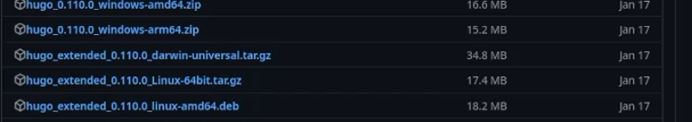
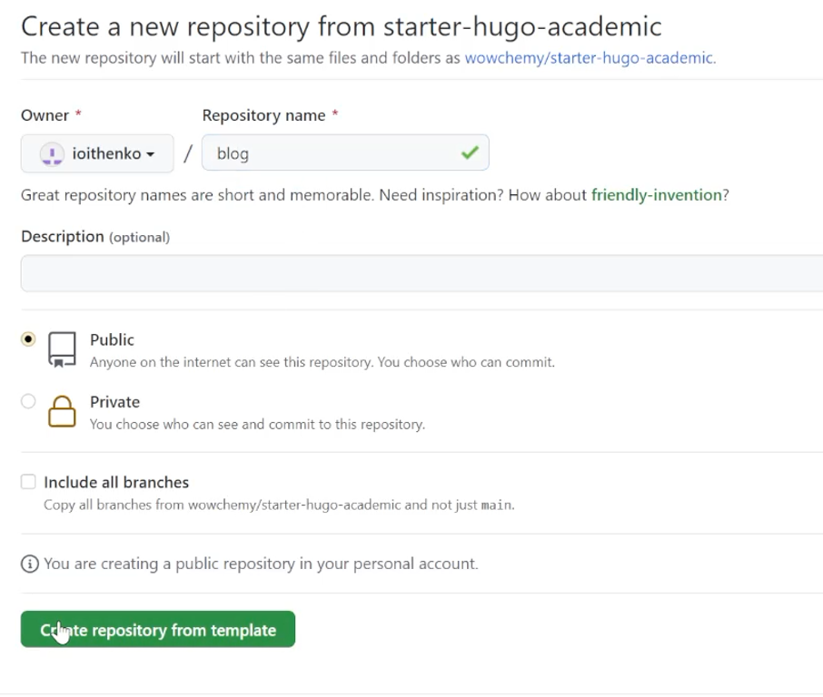
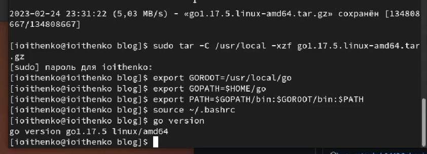
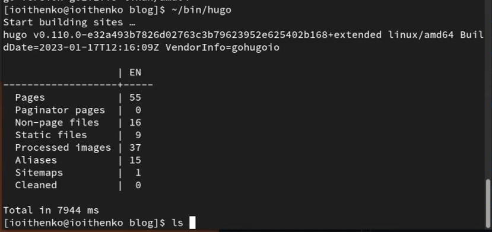
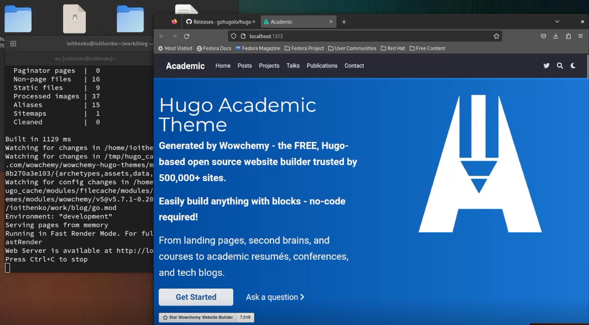
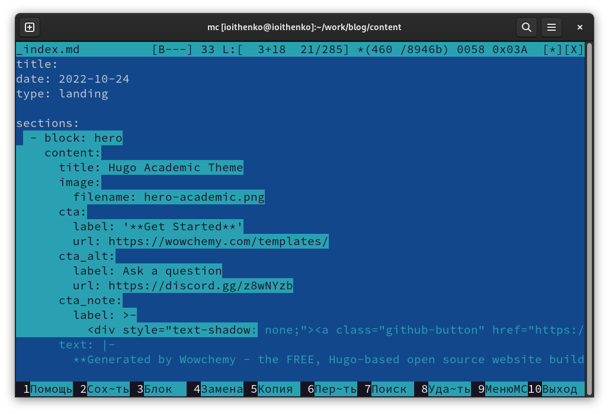
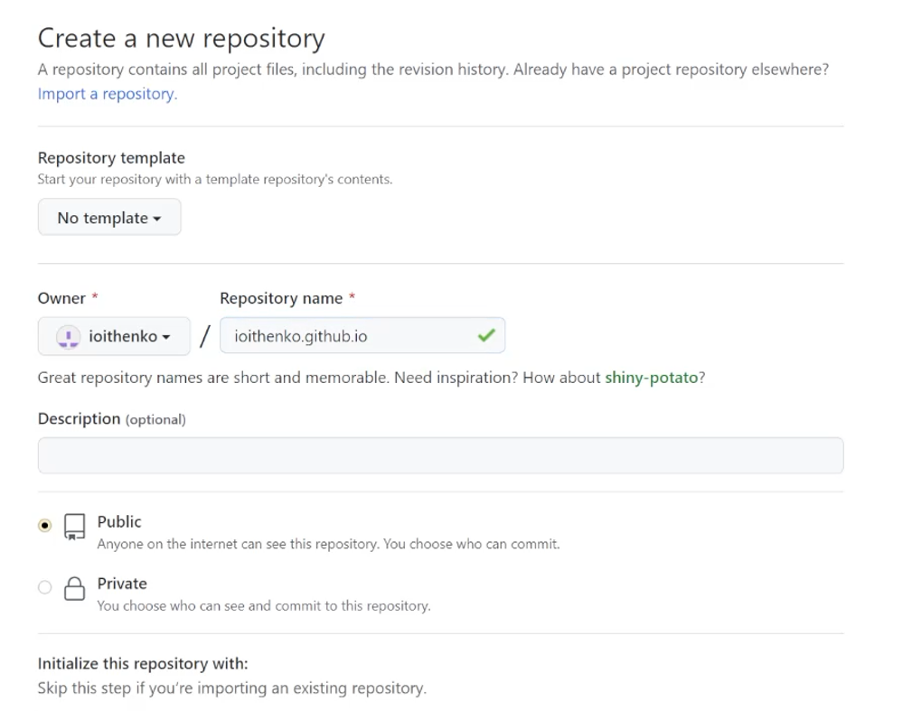
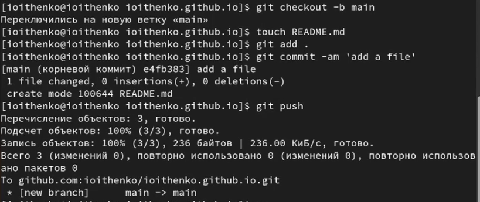
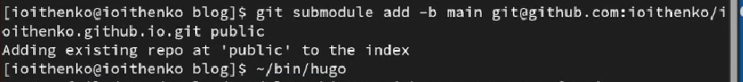

---
## Front matter
lang: ru-RU
title: Индивидуальный проект. Первый этап
subtitle: Операционные системы
author:
  - Ищенко Ирина Олеговна
institute:
  - Российский университет дружбы народов, Москва, Россия

date: 25 февраля 2023

## i18n babel
babel-lang: russian
babel-otherlangs: english

## Formatting pdf
toc: false
toc-title: Содержание
slide_level: 2
aspectratio: 169
section-titles: true
theme: metropolis
header-includes:
 - \metroset{progressbar=frametitle,sectionpage=progressbar,numbering=fraction}
 - '\makeatletter'
 - '\beamer@ignorenonframefalse'
 - '\makeatother'
---

## Докладчик

:::::::::::::: {.columns align=center}
::: {.column width="70%"}

  * Ищенко Ирина Олеговна
  * НПИбд-01-22

:::
::: {.column width="30%"}

:::
::::::::::::::

## Цель 

Размещение на Github pages заготовки для персонального сайта.

# Выполнение индивидуального проекта

## Установка hugo

{#fig:001 width=60%}

## Создание репозитория

{#fig:002 width=50%}

## Установка go

{#fig:003 width=60%}

## Использование hugo и hugo server

{#fig:004 width=60%}

## Локальный сайт

{#fig:005 width=60%}

## Удаление welcome page

{#fig:006 width=50%}

## Создание репозитория

{#fig:007 width=55%}

## Создание ветки

{#fig:008 width=60%}

## Создание субмодуля

{#fig:009 width=60%}

## Вид сайта

{#fig:0010 width=60%}

# Вывод

## Вывод

В результате выполнения первого этапа я разместила на Github pages заготовку для персонального сайта.
