---
## Front matter
title: "Отчет к первому этапу выполнения индивидуального проекта"
subtitle: "Дисциплина: Операционные системы"
author: "Ищенко Ирина Олеговна"

## Generic otions
lang: ru-RU
toc-title: "Содержание"

## Bibliography
bibliography: bib/cite.bib
csl: pandoc/csl/gost-r-7-0-5-2008-numeric.csl

## Pdf output format
toc: true # Table of contents
toc-depth: 2
lof: true # List of figures
lot: true # List of tables
fontsize: 12pt
linestretch: 1.5
papersize: a4
documentclass: scrreprt
## I18n polyglossia
polyglossia-lang:
  name: russian
  options:
	- spelling=modern
	- babelshorthands=true
polyglossia-otherlangs:
  name: english
## I18n babel
babel-lang: russian
babel-otherlangs: english
## Fonts
mainfont: PT Serif
romanfont: PT Serif
sansfont: PT Sans
monofont: PT Mono
mainfontoptions: Ligatures=TeX
romanfontoptions: Ligatures=TeX
sansfontoptions: Ligatures=TeX,Scale=MatchLowercase
monofontoptions: Scale=MatchLowercase,Scale=0.9
## Biblatex
biblatex: true
biblio-style: "gost-numeric"
biblatexoptions:
  - parentracker=true
  - backend=biber
  - hyperref=auto
  - language=auto
  - autolang=other*
  - citestyle=gost-numeric
## Pandoc-crossref LaTeX customization
figureTitle: "Рис."
tableTitle: "Таблица"
listingTitle: "Листинг"
lofTitle: "Список иллюстраций"
lotTitle: "Список таблиц"
lolTitle: "Листинги"
## Misc options
indent: true
header-includes:
  - \usepackage{indentfirst}
  - \usepackage{float} # keep figures where there are in the text
  - \floatplacement{figure}{H} # keep figures where there are in the text
---

# Цель работы

Размещение на Github pages заготовки для персонального сайта.

# Выполнение лабораторной работы

Скачали hugo, распаковали архив с файлами, перенесли файл hugo в отдельный каталог bin (рис. @fig:001).

{#fig:001 width=70%}

С помощью шаблона создали репозиторий blog (рис. @fig:002).

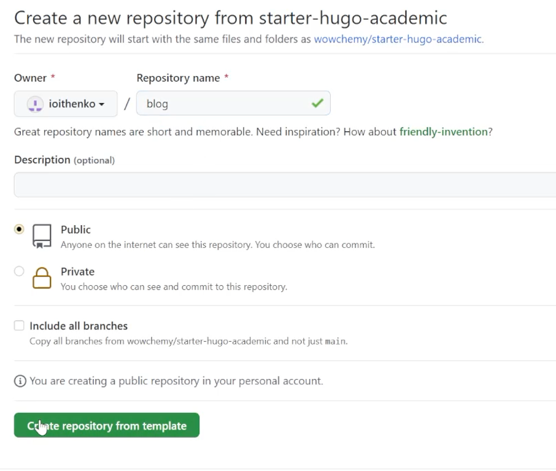{#fig:002 width=70%}

Клонировали репозиторий в каталог work (рис. @fig:003).

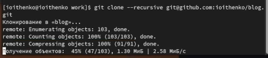{#fig:003 width=70%}

Установили go, прописали путь и проверили go version (рис. @fig:004).

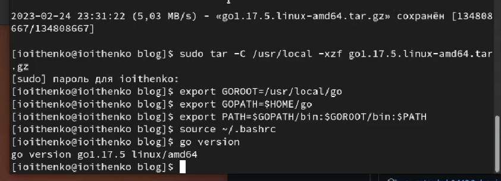{#fig:004 width=70%}

Использовали hugo, прописывая полный путь к файлу (рис. @fig:005). Удалили каталог public (рис. @fig:006). Использовали hugo server (рис. @fig:007).

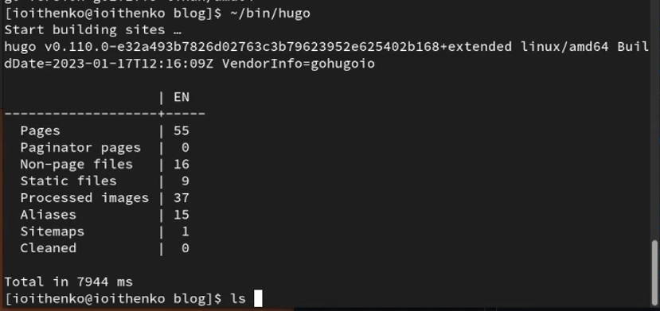{#fig:005 width=70%}

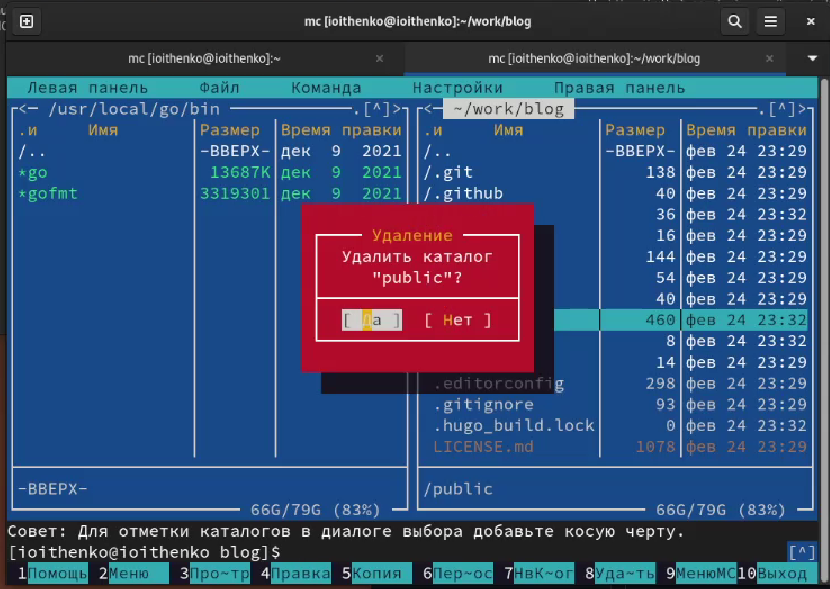{#fig:006 width=70%}

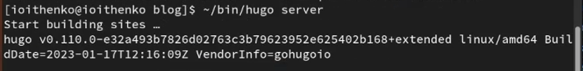{#fig:007 width=70%}

Появляется ссылка на локальный сайт, переходим по ней (рис. @fig:008).

{#fig:008 width=70%}

Открываем файл _index.md и удаляем welcome page (block hero) (рис. @fig:009).

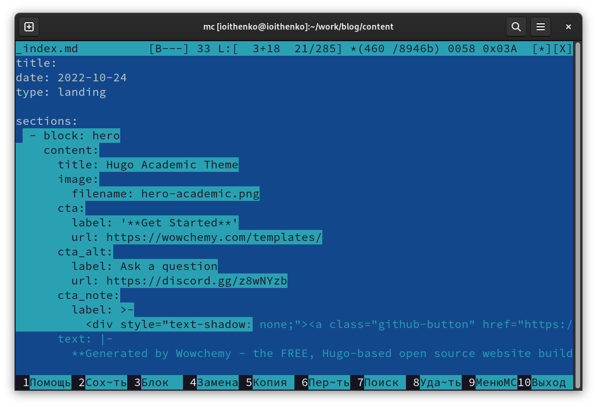{#fig:009 width=70%}

Создаем новый репозиторий ioithenko.github.io (рис. @fig:0010).

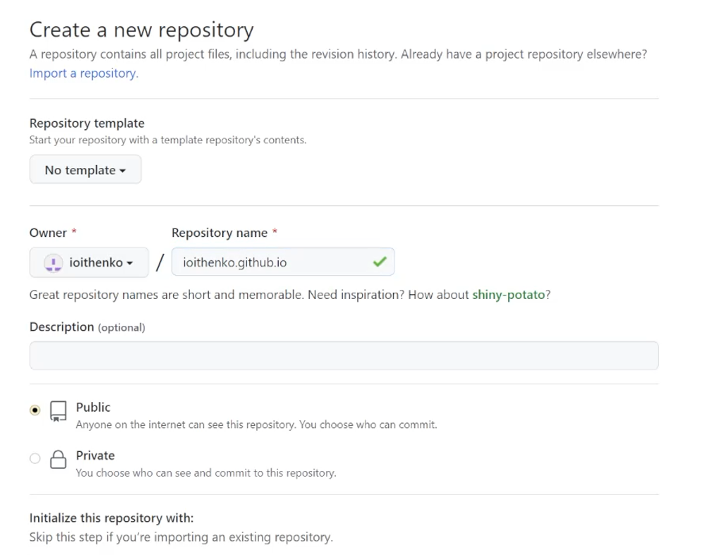{#fig:0010 width=70%}

Клонируем новый пустой репозиторий в каталог work (рис. @fig:0011).

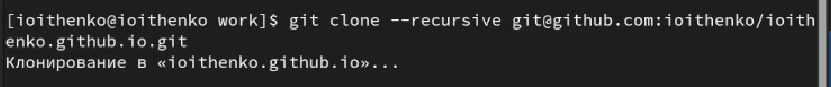{#fig:0011 width=70%}

Создаем в репозитории ветку main и файл README.md, пушим изменения на гитхаб (рис. @fig:0012).

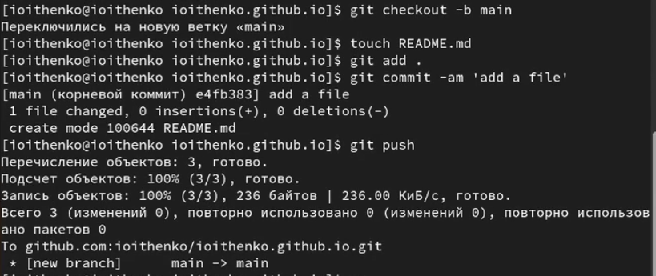{#fig:0012 width=70%}

Заходим в файл .gitignore и комментируем строку public (рис. @fig:0013).

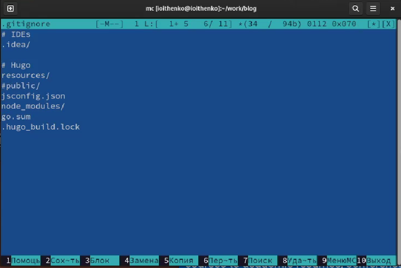{#fig:0013 width=70%}

Добавляем субмодуль в public и используем hugo (рис. @fig:0014).

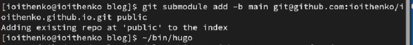{#fig:0014 width=70%}

Пушим измения на гитхаб (рис. @fig:0015).

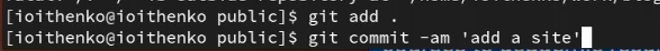{#fig:0015 width=70%}

Итоговый вид сайта с использованием  шаблона (рис. @fig:0016).

{#fig:0016 width=70%}

# Выводы

В результате выполнения первого этапа я разместила на Github pages заготовку для персонального сайта.

