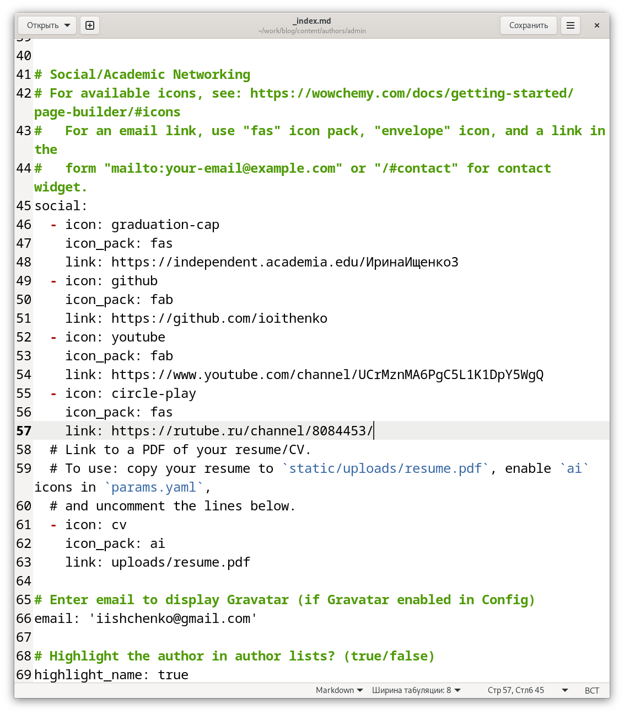
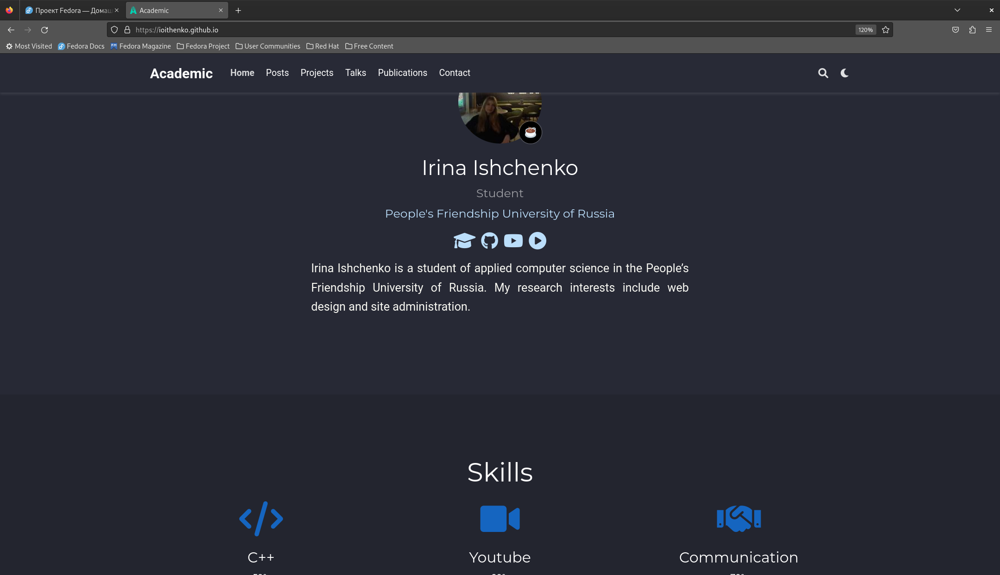
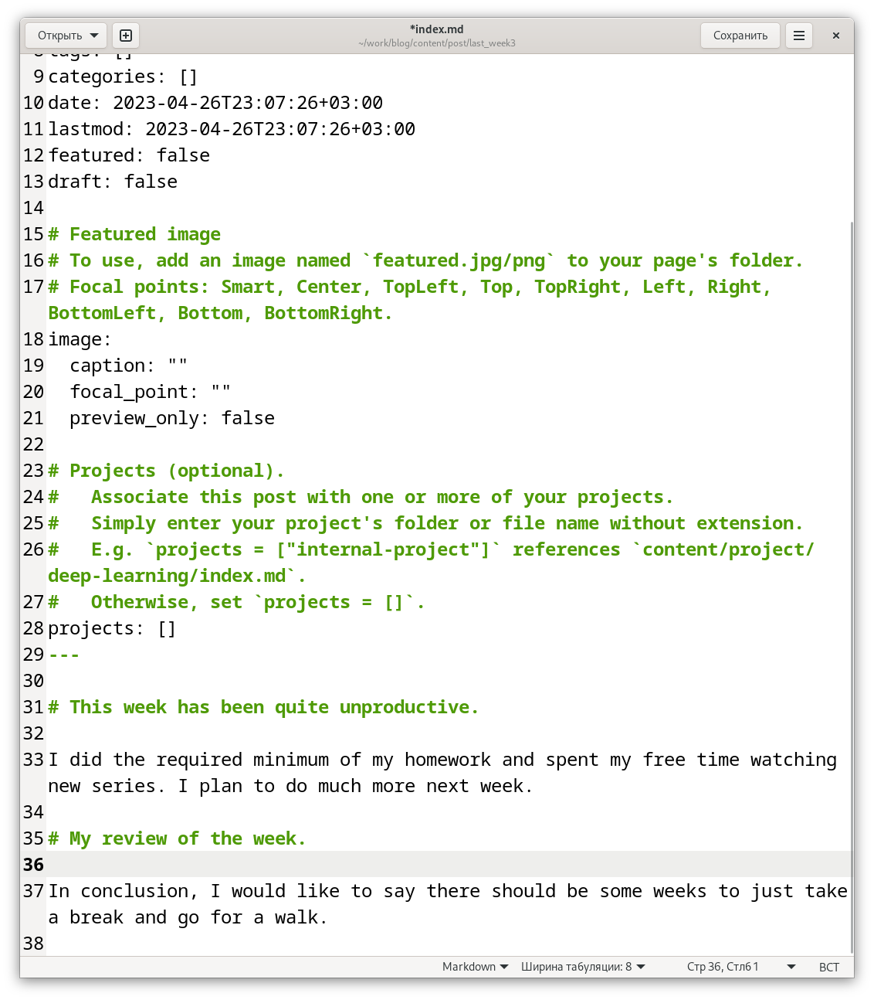
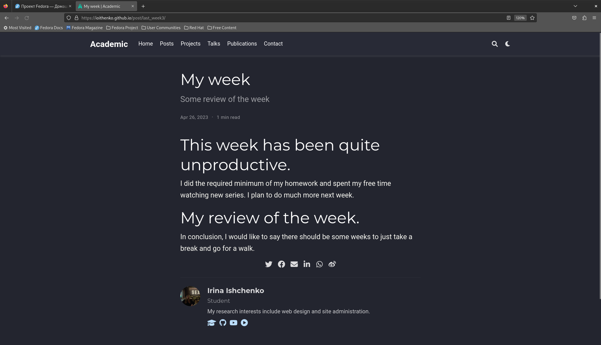
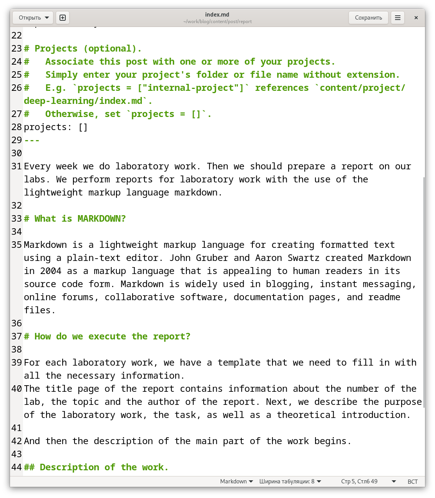
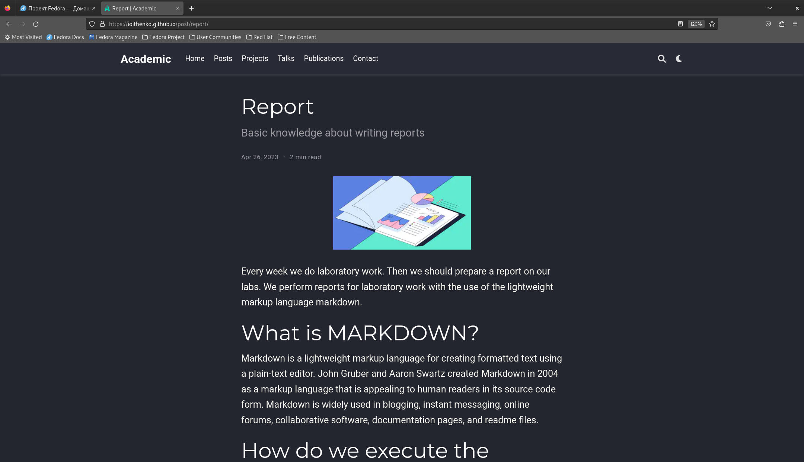

---
## Front matter
lang: ru-RU
title: Четвертый этап индивидуального проекта
subtitle: Операционные системы
author:
  - Ищенко Ирина Олеговна
institute:
  - Российский университет дружбы народов, Москва, Россия
date: 27 апреля 2023

## i18n babel
babel-lang: russian
babel-otherlangs: english

## Formatting pdf
toc: false
toc-title: Содержание
slide_level: 2
aspectratio: 169
section-titles: true
theme: metropolis
header-includes:
 - \metroset{progressbar=frametitle,sectionpage=progressbar,numbering=fraction}
 - '\makeatletter'
 - '\beamer@ignorenonframefalse'
 - '\makeatother'
---

## Докладчик

:::::::::::::: {.columns align=center}
::: {.column width="70%"}

  * Ищенко Ирина Олеговна 
  * НПИбд-01-22

:::
::: {.column width="30%"}

:::
::::::::::::::

## Цели и задачи

Добавить к сайту данные о собственных ресурсах и сделать несколько постов.

# Выполнение индивидуального проекта

## Изменение ссылок  на ресурсы

{ #fig:001 width=40% }

## Изменение ссылок  на ресурсы

{ #fig:002 width=50% }

## Пост о прошедшей неделе

{ #fig:003 width=40% }

## Пост о прошедшей неделе
 
{ #fig:004 width=50% }

## Пост об оформлении отчета

{ #fig:005 width=40% }

## Пост об оформлении отчета

{ #fig:006 width=50% }

## Вывод

В ходе выполнения четвертого этапа индивидуально проекта я разместила на сайте ссылки на ресурсы и выложила несколько постов.
