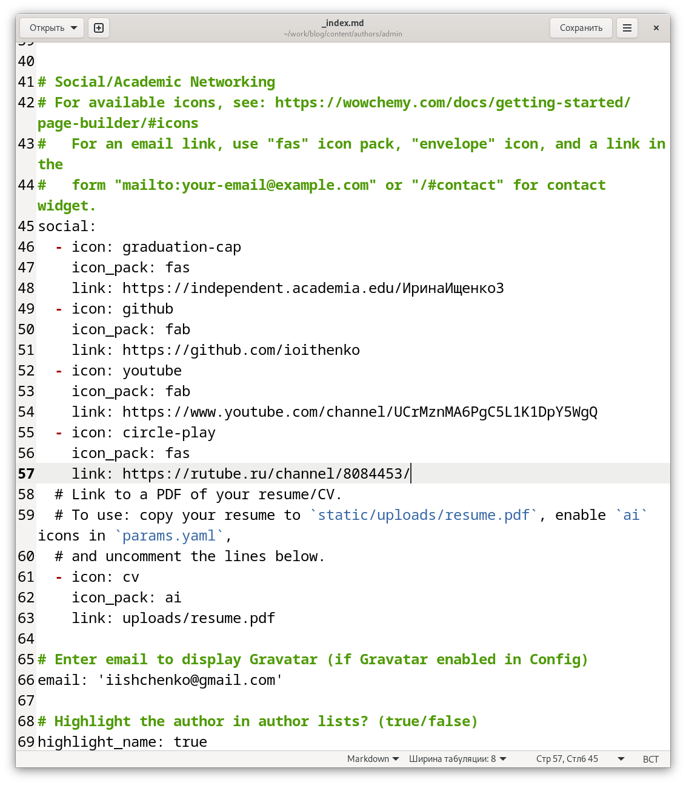
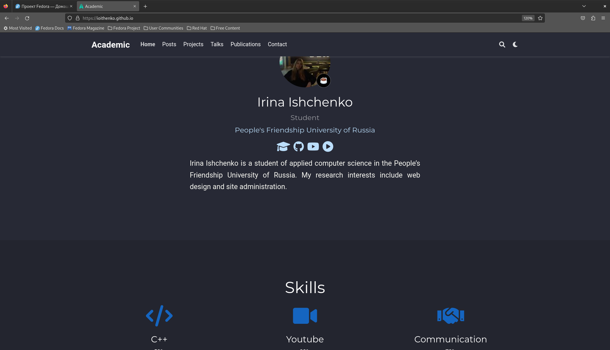
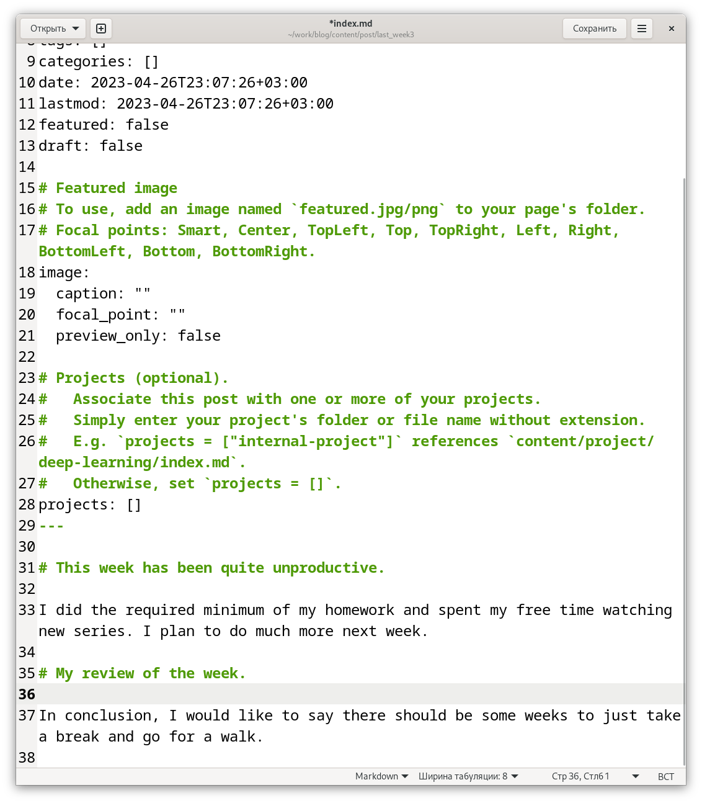
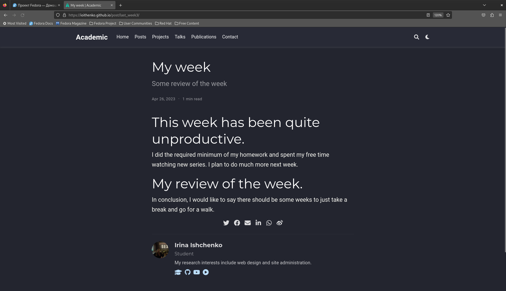
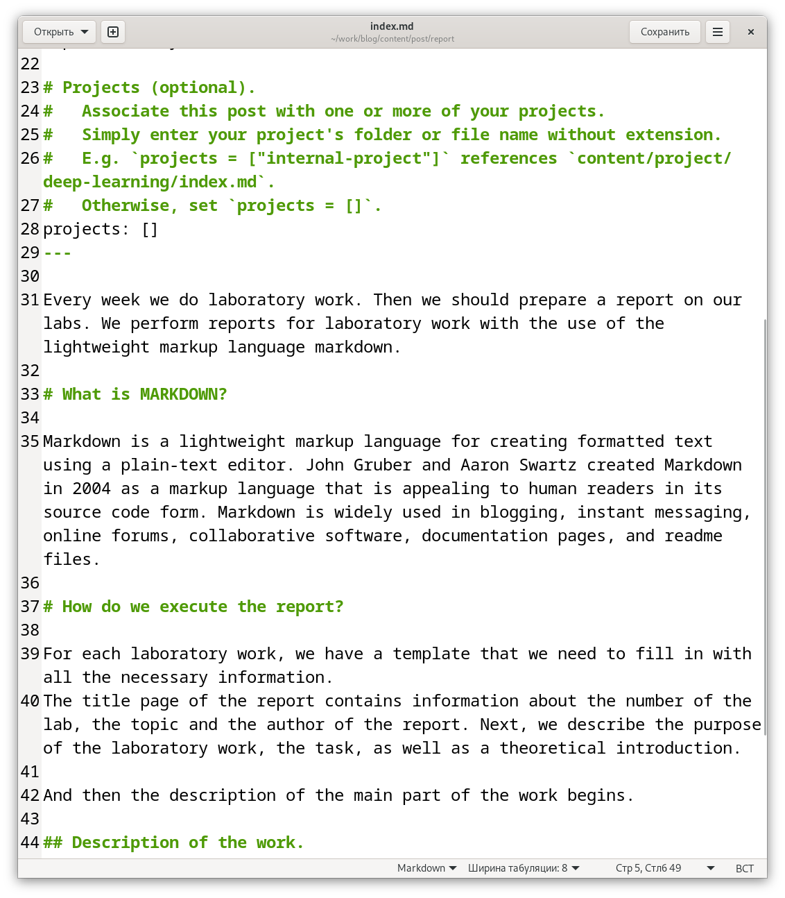
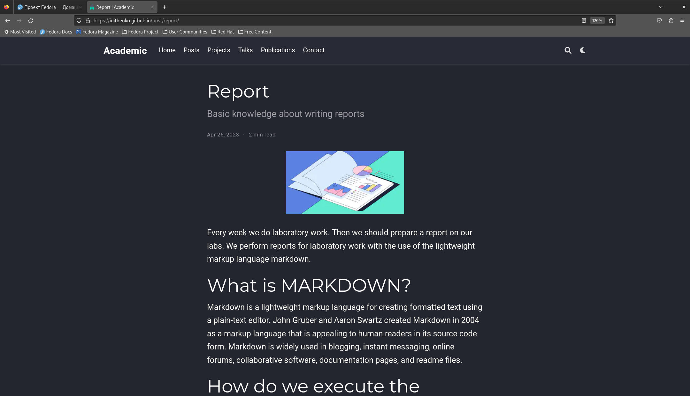

---
## Front matter
title: "Отчет по четвертому этапу индивидуального проекта"
subtitle: "Операционные системы"
author: "Ищенко Ирина Олеговна"

## Generic otions
lang: ru-RU
toc-title: "Содержание"

## Bibliography
bibliography: bib/cite.bib
csl: pandoc/csl/gost-r-7-0-5-2008-numeric.csl

## Pdf output format
toc: true # Table of contents
toc-depth: 2
lof: true # List of figures
lot: true # List of tables
fontsize: 12pt
linestretch: 1.5
papersize: a4
documentclass: scrreprt
## I18n polyglossia
polyglossia-lang:
  name: russian
  options:
	- spelling=modern
	- babelshorthands=true
polyglossia-otherlangs:
  name: english
## I18n babel
babel-lang: russian
babel-otherlangs: english
## Fonts
mainfont: PT Serif
romanfont: PT Serif
sansfont: PT Sans
monofont: PT Mono
mainfontoptions: Ligatures=TeX
romanfontoptions: Ligatures=TeX
sansfontoptions: Ligatures=TeX,Scale=MatchLowercase
monofontoptions: Scale=MatchLowercase,Scale=0.9
## Biblatex
biblatex: true
biblio-style: "gost-numeric"
biblatexoptions:
  - parentracker=true
  - backend=biber
  - hyperref=auto
  - language=auto
  - autolang=other*
  - citestyle=gost-numeric
## Pandoc-crossref LaTeX customization
figureTitle: "Рис."
tableTitle: "Таблица"
listingTitle: "Листинг"
lofTitle: "Список иллюстраций"
lotTitle: "Список таблиц"
lolTitle: "Листинги"
## Misc options
indent: true
header-includes:
  - \usepackage{indentfirst}
  - \usepackage{float} # keep figures where there are in the text
  - \floatplacement{figure}{H} # keep figures where there are in the text
---

# Цель работы

Добавить к сайту данные о собственных ресурсах и сделать несколько постов.

# Задание

Разместить ссылки на собственные ресурсы.

Сделать пост по прошедшей неделе.

Добавить пост на тему:

- Оформление отчёта.

# Выполнение

Выполняю команду ~/bin/hugo server чтобы получить ссылку на локальный сайт, на котором буду отслеживать все изменения в процессе работы. 

Изменяю ссылки на ресурсы: меняю иконки на подходящие и добавляю ссылки на мои ресурсы (рис. @fig:001).

{ #fig:001 width=70% }

Просматриваю изменения на сайте (рис. @fig:002).

{ #fig:002 width=70% }

Приступаю к созданию постов: 

С помощью команды ~/bin/hugo new post/название_поста создаю два поста: о прошлой неделе и на тему по выбору (про оформление отчета).

Заполняю пост о прошедшей неделе всей необходимой информацией:
указываю заголовок, подзаголовок, автора и т.д. (рис. @fig:003).

{ #fig:003 width=70% }

Далее проверяю на локальном сайте все изменения (рис. @fig:004). 

{ #fig:004 width=70% }

Далее приступаю к заполнению второго поста. Этот пост на тему оформления отчета. Я также указываю заголовок, подзаголовок, автора и т.д. А затем проверяю изменения на локальном сайте (рис. @fig:005) и (рис. @fig:006).

{ #fig:005 width=70% }

{ #fig:006 width=70% }

Затем выполняю ~/bin/hugo, выполняю команду git status, чтобы убедиться, что произошли необходимые изменения, убеждаюсь в этом и отправляю изменения на сервер. 

Затем проверяю изменения на публичном сайте, убеждаюсь, что все выполнено корректно.

# Вывод

В ходе выполнения четвертого этапа индивидуально проекта я разместила на сайте ссылки на ресурсы и выложила несколько постов.

