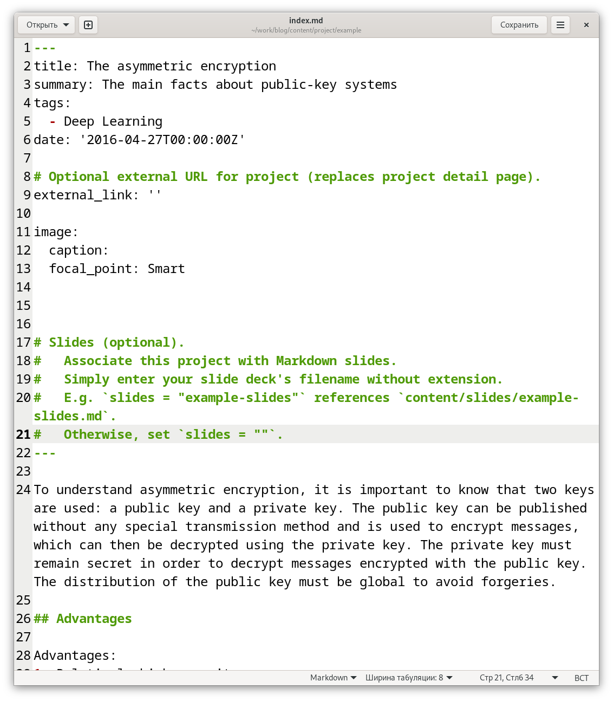
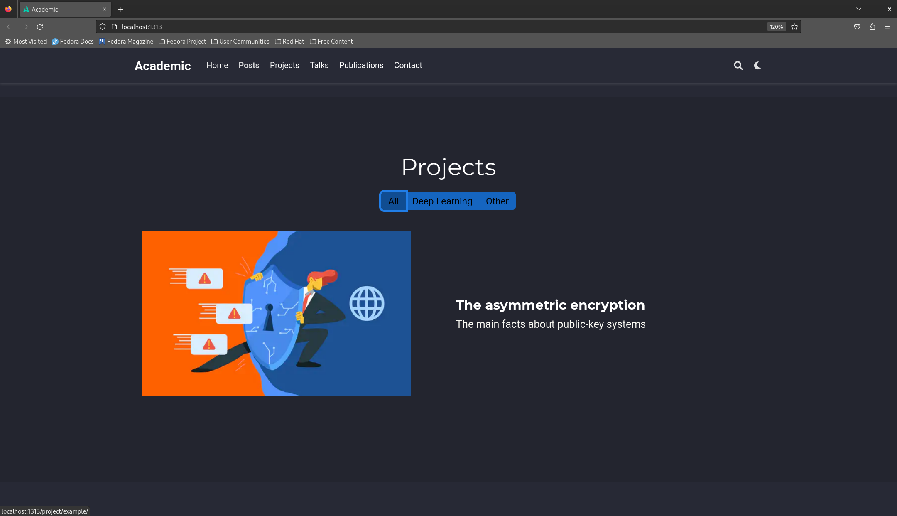
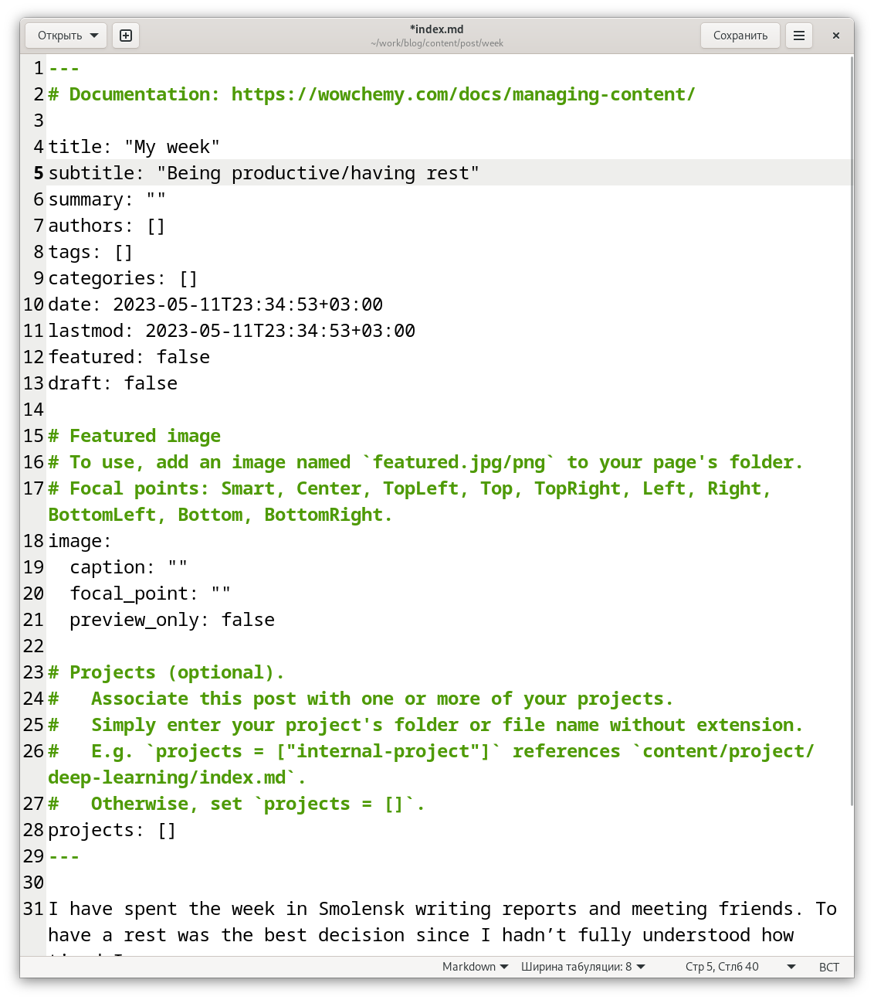
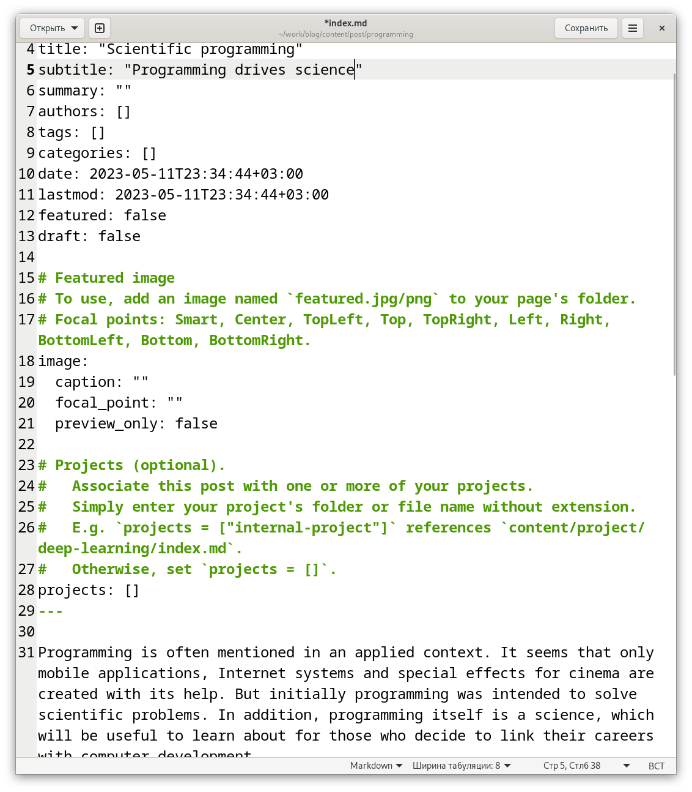
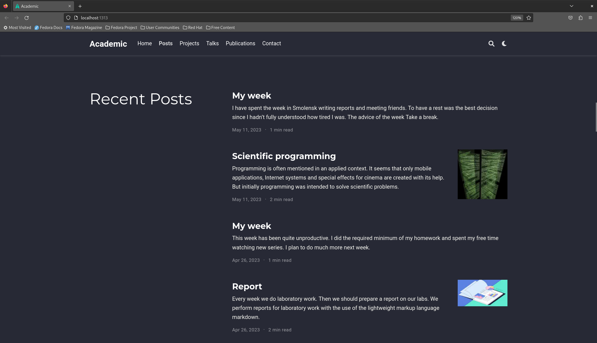

---
## Front matter
lang: ru-RU
title: Пятый этап индивидуального проекта
subtitle: Операционные системы
author:
  - Ищенко Ирина Олеговна
institute:
  - Российский университет дружбы народов, Москва, Россия
date: 12 мая 2023

## i18n babel
babel-lang: russian
babel-otherlangs: english

## Formatting pdf
toc: false
toc-title: Содержание
slide_level: 2
aspectratio: 169
section-titles: true
theme: metropolis
header-includes:
 - \metroset{progressbar=frametitle,sectionpage=progressbar,numbering=fraction}
 - '\makeatletter'
 - '\beamer@ignorenonframefalse'
 - '\makeatother'
---

## Докладчик

:::::::::::::: {.columns align=center}
::: {.column width="70%"}

  * Ищенко Ирина Олеговна
  * НПИбд-01-22

:::
::: {.column width="30%"}

:::
::::::::::::::

## Цель работы

Добавить к сайту остальные элементы: сделать запись персонального проекта, а также разместить два поста.

# Выполнение индивидуального проекта

## Проект

{#fig:001 width=40%}

## Проект

{#fig:002 width=50%}

## Пост

{#fig:003 width=40%}

## Пост

{#fig:004 width=40%}

## Пост

{#fig:005 width=50%}

## Вывод

В ходе выполнения данного этапа я добавила к сайту остальные данные, разместила проект и создала два поста.
